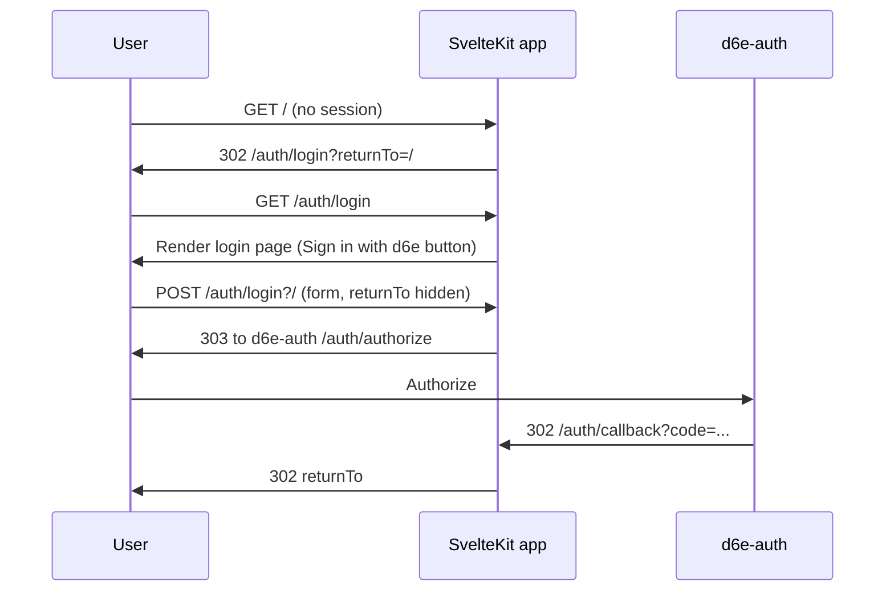

# ログイン画面の新設と /auth/no-access ログアウトボタン追加

未認証時に d6e-auth へ自動リダイレクトしている現在のフローを廃止し、自前のログイン画面（「d6e で認証」ボタン）を表示する。あわせて `/auth/no-access` ページにログアウトボタンを置き、誤ったアカウントで入った場合のアカウント切替を可能にする。

関連 Issue: #14

## 背景と現状

- 現在は [`src/hooks.server.ts`](../src/hooks.server.ts) が未認証アクセスを `/auth/login?returnTo=...` に 302 し、[`src/routes/auth/login/+server.ts`](../src/routes/auth/login/+server.ts) の GET ハンドラがさらに d6e-auth (`D6E_AUTH_URL`) の認可ページへ即リダイレクトしている。間に「ログイン画面」が存在しない。
- [`src/routes/auth/no-access/+page.svelte`](../src/routes/auth/no-access/+page.svelte) には `<a href="/auth/login">` の「再度ログイン」リンクしかなく、d6e-auth 側のセッションが残っているため同じアカウントで戻ってきてしまい、別アカウントへ切り替えられない。

## フロー（変更後）

## 変更概要

### 1. ログインページの新設

- 削除: [`src/routes/auth/login/+server.ts`](../src/routes/auth/login/+server.ts)（`+page.svelte` と共存できないため）
- 新規: `src/routes/auth/login/+page.svelte`
  - 既存 [`src/routes/auth/+layout.svelte`](../src/routes/auth/+layout.svelte) の中央寄せレイアウトに乗せる（サイドバー非表示）。
  - 構成: アプリ名 → リード文 → アプリ概要カード → 「d6e で認証」ボタン（`<form method="POST">` で `` を含む）→ d6e アカウントについての補足。
  - `data.returnTo` を hidden input としてフォームに埋め込む。
- 新規: `src/routes/auth/login/+page.server.ts`
  - `load({ url })`: `returnTo` クエリを読み、`isSafeReturnTo` 相当のチェック後にデータとして返す。
  - `actions.default({ url, cookies, request })`: 既存 `+server.ts` GET と同等の OAuth 開始処理（`createOauthState` → state cookie 書き込み → `buildAuthorizeUrl` → `throw redirect(303, ...)`）。hidden input の `returnTo` を再度サニタイズして state cookie に折り畳む。
- [`src/hooks.server.ts`](../src/hooks.server.ts) の未認証時リダイレクト先 (`/auth/login?returnTo=...`) はそのまま。新ページに到達する形になる。
- [`src/routes/auth/logout/+server.ts`](../src/routes/auth/logout/+server.ts) で組み立てている `${D6E_AUTH_URL}/auth/logout?redirect_uri=.../auth/login` もそのまま。d6e-auth ログアウト後に新ログイン画面が表示される（自動再認証されないので「アカウント切替」が機能する）。

### 2. /auth/no-access のログアウトボタン

- [`src/routes/auth/no-access/+page.svelte`](../src/routes/auth/no-access/+page.svelte) の「再度ログイン」リンクを削除。
- 代わりに [`src/lib/components/app-sidebar.svelte`](../src/lib/components/app-sidebar.svelte) の `<form method="POST" action="/auth/logout">` と同じパターンで「ログアウトして別アカウントでログイン」ボタンを設置。
- ボタンに `LogOutIcon` を添える。

### 3. i18n メッセージ更新

- 追加: `auth_login_title` / `auth_login_lead` / `auth_login_app_overview` / `auth_login_provider_hint` / `auth_login_sign_in_with_d6e` / `auth_no_access_switch_account`。
- 削除: `auth_login_retry`（`grep` の結果 `no-access` ページ以外で未使用）。
- [`messages/ja-JP.json`](../messages/ja-JP.json) と [`messages/en-US.json`](../messages/en-US.json) の両方を同期して更新。
- Paraglide が Vite プラグインで自動再生成（手動で `src/lib/paraglide/` を触る必要なし）。

### 4. ファイル先頭コメント規約

- `+page.server.ts` 先頭、`+page.svelte` の `<script lang="ts">` 内に英語コメントで目的・主な仕様・制限事項を記載（既存ファイルと同じスタイル）。

## 検証手順

- `npm run check` でスベルトチェック通過。
- `npm run format` で整形。
- 手動ブラウザ確認:
  1. ログアウト状態で `/` にアクセス → 新ログイン画面が表示されることを確認。
  2. ボタンを押して d6e-auth に遷移、認証成功で元の `/` に戻ることを確認。
  3. 別ワークスペースのアカウントでログインして `/auth/no-access` を表示。
  4. ログアウトボタンで d6e-auth セッションも切れ、新ログイン画面に戻ることを確認。
  5. 別アカウントでログインし直せることを確認。

## ファイル変更まとめ

- 削除: `src/routes/auth/login/+server.ts`
- 新規: `src/routes/auth/login/+page.svelte`
- 新規: `src/routes/auth/login/+page.server.ts`
- 編集: `src/routes/auth/no-access/+page.svelte`
- 編集: `messages/ja-JP.json`
- 編集: `messages/en-US.json`
- 新規: `.plans/add-login-page-and-no-access-logout.plan.md`
