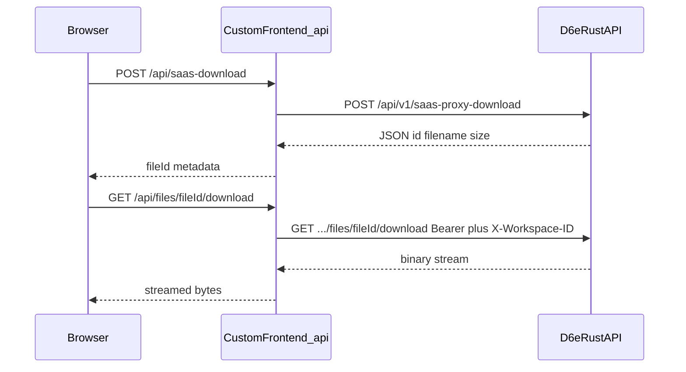

# Agent Skills 3種の情報拡充

## 目標

private な [d6e](https://github.com/d6e-ai/d6e) を直接参照できない外部開発者が、公開 Skills だけで次を迷わず実装できる状態にする。

**当初フォーカス（必達）:**

- `saas-proxy-download` → `storage_file` → `files/{id}/download` の **2 段フロー**
- same-origin **ストリーミングプロキシ**（302 直リンク不可）
- **短寿命ワーカー（CF Workers ~30s）** vs **長時間ジョブ（intent jobs）** vs **ファイル転送の分離**
- Vercel / Cloudflare それぞれの上限と推奨パターン

**実装確認で追加した落とし穴（必達に昇格）:** 下記「追加落とし穴カタログ」を参照。当初4点だけでは足りない。

順序は **C**（frontend 完了 → docker-stf → plugin）。ホスティング記述は **A**（CF + Vercel を詳しく）。

## 追加落とし穴カタログ（d6e 実装照合）

公開スキル／docs に無い、または薄いが実装者が高確率で誤解する項目。各 reference に必ず落とし込む。

### High

| ID | 混乱しやすい点 | 正しい挙動（根拠） | 記載スキル |
| --- | --- | --- | --- |
| H1 | Docker STF の `api_token` で saas-proxy / files も叩ける | `AuthContext::InternalStf` は実質 **SQL 専用**（`sql.rs` + container token）。`user_id()` は nil のため saas-proxy の membership チェックに通らない | docker-stf `external-apis.md` |
| H2 | workflow の `stf_version_id` が固定版だと思う | デフォルト `pin_version: false` なら実行時に **親の最新 version** を解決（`engine/workflow.rs`）。plugin installer も false で作成 | plugin `pinning-and-versions.md` |
| H3 | プラグイン再インストールで全 workflow が追従する | re-pin は **旧 version ID を参照する workflow のみ**。エージェントがコピーした独自 workflow は対象外（`plugin-installer.ts` step 5） | plugin |
| H4 | Effect も Input Fetch と同様 60s で切れる | Input Fetch のみ `MAX_FETCH_TIMEOUT_SECS=60`（`input_resolver.rs`）。**Effect HTTP は reqwest デフォルトで timeout 未設定**（`engine/effect.rs`） | plugin |

### Medium

| ID | 混乱しやすい点 | 正しい挙動 | 記載スキル |
| --- | --- | --- | --- |
| M1 | `gen_random_uuid()` で PK 可 | 公開スキルに無いが MCP/SQL 層は **`uuidv7()` 必須**（private `d6e-sql` skill） | workspace-api `sql.md` |
| M2 | multipart `metadata` 不正 JSON → 400 | `from_str(...).ok()` で **黙って null**、アップロードは成功（`storage_file.rs`） | workspace-api `file-storage.md` |
| M3 | scoped JWT で API key CRUD | `reject_scoped_token()` で **403**（`api_key.rs`） | auth-integration |
| M4 | SQL preview が通れば execute も通る | preview は **ポリシー未評価**；execute で `POLICY_DENIED` になり得る | workspace-api `sql.md` |
| M5 | soft-delete 済み fileId を `inputFileRefs` に残す | list/download から除外；intent 注入時に失敗 | workspace-api + prompt-ui |
| M6 | Docker STF 5分は起動から計測 | **semaphore 取得後**から計測（`STF_DOCKER_MAX_CONCURRENT` default 2）。待ち時間で超過しやすい | docker-stf `limits-and-timeouts.md` |
| M7 | Fetch `timeout_secs: 120` が効く | **60 にクランプ** | plugin |
| M8 | chat-sessions に Bearer / API key | **Cookie `auth-token` のみ**；intent は Bearer（API key 可）— 混在不可 | workspace-api + auth |
| M9 | saas-proxy JSON も 100MB/1GB | JSON proxy **10MB**、download **100MB**、storage **1GB** — 上限が三段 | workspace-api |
| M10 | d6e-auth の JWT ならどの instance でも通る | instance の `jwtVerify` は **`aud` = `D6E_AUTH_CLIENT_ID` 必須** | auth-integration |

### Low–Med

| ID | 内容 | 記載スキル |
| --- | --- | --- |
| L1 | `output_schema` 不一致で workflow 全体失敗 | plugin |
| L2 | `GET /workspaces/{id}/tables` は存在しない（古い README 残骸）。`information_schema` + SQL | workspace-api |
| L3 | Drive Sync の `200 {status:started}` は完了ではない（既存記載を references へ移管） | workspace-api |

**既にスキルで十分カバー済み（再掲しない）:** Cookie vs Bearer 行列の骨格、files/documents の header 解決、stdout 単一 JSON、テーブル名 23 文字、Effect `$` 構文、async job concurrency/heartbeat の基本、instance-brokered refresh。

## 共通ドキュメント方針

```
skill-name/
├── SKILL.md              # 索引・判断・Quick Start・checklist（目安 200–400 行）
└── references/           # 実装詳細・スキーマ・E2E・タイムアウト表
```

- SKILL.md の frontmatter `description` に、references 内の重要トリガー語（`saas-proxy-download`、`Cloudflare Workers`、`files/.../download` 等）を含める
- 各 reference 先頭に「根拠となる d6e パス」（例: `packages/api/src/routes/v1/saas_proxy_download.rs`）を明記し、内部メンテ用に追跡可能にする（外部読者にはコードが見えない前提で、挙動は全文で再現する）
- 既存の厚いモノリスは **移動＋要約**し、重複は残さない

## Phase 1 — [d6e-custom-frontend-skills](https://github.com/d6e-ai/d6e-custom-frontend-skills)（最優先）

### 1a. `d6e-workspace-api-client`（最大の穴を塞ぐ）

現行 ~1272 行の [SKILL.md](d6e-custom-frontend-skills/skills/d6e-workspace-api-client/SKILL.md) を slim index 化し、以下を `references/` に分割する。

| ファイル | 内容 |
| --- | --- |
| `references/saas-proxy-download.md` | Request/Response 完全形、`error_body`、100MB、editor 権限。成功時はメタデータ JSON（`id` 等）のみ |
| `references/file-storage.md` | list/get/multipart/JSON upload/delete + **download**。`X-Workspace-ID` 必須・パス WS ID 無視。Accept 例 |
| `references/download-two-step.md` | **必須 E2E**: POST saas-proxy-download → GET files/{id}/download → same-origin プロキシ。公式実装の写経 |
| `references/platform-timeouts.md` | Vercel（maxDuration / waitUntil）と **Cloudflare Workers（~30s CPU、streaming、cookie）** の対比表と推奨パターン |
| `references/async-intent-jobs.md` | 既存 sync/async 記述を移管 |
| `references/auth-header-matrix.md` | 既存行列を移管＋scoped JWT（M3/M8/M10 と連携） |
| `references/sql.md` | 実行/preview、uuidv7、23 文字、POLICY、preview≠execute（M1/M4/L2） |
| `references/size-limits.md` | 10MB / 100MB / 1GB の三段上限（M9）と multipart metadata 黙殺（M2） |
| その他 | workflows、drive-sync、saas-proxy JSON、members/invitations |

**2 段フロー（ドキュメントの核）:**



写経元: [download/+server.ts](d6e/packages/frontend/src/routes/api/workspaces/[workspaceId]/files/[fileId]/download/+server.ts)（cookie → Bearer + `X-Workspace-ID`、`upstream.body` をストリーム中継。302 しない）。

**platform-timeouts.md の結論（ユーザー共有の設計メモを正式化）:**

- LLM + ツール連鎖が長い → `execute-by-intent/jobs` を作成してすぐ返し、ポーリング（CF Worker は起動直後に返す）
- ファイル転送 → Worker はメタデータ・認可・ストリーム中継のみ。大バイナリを Worker 内でバッファしない
- 実装コストが高い場合の現実解として Vercel を選択肢として記載（CF の CPU デフォルトほど厳しくない／別途 OOM・ボディサイズ制限あり）

### 1b. example app への download ルート追加

[d6e-custom-frontend-skills](d6e-custom-frontend-skills) の example に  
`src/routes/api/files/[fileId]/download/+server.ts` を追加し、SKILL / references からリンクする（現状 upload のみで download 実装例が無い）。

[docs/d6e-api-integration.md](d6e-custom-frontend-skills/docs/d6e-api-integration.md) に File download / saas-proxy-download 節を references と同期して追記。

### 1c. `d6e-auth-integration` / `d6e-prompt-driven-ui`

- auth: `references/platform-adapters.md`（SvelteKit / Next.js / CF Workers）；`references/token-kinds.md`（JWT / scoped JWT / API key、`aud` 検証、API key CRUD 不可 = M3/M10）
- prompt-ui: `references/async-jobs-ui.md`（toolTrace、`files[]`、soft-deleted fileId = M5）；download 連携は workspace-api を参照

## Phase 2 — [d6e-docker-stf-skills](https://github.com/d6e-ai/d6e-docker-stf-skills)

既存の [reference.md](d6e-docker-stf-skills/skills/d6e-docker-stf-development/reference.md) / [examples.md](d6e-docker-stf-skills/skills/d6e-docker-stf-development/examples.md) は維持。SKILL.md を ~400 行 index に slim 化し、追加:

- `references/limits-and-timeouts.md` — STF ~5min（**semaphore 取得後**から計測 = M6）vs workflow vs intent job ~30min
- `references/storage-and-files.md` — バイナリは input `sources` / workflow File step；コンテナから files API は想定外
- `references/external-apis.md` — **H1 を正面から**: `api_token` = SQL only；外部 SaaS は Effect / MCP / カスタムフロントの saas-proxy

## Phase 3 — [d6e-plugin-skills](https://github.com/d6e-ai/d6e-plugin-skills)

SKILL.md を index 化し、repo 直下 `docs/` を skill 内 `references/` に取り込むか明示リンク:

- `references/saas-and-downloads.md` — MCP `d6e_download_external_file` ↔ REST 2 段フロー
- `references/pinning-and-versions.md` — H2/H3（pin_version デフォルト false、re-pin 範囲）
- `references/timeouts.md` — H4/M7（Effect 無制限 vs Input Fetch 60s clamp）と L1（output_schema）
- `references/custom-frontend-combo.md` — redirect URI・再起動・フロント併用時の jobs / download
- `references/template-yaml.md` — 既存 template-yaml-spec の移管またはリンク

## 完了条件（受け入れ）

外部開発者が d6e を開かずに、次を実装／判断できる記述があること。

1. SaaS から PDF を materialize し、ブラウザへストリーム配信する
2. CF Workers 上で長時間 intent を jobs + poll で回す
3. CF / Vercel のどちらを選ぶか、タイムアウト表だけで判断できる
4. Docker STF 作者が `api_token` で saas-proxy を呼ばない（H1）
5. Plugin 作者が `pin_version` / re-pin 範囲と Effect vs Fetch タイムアウト差を説明できる（H2–H4）
6. SQL HITL UI が preview≠execute を扱い、uuidv7 / サイズ上限三段を守れる（M1/M4/M9）

## デリバリ単位

- リポジトリごとにブランチ + PR（frontend を先にマージ可能な独立 PR）
- 各リポジトリに Issue を作成し、本プラン（`.plans/`）へのリンクをコメントする
- frontend PR は `Closes #<issue>` で紐付け
