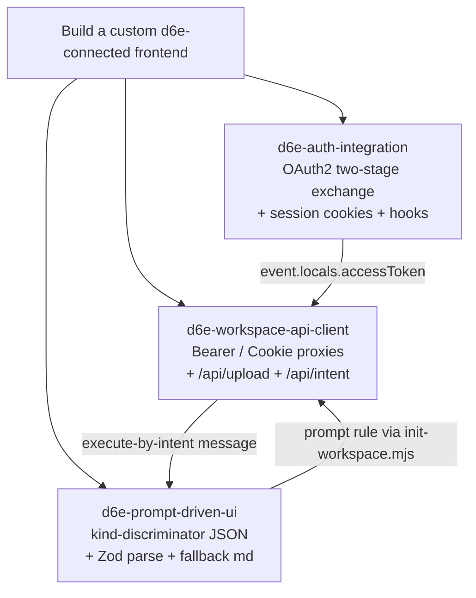

# Agent Skills for d6e Custom Frontend

## 目的とゴール

`d6e-ai/d6e-app-skills` リポジトリと同じ規約 (`skills/<skill-name>/SKILL.md` + YAML frontmatter) で本リポジトリに 3 つの Agent Skill を追加し、`skills.sh` から `d6e-ai/d6e-ai-keiri-example/<skill>` URL で自動掲載されるようにします。各 Skill は本リポジトリの実装を「動くリファレンス」として参照しつつ、AI エージェントが他ドメイン向けの d6e 接続フロントエンドを実装できる粒度のガイドを提供します。

## スキル構成と責務



3 つは独立に install できるが、フル機能のフロントエンドを実装する場合は 3 つとも使うことを各 SKILL の "Related skills" で案内します。

## 追加するディレクトリ構造

```
skills/
├── README.md                          # 3 Skill の関係と install コマンド
├── d6e-auth-integration/
│   └── SKILL.md
├── d6e-workspace-api-client/
│   └── SKILL.md
└── d6e-prompt-driven-ui/
    └── SKILL.md
```

## 各 SKILL.md のテンプレート

参考の `~/github.com/d6e-ai/d6e-app-skills/skills/d6e-app-development/SKILL.md` を踏襲し、各 SKILL は以下の章立てで統一:

- YAML frontmatter: `name` (kebab-case) + `description` (1〜2 文・トリガフレーズを含む英語)
- `# Title` / `## Overview`
- `## When to Use` (代表的なユーザー発話例)
- `## Core Concepts`
- `## Quick Start` (最小コード)
- `## Reference` (フィールド/エンドポイント/コード例の詳細)
- `## Implementation Checklist`
- `## Best Practices` / `## Security`
- `## Troubleshooting`
- `## Related Skills` (相互リンク)

## Skill ごとの中身

### 1. `skills/d6e-auth-integration/SKILL.md`

参照する実装:

- `src/lib/server/oauth.ts` — `exchangeAuthorizationCode` (Stage 1) / `refreshAccessTokenViaBaseUrl` (Stage 2) / `decodeJwtExpMs`
- `src/lib/server/session.ts` — `storeSession` / `loadSession` / `clearSession`, in-flight refresh dedup, 60 秒 grace window
- `src/hooks.server.ts` — `event.locals.accessToken` populate
- `src/routes/auth/login/+server.ts` / `callback/+server.ts` / `logout/+server.ts` / `no-access/+page.svelte`
- `src/lib/server/d6e-client.ts` の `verifyWorkspaceMembership`
- `docs/d6e-api-integration.md` §4 と `docs/architecture.md` の sequence 図

教える主トピック:

- なぜ二段階か (`iss=d6e-auth` の access_token は b-button が `aud` mismatch で 401)
- Stage 1 (`${D6E_AUTH_URL}/api/v1/auth/token` `authorization_code`) — refresh_token のみ採用、access_token は即座に破棄
- Stage 2 (`${D6E_BASE_URL}/api/v1/auth/token` `refresh_token`) — ここで得た pair のみ cookie に保存
- Cookie 設計: `auth-access` / `auth-refresh` / `auth-user` / `auth-oauth-state` (HTTP-only / SameSite=Lax / Secure / max-age)
- exp 60 秒前の透過リフレッシュと並行 refresh の dedup
- Workspace allow-list (`verifyWorkspaceMembership` → `/auth/no-access`)
- `/auth/logout` の二段階 (local cookie delete + d6e-auth へ 303) と、これを省略するとなぜすぐ再ログインしてしまうのか
- 管理者用 `D6E_INIT_REFRESH_TOKEN` と end-user `auth-refresh` cookie の責務分離
- 環境変数チェックリスト (`D6E_AUTH_URL` / `D6E_AUTH_CLIENT_ID` / `D6E_AUTH_CLIENT_SECRET` / `D6E_AUTH_REDIRECT_URI` / `D6E_BASE_URL` / `D6E_WORKSPACE_ID`)

### 2. `skills/d6e-workspace-api-client/SKILL.md`

参照する実装:

- `src/lib/server/d6e-client.ts` — `uploadFile` / `deleteFile` / `executeByIntent` / `verifyWorkspaceMembership` / `listChatSessions` etc., `D6eClientError`, `buildCombinedSignal`
- `src/routes/api/upload/+server.ts` / `upload/[fileId]/+server.ts` / `intent/+server.ts` / `chat-sessions/+server.ts`
- `scripts/init-workspace.mjs`
- `docs/d6e-api-integration.md` §1, §2, §3, §5, §6

教える主トピック:

- 「ブラウザは d6e API を直接叩かず、必ず本アプリの `/api/*` プロキシ経由」というアーキテクチャ原則 (Bearer 漏洩防止 + workspace_id サーバ固定)
- 共通 fetch ラッパの設計指針:
  - `caller: string` を第 1 引数に取り、ログ・エラーメッセージで関数名を識別する規約
  - `accessToken` を明示的に引数で受け取る (グローバル参照しない)
  - `AbortSignal.timeout` + 任意 external signal を `AbortSignal.any` で合成
  - 全エラーを `D6eClientError` (`status` / `upstreamBody` / `timedOut` / `aborted`) で normalize
  - `console.error('[d6e-client] ...')` のログ prefix
- 認証ヘッダ別エンドポイント早見表:
  - Bearer + `X-Workspace-ID`: `POST /api/v1/workspaces/{wsId}/files/multipart`, `DELETE /api/v1/workspaces/{wsId}/files/{fileId}`, `GET /api/v1/workspaces/{wsId}`
  - Bearer のみ: `POST /api/workflows/execute-by-intent`
  - `Cookie: auth-token=<jwt>`: `/api/chat-sessions` の全 CRUD, `POST /api/workspace-prompt-rules`, `POST /api/v1/auth/token` (refresh)
- SvelteKit ルートハンドラ (`/api/upload` 等) の作り方:
  - `requireAccessToken(event, caller)` で 401 narrowing
  - `multipart/form-data` の relay (Blob + FormData)
  - 上流の status と body をクライアントへ relay
- `scripts/init-workspace.mjs` パターン: SHA-256 で content hash → 既存 rule と一致したら冪等的に skip
- 環境変数 (`D6E_BASE_URL`, `D6E_WORKSPACE_ID`, `D6E_INIT_REFRESH_TOKEN`) と `src/lib/server/env.ts` の `requireEnv` パターン

### 3. `skills/d6e-prompt-driven-ui/SKILL.md`

参照する実装:

- `scripts/prompts/ai-keiri-prompt.md` — 4 シナリオ分類 (A 作成 / B 修正 / C 一般質問 / D 追記) と `kind: "journal"` 規約
- `scripts/prompts/freee-registration-prompt.md` — `kind: "registration"` 規約とシナリオ追記の対話的セットアップ
- `src/lib/journal-schema.ts` — `kind` を `z.literal` で discriminate、`nullish().transform()` パターン、URL の安全な正規化
- `src/lib/parse-journal.ts` — `JSON_FENCE_RE` / `extractJsonBlocks` / `dispatchSchema` / `parseAssistantMessage` / fallback の 3 reason (`no_code_block` / `invalid_json` / `schema_mismatch`)
- `src/lib/components/journal-result.svelte` と `src/lib/components/registration-result.svelte` — `parsed.kind` 分岐表示と markdown fallback
- `docs/llm-output-contract.md`

教える主トピック:

- 「LLM の自由文を構造化する」3 層パターン: プロンプトで形を強制 → Zod で厳密パース → fallback で raw markdown を絶対に捨てない
- ワークスペースプロンプト (`workspace_prompt_rule`) の構造:
  - シナリオ分類 (添付の有無 / 特定 XML タグの有無 / 直前 assistant の `kind` で分岐)
  - 各シナリオの「必須応答フォーマット」と「フィールド規約」セクション分け
  - `kind` discriminator を必ず literal で固定する書き方
  - 一般質問シナリオでは json fence を「絶対に出さない」と明記して UI 誤動作を防ぐ
  - `<previous_journal>` / `<additional_comment>` / `<registration_request>` のような XML タグでターン文脈を再生成へ引き渡すパターン
- Zod スキーマ設計の慣習 (本リポジトリ準拠):
  - `kind: z.literal('...')` を必須 discriminate
  - 金額は `z.number().int().nonnegative()`
  - `date` 文字列は format 強制しない (LLM が「推定: 2026-04-30」のような prefix を出すケースを許容)
  - `nullish().transform(val => val ?? [])` で配列のデフォルトを補う
  - `web_view_link` のように URL が壊れていても全体を reject しない正規化
- パース層の慣習: `JSON_FENCE_RE = /` ` ``` ` `(?:json)?\s*([\s\S]*?)` ` ``` ` `/gi` を `g` フラグ付きで使用、最初に `kind` ヒットしたブロックを採用、`console.warn('[parse-journal] ...')` で issue path をログ出力
- UI コンポーネント側で `parsed.kind === 'fallback'` を必ずハンドリングし raw text を捨てない
- シナリオ追記方式 (`freee-registration-prompt.md` 形式):
  - d6e チャットに貼り付けると d6e AI が MCP ツール (`d6e_list_workspace_prompt_rules` / `d6e_call_external_api` / `d6e_list_saas_credentials` / `d6e_update_workspace_prompt_rule`) で対話探索
  - `{{placeholder}}` をワークスペース固有値で置換してから rule の `## 共通ルール` 直前に挿入
  - 冪等性ガード (`### シナリオ D` 見出し検出で skip)
- プロンプト管理運用: `scripts/prompts/*.md` を単一情報源にし、`npm run init` で content hash 一致時はスキップ、admin UI と script は相互排他編集

## 共通ファイル更新

- `README.md`: "Agent Skills" セクションを新設し、3 つの `npx skills add ...` コマンドと `skills.sh` バッジを記載
- `AGENTS.md` / `CLAUDE.md`: 末尾に "Agent Skills" の節を追加して `skills/` の存在と単一情報源ポリシーを記述
- 公開掲載に必要な GitHub topic (`agent-skills`) の追加を README の手順に明記 (リポジトリ設定変更はユーザー本人が UI で実施)

## 言語ポリシー

各 SKILL.md は英語ベース (skills.sh の表示・`description` フィールド英語必須)。`When to Use` のトリガフレーズだけ日本語・英語両方を載せて多言語チャット利用者をカバーします。コード例コメントは英語、本リポジトリの AGENTS.md 規約に準拠。

## 実装ステップ (Plan mode 解除後 / Agent mode で実行)

ユーザールール「Plan Modeでの追加作業」に従う:

1. GitHub に Issue "Add Agent Skills for d6e custom frontend development" を作成 (本プランの概要を貼る)
2. 新ブランチ `feature/agent-skills` を作成
3. `.plans/agent-skills-for-d6e-custom-frontend.plan.md` に本プラン本文をコピーして push、URL を Issue にコメント
4. `skills/d6e-auth-integration/SKILL.md` 作成
5. `skills/d6e-workspace-api-client/SKILL.md` 作成
6. `skills/d6e-prompt-driven-ui/SKILL.md` 作成
7. `skills/README.md` 作成
8. ルート `README.md` / `AGENTS.md` / `CLAUDE.md` を更新
9. `npm run format` で整形 (markdown は prettier 対象)
10. PR 作成 (本文に "Closes #<issue>" を含める)
11. PR URL を返却

## 非スコープ

- `schema/` JSON Schema の整備 (本 Skill 群は YAML manifest を持たないため `d6e-app-skills` のような `template.schema.json` は不要)
- `examples/` ディレクトリの追加 (本リポジトリ自体が動く example として機能。各 SKILL から相対パスで参照する)
- 既存ソースコードの変更 (Skill はガイドのみで実装は変えない)
- skills.sh への手動申請 (`agent-skills` topic 付与で自動クロールされる前提)
