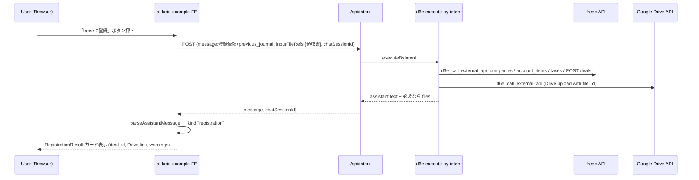

# freee 登録と Google Drive 保存の追加

## 概要

AI 仕訳結果カードに「freee に登録」ボタンを追加し、押下時に固定メッセージを既存 `/api/intent`
で送って LLM 経由で freee 仕訳登録 → Google Drive 領収書保存まで一気通貫で行う。
LLM 応答は新スキーマ `kind: "registration"` で構造化し、UI に登録結果を表示する。
運用面の揺れ（company_id、Drive フォルダ等）は LLM 側で対話確認させ、フォローアップは
既存 Revise フォームを汎用化して受ける。

## 設計の根拠

d6e 本体には `d6e_call_external_api` MCP ツールがあり、`provider="freee"` で freee API、
`provider="google_workspace"` で Google Drive API を LLM から直接呼べる。saas-proxy が
OAuth 解決と token refresh を担うので、フロントエンドからは「LLM にやらせる」だけで
連携が完結する。すなわちこのサンプルアプリ側の責務は次の 3 点に絞られる。

- 仕訳結果カードに「freee に登録」ボタンを置く
- ボタン押下で固定の自然文メッセージ（前回 JSON + 領収書 file ref）を `/api/intent` に送る
- 返ってきた LLM 応答を `kind: "registration"` スキーマで解釈して結果を表示する

freee API 仕様: d6e リポジトリの `packages/skills/d6e-saas-freee/SKILL.md`
Google Drive 仕様: d6e リポジトリの `packages/skills/d6e-saas-google-workspace/SKILL.md`
（`POST /upload/drive/v3/files?uploadType=multipart` に `file_id` を渡せば d6e Storage の
バイナリをそのままアップロード可能）

## エンドツーエンドのフロー



## LLM 出力契約の追加: `kind: "registration"`

`scripts/prompts/freee-registration-prompt.md` を新規追加し、d6e 本体側で「2 つ目の
workspace prompt rule」として登録してもらう想定で書く（既存の `ai-keiri-prompt.md` は
最初の 1 ターン＝仕訳作成用のままで触らない）。LLM は登録ターンで以下スキーマの JSON を
`kind: "registration"` で返す。

```json
{
  "kind": "registration",
  "status": "success | partial | failed | needs_input",
  "freee": {
    "company_id": 1234567,
    "deals": [
      {
        "deal_id": 9876543210,
        "date": "2026-04-30",
        "amount": 1280,
        "description": "コンビニ事務用品"
      }
    ]
  },
  "drive": {
    "uploads": [
      {
        "file_id": "1A2B...",
        "name": "receipt.jpg",
        "web_view_link": "https://drive.google.com/file/d/..."
      }
    ]
  },
  "warnings": ["company_id を 1234567 と推定しました。違っていれば指示してください"],
  "follow_up_question": null
}
```

`status: "needs_input"` のときのみ `follow_up_question` に日本語で質問を書く。それ以外は `null`。
`freee` / `drive` 各サブ要素は登録が走らなかった場合 `null` 可。UI 側は status と warnings、
フォローアップ質問を視覚的に分けて表示する。

シナリオ A/B/C の既存契約は据え置き、`kind` ディスクリミネータで一意に分岐できる。

## 変更するファイル

### 1. プロンプト（新規ファイル、既存は触らない）

`scripts/prompts/freee-registration-prompt.md` を新規作成。

- 「シナリオ D: freee 登録 + Drive 保存」専用のプロンプト。
- d6e 本体側の workspace prompt rules に「2 つ目のルール」として登録する想定。本リポジトリの
  `npm run init` には組み込まない。冒頭にその運用前提を明記。
- トリガ条件は「`<registration_request>` タグを含むメッセージ」。
- 手順:
  1. `d6e_list_saas_credentials` で freee / google_workspace の `enabled` を確認。未連携ならその旨を
     `warnings` に入れて即返す。
  2. freee: `GET /api/1/companies` → `GET /api/1/account_items` → `GET /api/1/taxes/codes`
     → 仕訳行ごとに `POST /api/1/deals`。
  3. Drive: 添付ファイル ID を `d6e_call_external_api` で
     `POST /upload/drive/v3/files?uploadType=multipart` 、metadata `{ "name": filename }` でアップロード。
     フォルダ指定は基本ルートだが、ユーザーから指定があればそれに従う。
  4. 不足情報（事業所が複数ある、勘定科目が一意に決まらない、Drive フォルダ指定が欲しい等）は
     `status: "needs_input"` で停止して質問を返す。
- 共通ルールに「`kind: "registration"` のスキーマは必ず守る。エラー時も JSON フェンス内に
  `kind: "registration", status: "failed"` で返し、自然文だけにしない」を入れる。
- 既存 `ai-keiri-prompt.md` には触らない（仕訳作成・修正・経理質問の単一情報源として保つ）。

### 2. Zod スキーマ

`src/lib/journal-schema.ts` に `RegistrationResultSchema` を追加。
`JournalResultSchema` はそのまま温存。

### 3. パーサ

`src/lib/parse-journal.ts` に共通の `parseAssistantMessage()` を追加し、`kind` で
`journal` / `registration` / `fallback` を出し分ける Discriminated Union を返す。
既存の `parseJournalMessage()` は内部で `parseAssistantMessage()` を呼ぶ薄いラッパに置き換え、
後方互換を保つ。

### 4. 結果カードコンポーネント（新規）

`src/lib/components/registration-result.svelte` を新規追加。

- status バッジ（success/partial/failed/needs_input）
- freee deals テーブル（deal_id, 日付, 金額, description）
- Drive uploads（リンクボタン）
- warnings リスト（既存 journal-result と同じ見た目）
- `follow_up_question` があれば目立つボックスで表示
- 最後に Raw AI response の details ブロックを共通で出す

### 5. 既存結果カード

`src/lib/components/journal-result.svelte` を更新。

- `parsed.kind === 'registration'` のときは `RegistrationResult` コンポーネントに委譲。
- `parsed.kind === 'journal'` のときは既存テーブルに加えて、warnings の下に「freee に登録」ボタンを表示。
- 親から `onRegister` ハンドラを受け取り、押下で呼び出す。

### 6. AI 仕訳ページ

`src/routes/+page.svelte` を更新。

- `handleRegister()` を新設。固定文言 + `<registration_request>` ラップで JSON を埋め込み、
  既存 `currentFileRef` と `currentChatSessionId` を再利用して `/api/intent` に投げる。
- `handleRevise()` の文言生成を「現在の `parseResult.kind`」で切り替える。
  - `journal`: 既存の `<previous_journal>` 包みで再生成依頼。
  - `registration`: `<additional_comment>` で囲んだ追加コメントとして送る（LLM はその指示で対話を続ける）。
- `JournalResult` に `onRegister={handleRegister}` を渡す。

### 7. Revise フォームの汎用化

`src/lib/components/revise-comment-form.svelte` を更新。

- 直近の parseResult kind に応じてプレースホルダ／ラベル／ボタン文言を切り替えるための
  `mode: 'journal' | 'registration'` プロップを受け取る。
- 文字列は Paraglide に追加。

### 8. i18n

`messages/ja-JP.json` / `messages/en-US.json` に登録・結果表示関連の文言を追加。

### 9. ドキュメント更新

- `docs/llm-output-contract.md` に `kind: "registration"` スキーマと運用ルールを追記。
- `docs/d6e-api-integration.md` に「freee / Google Workspace 連携は d6e の saas-proxy +
  `d6e_call_external_api` を LLM 経由で利用する」短い節を追加。

## 動作確認のシナリオ

実装後にローカルで確認したい順序:

1. d6e 管理画面で freee と Google Workspace を該当ワークスペースに接続する（前提条件）。
   さらに `freee-registration-prompt.md` の内容を 2 つ目の workspace prompt rule として登録する。
2. `npm run dev` で AI 仕訳ページを開き、領収書をアップ→仕訳生成。
3. 「freee に登録」ボタンを押下、`status: "success"` で deal_id と Drive リンクが表示されることを確認。
4. 一旦 d6e 管理画面で freee 連携を切る → 同じ操作で `status: "failed"` と warnings に
   未連携メッセージが入ることを確認。
5. 事業所が複数あるアカウントで `status: "needs_input"` が返ること、Revise フォームで
   「事業所 ID 1234 を使ってください」と返信→ 続行が成功することを確認。

## 前提と非スコープ

- ワークスペースのカスタムプロンプトは 2 ファイル構成。既存 `ai-keiri-prompt.md`（仕訳作成・修正・
  経理質問）と新規 `freee-registration-prompt.md`（freee 登録 + Drive 保存）。両方とも d6e 本体側の
  管理画面で workspace prompt rules に登録する想定。
- このリポジトリの `npm run init` は既存ファイル 1 本のみを登録するふるまいを維持し、freee 登録
  プロンプトは d6e 本体側で別途追加してもらう。`scripts/init-workspace.mjs` には触らない。
- 登録成功時にチャットセッションを自動で「完了」マークすることは今回スコープ外（ユーザーは引き続き
  既存の `#completed` ボタンで完了化）。
- 完了タスク詳細ダイアログ（`task-detail-dialog.svelte`）からの「freee に登録」ボタンは今回スコープ外。
  過去ターンの fileRef を chat_session メッセージから復元する仕組みが別途必要なため、別チケットで対応。
- freee の添付（`/api/1/receipts`）には登録しない。領収書は Google Drive のみ。
- d6e 本体の API シグネチャ変更は今回行わない。すべて既存の `d6e_call_external_api` と
  `executeByIntent` の枠内で実装する。

## 作業フロー（ユーザールール準拠）

- 新ブランチ `feat/freee-registration-and-drive-upload` を切る。
- `.plans/freee-registration-and-drive-upload.plan.md` にこのプランを保存して push。
- 該当リポジトリに GitHub Issue を起票し、コメントに plan.md のリンクを貼る。
- 上記実装を進める。完了したら `Closes #<issue>` を含む PR を作成。
- コミットメッセージは英語のみ、AI 由来の署名を入れない。
