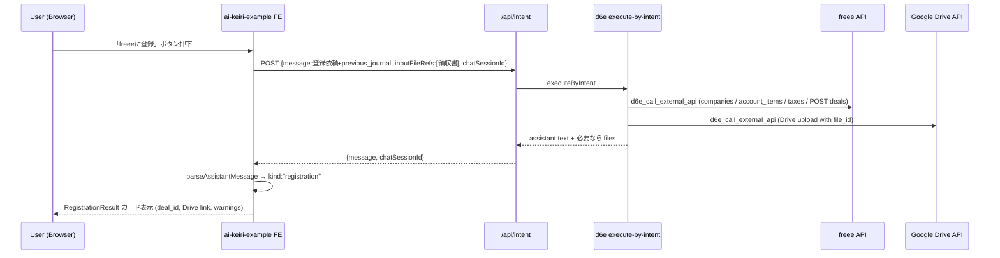

# freee 登録と Google Drive 保存の追加

## 概要

AI 仕訳結果カードに「freee に登録」ボタンを追加し、押下時に固定メッセージを既存 `/api/intent`
で送って LLM 経由で freee 仕訳登録 → Google Drive 領収書保存まで一気通貫で行う。
LLM 応答は新スキーマ `kind: "registration"` で構造化し、UI に登録結果を表示する。
運用面の揺れ（company_id、Drive フォルダ等）は LLM 側で対話確認させ、フォローアップは
既存 Revise フォームを汎用化して受ける。

## 運用上の決定事項（プラン v4 で更新）

workspace prompt rule は最終的に **1 件のまま** とする。シナリオ A/B/C は引き続き
`ai-keiri-prompt.md`（`npm run init` で登録）が担い、シナリオ D（freee 登録 + Drive 保存）は
`freee-registration-prompt.md` の中身を **d6e のチャット UI に貼り付け**、d6e AI に
`d6e_list_workspace_prompt_rules` + `d6e_update_workspace_prompt_rule` で既存ルールに
挿入してもらう運用にする。シナリオ D の追記前でもサンプルアプリの仕訳生成・修正・経理質問は
壊れずに動く（「freee に登録」ボタンを押すと fallback UI に落ちる）。

そのため `freee-registration-prompt.md` は「2 つ目の workspace prompt rule」ではなく、
**d6e AI 向けの編集指示書 + シナリオ D 本文テンプレート** という二層構造で書く。

### v3: 追記時に探索 → 具体化

「事業所」「Drive 保存先フォルダ」をワークスペースごとに 1 つ固定したいという要件に合わせ、
貼り付け後の対話で次を実行する。

1. `d6e_list_saas_credentials` で freee / google_workspace の `enabled` を確認。
2. `d6e_call_external_api` で `GET /api/1/companies`（freee）を叩き、結果をユーザーに見せて
   採用する `company_id` を確定。
3. `d6e_call_external_api` で `GET /drive/v3/files`（Google Drive ルート直下のフォルダ）を叩き、
   結果をユーザーに見せて領収書保存先 `drive_folder_id` を確定（または「ルート直下」を選択）。
4. テンプレートの `{{company_id}}` / `{{drive_folder_id}}` 等を確定値で **置換** し、その具体化
   済み本文を rule に書き込む。
5. 実行時（「freee に登録」押下時）の LLM は、追記済みの固定値をそのまま使用する。`GET
   /api/1/companies` を再度呼ぶ必要も、`needs_input` で事業所選択を求める必要もなくなる。

つまり、サンプルアプリ実行時に毎回 `needs_input` で停止して事業所選択を求める初期案 (v2) を
廃し、**「ワークスペースは 1 法人 + 1 領収書親フォルダ」という前提を rule に焼き込む** 構成に
変更した。

### v4: 挿入位置・月別サブフォルダ・`type` 判定ロジック

実際に d6e AI に貼り付けて生成された rule をレビューした結果、次の改善を加える。

1. **挿入位置を厳密化**: 末尾追記ではなく、既存 rule 内の `## 共通ルール` 見出しの **直前**
   （シナリオ C の直後）にシナリオ D を **挿入** する運用に変更。これによりタスク種別
   A/B/C/D が連続したセクションとして並び、共通ルールはその下にまとめて適用される論理構造に
   なる。`## 共通ルール` 見出しを `String.indexOf` 相当で探索し、`head + scenario_d + "\n\n"
   + tail` に再構成する。見出しが無い場合のみ末尾追記にフォールバックし `warnings` に明記。
2. **月別サブフォルダの自動作成**: 領収書は親フォルダ直下ではなく
   `<親フォルダ>/YYYY/MM/` の階層に保存する。年・月フォルダは存在しなければ自動作成
   （`POST /drive/v3/files` で `mimeType=application/vnd.google-apps.folder`）。日付選択は
   `entries[].date` の最小値（ISO 文字列として）。親フォルダの 404 は致命的で `needs_input`、
   年・月フォルダの不在は非エラー（自動作成）として扱う。
3. **`type` 判定ロジックの強化**: `description` 推測ベースではなく、貸方科目が収益系
   （売上高 / 雑収入 / 受取手数料 / 受取利息 / 受取配当金 / 受取家賃 / 為替差益 など）の
   場合に `"income"`、それ以外（経費仕訳・買掛金計上・資産取得など）は `"expense"`。
   振替仕訳（現金 → 普通預金 など）はサンプルアプリでは `"expense"` をデフォルトとし、
   `warnings` に「振替仕訳のため `type=expense` で登録しました」と明記して freee 上での
   再分類をユーザーに委ねる。

## 設計の根拠

d6e 本体には `d6e_call_external_api` MCP ツールがあり、`provider="freee"` で freee API、
`provider="google_workspace"` で Google Drive API を LLM から直接呼べる。saas-proxy が
OAuth 解決と token refresh を担うので、フロントエンドからは「LLM にやらせる」だけで
連携が完結する。すなわちこのサンプルアプリ側の責務は次の 3 点に絞られる。

- 仕訳結果カードに「freee に登録」ボタンを置く
- ボタン押下で固定の自然文メッセージ（前回 JSON + 領収書 file ref）を `/api/intent` に送る
- 返ってきた LLM 応答を `kind: "registration"` スキーマで解釈して結果を表示する

freee API 仕様: d6e リポジトリの `packages/skills/d6e-saas-freee/SKILL.md`
Google Drive 仕様: d6e リポジトリの `packages/skills/d6e-saas-google-workspace/SKILL.md`
（`POST /upload/drive/v3/files?uploadType=multipart` に `file_id` を渡せば d6e Storage の
バイナリをそのままアップロード可能）

## エンドツーエンドのフロー



## LLM 出力契約の追加: `kind: "registration"`

`scripts/prompts/freee-registration-prompt.md` を新規追加する。このファイルは
**workspace prompt rule として直接登録するものではなく**、d6e のチャット UI に貼り付けて
d6e AI に既存 rule への追記を依頼するための「マージ指示書」として作成する。LLM は登録
ターンで以下スキーマの JSON を `kind: "registration"` で返す。

```json
{
  "kind": "registration",
  "status": "success | partial | failed | needs_input",
  "freee": {
    "company_id": 1234567,
    "deals": [
      {
        "deal_id": 9876543210,
        "date": "2026-04-30",
        "amount": 1280,
        "description": "コンビニ事務用品"
      }
    ]
  },
  "drive": {
    "uploads": [
      {
        "file_id": "1A2B...",
        "name": "receipt.jpg",
        "web_view_link": "https://drive.google.com/file/d/..."
      }
    ]
  },
  "warnings": ["company_id を 1234567 と推定しました。違っていれば指示してください"],
  "follow_up_question": null
}
```

`status: "needs_input"` のときのみ `follow_up_question` に日本語で質問を書く。それ以外は `null`。
`freee` / `drive` 各サブ要素は登録が走らなかった場合 `null` 可。UI 側は status と warnings、
フォローアップ質問を視覚的に分けて表示する。

シナリオ A/B/C の既存契約は据え置き、`kind` ディスクリミネータで一意に分岐できる。

## 変更するファイル

### 1. プロンプト（新規ファイル、既存は触らない）

`scripts/prompts/freee-registration-prompt.md` を新規作成。

- ファイル名と置き場所は `scripts/prompts/` の下のまま。ただし **`npm run init` の登録対象外**。
- 構成は二層:
  1. **d6e AI 向けの編集指示書 + 探索手順**（冒頭）。
     d6e のチャット UI に貼り付けると、受け取った d6e AI が次の 10 ステップを踏む。
     1. `d6e_list_workspace_prompt_rules` で既存 rule 一覧を取得
     2. シナリオ A/B/C を含む対象 rule を特定（複数該当時はユーザーに選択させる）
     3. `### シナリオ D` の冪等性チェック
     4. `d6e_list_saas_credentials` で freee / google_workspace の `enabled` を確認
     5. `d6e_call_external_api` で `GET /api/1/companies` を呼び、ユーザーに事業所を選ばせ
        `company_id` / `company_name` を確定
     6. `d6e_call_external_api` で `GET /drive/v3/files?q=...folder...` を呼び、マイドライブ
        ルート直下のフォルダ一覧から保存先を選ばせ `drive_folder_id` / `drive_folder_name` を確定
        （または「ルート直下」「新規フォルダ作成」を選択肢に含める）
     7. テンプレート本文の `{{company_id}}` / `{{company_name}}` / `{{drive_folder_id}}` /
        `{{drive_folder_name}}` / `{{generated_at}}` を確定値で置換
     8. 具体化済みのシナリオ D 本文をユーザーに提示して最終確認
     9. `d6e_update_workspace_prompt_rule` で既存 `content` 末尾に `\n\n` + 具体化本文を追記
     10. 完了報告
     ガードレール: シナリオ A/B/C の本文を一切変更しない／他 workspace の rule に触れない／
     探索フェーズは原則 `GET` のみ（Drive フォルダ新規作成のみ明示同意ありで許容）／
     プレースホルダ `{{...}}` の置換漏れを残さない。
  2. **追記する本文テンプレート（シナリオ D）**（後段）。
     - 冒頭に「このセクションのワークスペース固有値」ブロック（`{{company_name}}` /
       `{{company_id}}` / `{{drive_folder_name}}` / `{{drive_folder_id}}` / `{{generated_at}}`）
       を置く。
     - トリガ条件は「`<registration_request>` または `<additional_comment>` タグを含むメッセージ」。
     - 「同じ rule の前半（共通ルール）末尾の『ツールを呼ぶ必要はありません』はシナリオ D には
       適用外」と明記して打ち消す。
     - 実行時の手順:
       1. `d6e_list_saas_credentials` で連携状態の health check。
       2. 事業所は **固定** `company_id = {{company_id}}` を使用（`<additional_comment>` で明示
          上書きが来た場合のみ本ターン限定で上書き）。
       3. freee: `GET /api/1/account_items` → `GET /api/1/taxes/codes` → 仕訳行ごとに
          `POST /api/1/deals`。
       4. Drive: `POST /upload/drive/v3/files?uploadType=multipart`、`parents` は固定の
          `{{drive_folder_id}}`（`null` なら `parents` 省略）。
       5. 勘定科目が freee マスタに一意に決まらない等の現ターン固有の確認が必要な場合だけ
          `status: "needs_input"` で停止して質問を返す（事業所・Drive フォルダは追記時に
          固定済みなので、これらでの `needs_input` は基本発生しない）。
     - 「`kind: "registration"` のスキーマは必ず守る。エラー時も JSON フェンス内に
       `kind: "registration", status: "failed"` で返し、自然文だけにしない」を入れる。
- 既存 `ai-keiri-prompt.md` には触らない（仕訳作成・修正・経理質問の単一情報源として保つ）。

### 2. Zod スキーマ

`src/lib/journal-schema.ts` に `RegistrationResultSchema` を追加。
`JournalResultSchema` はそのまま温存。

### 3. パーサ

`src/lib/parse-journal.ts` に共通の `parseAssistantMessage()` を追加し、`kind` で
`journal` / `registration` / `fallback` を出し分ける Discriminated Union を返す。
既存の `parseJournalMessage()` は内部で `parseAssistantMessage()` を呼ぶ薄いラッパに置き換え、
後方互換を保つ。

### 4. 結果カードコンポーネント（新規）

`src/lib/components/registration-result.svelte` を新規追加。

- status バッジ（success/partial/failed/needs_input）
- freee deals テーブル（deal_id, 日付, 金額, description）
- Drive uploads（リンクボタン）
- warnings リスト（既存 journal-result と同じ見た目）
- `follow_up_question` があれば目立つボックスで表示
- 最後に Raw AI response の details ブロックを共通で出す

### 5. 既存結果カード

`src/lib/components/journal-result.svelte` を更新。

- `parsed.kind === 'registration'` のときは `RegistrationResult` コンポーネントに委譲。
- `parsed.kind === 'journal'` のときは既存テーブルに加えて、warnings の下に「freee に登録」ボタンを表示。
- 親から `onRegister` ハンドラを受け取り、押下で呼び出す。

### 6. AI 仕訳ページ

`src/routes/+page.svelte` を更新。

- `handleRegister()` を新設。固定文言 + `<registration_request>` ラップで JSON を埋め込み、
  既存 `currentFileRef` と `currentChatSessionId` を再利用して `/api/intent` に投げる。
- `handleRevise()` の文言生成を「現在の `parseResult.kind`」で切り替える。
  - `journal`: 既存の `<previous_journal>` 包みで再生成依頼。
  - `registration`: `<additional_comment>` で囲んだ追加コメントとして送る（LLM はその指示で対話を続ける）。
- `JournalResult` に `onRegister={handleRegister}` を渡す。

### 7. Revise フォームの汎用化

`src/lib/components/revise-comment-form.svelte` を更新。

- 直近の parseResult kind に応じてプレースホルダ／ラベル／ボタン文言を切り替えるための
  `mode: 'journal' | 'registration'` プロップを受け取る。
- 文字列は Paraglide に追加。

### 8. i18n

`messages/ja-JP.json` / `messages/en-US.json` に登録・結果表示関連の文言を追加。

### 9. ドキュメント更新

- `docs/llm-output-contract.md` に `kind: "registration"` スキーマと運用ルールを追記。
- `docs/d6e-api-integration.md` に「freee / Google Workspace 連携は d6e の saas-proxy +
  `d6e_call_external_api` を LLM 経由で利用する」短い節を追加。

## 動作確認のシナリオ

実装後にローカルで確認したい順序:

1. d6e 管理画面で freee と Google Workspace を該当ワークスペースに接続する（前提条件）。
2. `npm run init` で `ai-keiri-prompt.md` のみが登録された素の状態を確認。
3. `npm run dev` で AI 仕訳ページを開き、領収書をアップ→仕訳生成（シナリオ A/B/C は問題なく動作）。
4. **未追記の状態で**「freee に登録」ボタンを押下 → `kind: "registration"` JSON が返らず
   fallback UI に落ちることを確認（期待動作）。
5. `scripts/prompts/freee-registration-prompt.md` の全文を d6e のチャット UI に貼り付ける。
6. d6e AI が次の対話を順に行うことを確認:
   - 対象 rule の特定と冪等性チェック
   - `d6e_list_saas_credentials` での freee / google_workspace 確認
   - `GET /api/1/companies` の結果から「対象事業所はどれにしますか？」と質問
   - 事業所を選択
   - `GET /drive/v3/files?q=...folder...` の結果から「Drive 保存先はどこにしますか？」と質問
   - フォルダを選択（または「ルート直下」を選択）
   - 具体化済みシナリオ D のプレビューを表示し、最終確認
   - `d6e_update_workspace_prompt_rule` で追記
   - 完了報告
7. d6e admin UI の Prompt rules 画面で、rule が 1 件のまま、`### シナリオ D` セクションが
   `### シナリオ C` の直後・`## 共通ルール` の直前に **挿入** されていること、そして
   `{{company_id}}` や `{{drive_folder_id}}` などの **プレースホルダが残っていない** ことを
   確認。
8. サンプルアプリに戻り「freee に登録」ボタンを再度押下、`status: "success"` で deal_id と
   Drive リンクが表示されることを確認。実行時の LLM は事業所選択を求めず、固定 `company_id` を
   `freee.company_id` にそのまま返してくることを確認。Drive の保存先が
   `<親フォルダ>/YYYY/MM/` 階層になっていること（年・月フォルダが自動作成された場合は
   `warnings` にその旨が記録されること）も確認。
9. 売上計上仕訳（借方=現金 / 貸方=売上高 など）の領収書も登録してみて、`type` が `"income"` に
   なっていることを確認。
10. もう一度同じファイルを d6e チャットに貼り付け、d6e AI が「既に追記済みなのでスキップしました」と
    冪等にスキップすることを確認。
11. 一旦 d6e 管理画面で freee 連携を切る → 同じ操作で `status: "failed"` と warnings に
    未連携メッセージが入ることを確認。
12. Revise フォームで「事業所 ID 5678 を使ってください」と返信した場合、本ターン限定でその ID が
    使われ、`warnings` に上書きが記録され、次のターンでは再び固定 ID に戻ることを確認。
13. Drive で保存先親フォルダを削除した状態で再度「freee に登録」を押下 → `status: "needs_input"`
    で「保存先親フォルダが見つかりません。再選択してください」と返ること、d6e チャットでシナリオ D
    セクションを削除して再貼り付けすると新フォルダで固定し直せることを確認。

## 前提と非スコープ

- workspace prompt rule は最終的に **1 件のまま**。シナリオ A/B/C は `ai-keiri-prompt.md`
  （`npm run init` で登録）、シナリオ D は d6e AI が同じ rule の `## 共通ルール` 直前に
  挿入して有効化する。
- このリポジトリの `npm run init` は既存ファイル 1 本のみを登録するふるまいを維持する。
  `freee-registration-prompt.md` は d6e のチャット UI に貼り付ける用のソースであり、init では
  登録しない。`scripts/init-workspace.mjs` には触らない。
- 登録成功時にチャットセッションを自動で「完了」マークすることは今回スコープ外（ユーザーは引き続き
  既存の `#completed` ボタンで完了化）。
- 完了タスク詳細ダイアログ（`task-detail-dialog.svelte`）からの「freee に登録」ボタンは今回スコープ外。
  過去ターンの fileRef を chat_session メッセージから復元する仕組みが別途必要なため、別チケットで対応。
- freee の添付（`/api/1/receipts`）には登録しない。領収書は Google Drive のみ。
- d6e 本体の API シグネチャ変更は今回行わない。すべて既存の `d6e_call_external_api`、
  `d6e_update_workspace_prompt_rule`、`executeByIntent` の枠内で実装する。

## 作業フロー（ユーザールール準拠）

- 新ブランチ `feat/freee-registration-and-drive-upload` を切る。
- `.plans/freee-registration-and-drive-upload.plan.md` にこのプランを保存して push。
- 該当リポジトリに GitHub Issue を起票し、コメントに plan.md のリンクを貼る。
- 上記実装を進める。完了したら `Closes #<issue>` を含む PR を作成。
- コミットメッセージは英語のみ、AI 由来の署名を入れない。
