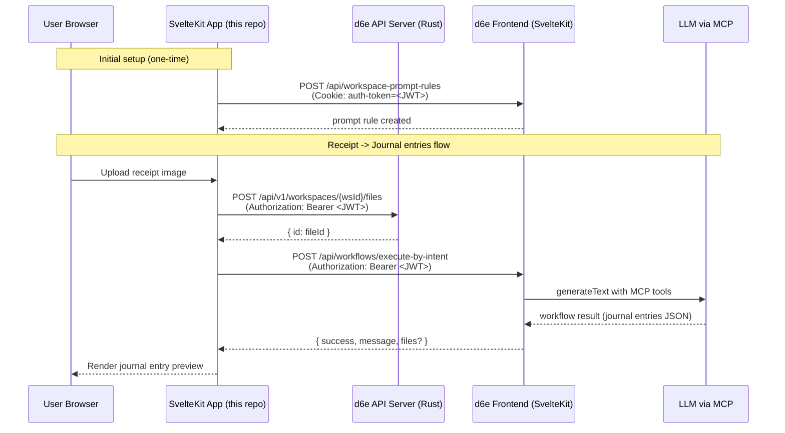
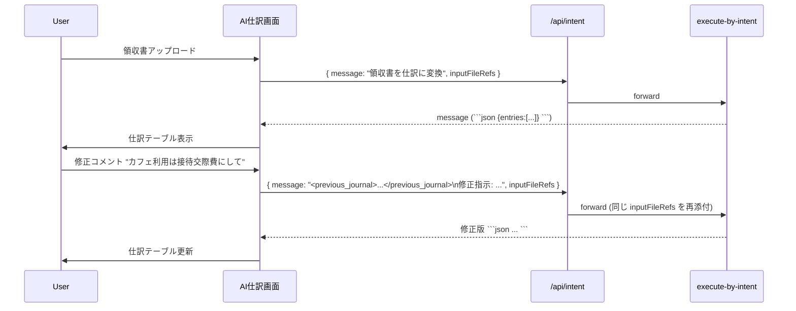

# d6e-ai-keiri-example 初期実装プラン

d6e API（`/api/workflows/execute-by-intent`）を呼び出す AI 経理デモアプリを新規 SvelteKit リポジトリとして作成し、
フロントエンド・API プロキシ・ワークスペース初期化スクリプト・関連ドキュメントを1つのリポジトリにまとめます。

関連 Issue: [#1 d6e-ai-keiri-example の初期実装](https://github.com/d6e-ai/d6e-ai-keiri-example/issues/1)

## 目的とスコープ

- d6e API を「薄く」叩く AI 経理アプリの実装一式（フロント + 初期化スクリプト + 関連ドキュメント）を1リポジトリにまとめる。
- ベースデザインは Google Workspace inspired モック（[ai-keiri-design-google-workspace](https://ai-keiri-design-google-workspace.pages.dev/)）の構成を踏襲（厳密追従はしない）。
- 認証は環境変数の固定 JWT（管理者発行）で動かす最小構成。本格的な d6e-auth ログイン連携は別フェーズ（C 案）として `docs/migration-to-full-integration.md` に独立プランを残す。
- 保守と機能追加は後任者に引き継ぐため、コードと同等以上にドキュメント整備を重視する。

## アーキテクチャ



ポイント：

- ブラウザ → 本アプリの SvelteKit サーバ → d6e API/Frontend の二段構成。JWT はブラウザに露出させない。
- 「AI 経理」専用の振る舞いは workspace 単位の prompt rule で表現する（カスタムワークフロー登録は今回スコープ外、必要なら C 案で対応）。

## リポジトリ構成

```
d6e-ai-keiri-example/
├── README.md                    # Quick start / アーキ概要 / docs リンク
├── CLAUDE.md                    # Claude / Cursor 向け規約（d6e-construction-frontend ベース）
├── AGENTS.md                    # AGENTS 規約（同上）
├── .env.example                 # 環境変数テンプレ
├── .gitignore / .prettierrc / .prettierignore
├── package.json / tsconfig.json / svelte.config.js / vite.config.ts
├── project.inlang/              # Paraglide 設定
├── messages/
│   ├── ja-JP.json
│   └── en-US.json
├── docs/
│   ├── architecture.md          # 構成・データフロー（mermaid 図含む）
│   ├── d6e-api-integration.md   # execute-by-intent / files upload 仕様メモ
│   ├── workspace-setup.md       # 初期化スクリプトの使い方 + プロンプト例
│   ├── llm-output-contract.md   # LLM 出力契約 (JSON schema + パース仕様)
│   └── migration-to-full-integration.md  # B → C 移行プラン
├── scripts/
│   ├── init-workspace.mjs       # workspace_prompt_rules の自動設定
│   └── prompts/
│       └── ai-keiri-prompt.md   # prompt rule 本文 (単一情報源)
├── static/
└── src/
    ├── app.html / app.d.ts
    ├── routes/
    │   ├── +layout.svelte                  # サイドバー + 本文の二カラム
    │   ├── +page.svelte                    # AI 仕訳画面（領収書 → 仕訳）
    │   ├── tasks/+page.svelte              # 完了タスク（モックリスト）
    │   ├── ask/+page.svelte                # 「尋ねる」自由入力チャット
    │   └── api/
    │       ├── upload/+server.ts           # 画像 → d6e files API プロキシ
    │       └── intent/+server.ts           # execute-by-intent プロキシ
    └── lib/
        ├── components/
        │   ├── ui/                         # shadcn-svelte（CLI で生成）
        │   ├── app-sidebar.svelte
        │   ├── receipt-uploader.svelte
        │   ├── task-card.svelte
        │   ├── journal-result.svelte      # 仕訳結果テーブル (読み取り専用)
        │   └── revise-comment-form.svelte # 修正コメント入力 + 再生成ボタン
        ├── server/
        │   ├── d6e-client.ts               # fetch ラッパ（JWT 注入）
        │   └── env.ts                      # 環境変数バリデーション
        ├── parse-journal.ts                # ```json``` 抽出 + Zod 検証
        ├── journal-schema.ts               # Zod スキーマ + TS 型 (entries / warnings)
        ├── mock-data/
        │   └── tasks.ts                    # 仕訳途中タスクのモック
        ├── paraglide/                      # 自動生成（編集しない）
        └── utils.ts                        # cn() ほか
```

## 機能仕様

### 画面

- `/`（AI 仕訳）
  - 領収書画像のドロップゾーン + ファイル選択ボタン。
  - 「仕訳途中」のタスクカードリスト（status / date / 枚数 / 金額 / 説明）。データは `mock-data/tasks.ts`。
  - 画像をアップロードすると `/api/upload` → `/api/intent` の順に呼び、結果は仕訳結果テーブル（`journal-result.svelte`、読み取り専用）として表示。
  - テーブルの下に「修正コメント」入力欄（`revise-comment-form.svelte`）。コメント送信で再生成（後述の修正フロー参照）。
- `/tasks`（完了タスク）：モック表示のみ。
- `/ask`（尋ねる）：単純な 1 ターン入力フォーム。経理関連の一般質問（勘定科目の説明、税区分の判定基準など）を投げて結果を表示。

### サーバ側 API プロキシ

- `POST /api/upload`（`src/routes/api/upload/+server.ts`）
  - 受け取った `File` を base64 化し、`POST {D6E_API_URL}/api/v1/workspaces/{D6E_WORKSPACE_ID}/files`（`Authorization: Bearer ${D6E_JWT}`）に転送。`{ id, filename, mimeType, sizeBytes }` を返す。
- `POST /api/intent`（`src/routes/api/intent/+server.ts`）
  - body: `{ message, inputFileRefs? }`。
  - `POST {D6E_FRONTEND_URL}/api/workflows/execute-by-intent`（`Authorization: Bearer ${D6E_JWT}`）に転送し、`workspaceId` をサーバ側で注入。
  - レスポンス（`IntentResponse`）をそのままクライアントに返す。

`src/lib/server/d6e-client.ts` に共通の `callD6eApi` / `callD6eFrontend` を実装。エラー時は `[d6e-client] ...` プレフィックス + 関数名 + 主要パラメータをログに出す。

### LLM 出力契約とパース

`execute-by-intent` の戻り値 `IntentResponse.message` は自由形式テキストなので、フロント側で安定して構造化表示するために「JSON code block 抽出方式」を採用する。

#### 1. 出力契約（prompt rule に書き込む）

`scripts/prompts/ai-keiri-prompt.md` を単一情報源として、以下の3シナリオを日本語で指示する。

- **シナリオ A: 仕訳作成**（領収書画像が添付されている場合）
- **シナリオ B: 仕訳修正**（メッセージに `<previous_journal>` 付き JSON が含まれる場合）
- **シナリオ C: 一般経理質問**（画像も `<previous_journal>` もない場合）

シナリオ A / B では必ず ` ```json ` コードブロック内に下記スキーマで出力させ、それ以外の自然文は1〜2文の前置きに抑える。シナリオ C はマークダウン生表示。

```json
{
	"kind": "journal",
	"entries": [
		{
			"date": "2026-04-30",
			"debit_account": "消耗品費",
			"credit_account": "現金",
			"amount": 1280,
			"tax_amount": 116,
			"description": "コンビニ事務用品"
		}
	],
	"warnings": []
}
```

#### 2. パース層（`src/lib/parse-journal.ts` + `journal-schema.ts`）

- `extractJsonBlocks(message: string): unknown[]`：` ```json ... ``` ` を正規表現で全件抽出（複数ブロック対応）。
- Zod スキーマ `JournalResultSchema`（`kind: 'journal'` を tagged union のディスクリミネータとして使用）で `safeParse`。
- 成功 → `journal-result.svelte` でテーブル表示。
- 失敗（コードブロックなし／パースエラー）→ `[parse-journal] failed: <reason>` を console に出し、警告バナー + マークダウン生表示にフォールバック。

#### 3. 「仕訳登録前の修正」フロー

テーブル UI 上で直接編集はせず、自然言語の修正コメントを LLM に渡して再生成する方式。



- 前回 JSON は `<previous_journal>...</previous_journal>` タグで囲んでメッセージに埋め込む（prompt rule のシナリオ B トリガ）。
- `inputFileRefs` は同じ `fileId` を再添付し、LLM が元画像を再参照できるようにする。
- 履歴は当面クライアント状態だけで保持（リロードで消える）。永続化は C 案で `chat_session` 連携。

### 初期化スクリプト

`scripts/init-workspace.mjs`（Node 20、依存ゼロ・`fetch` のみ）

- 環境変数 `D6E_FRONTEND_URL` / `D6E_AUTH_COOKIE`（= `auth-token` の値） / `D6E_WORKSPACE_ID` を読む。
- `POST {D6E_FRONTEND_URL}/api/workspace-prompt-rules`（`Cookie: auth-token=<JWT>`）に AI 経理向けプロンプト本文を 1 件送信。
- プロンプト本文は `scripts/prompts/ai-keiri-prompt.md` を単一情報源として読み込む。
- 既知の注意点：このエンドポイントは Bearer 認証ではなく Cookie 認証なので、Bearer JWT そのままでは通らない。README に取得手順（d6e フロントのブラウザ DevTools で `auth-token` Cookie をコピーする）を明記する。

### 環境変数（`.env.example`）

- `D6E_API_URL`（例: `http://localhost:8000`、Rust API）
- `D6E_FRONTEND_URL`（例: `http://localhost:5173`、SvelteKit 側）
- `D6E_JWT`（Bearer 用 access token）
- `D6E_WORKSPACE_ID`（UUID）
- `D6E_AUTH_COOKIE`（初期化スクリプト専用、`auth-token` Cookie 値）

`src/lib/server/env.ts` で起動時に必須変数の存在を検証し、欠落時はわかりやすいエラーを投げる。

## 技術スタック

[d6e-construction-frontend](https://github.com/d6e-ai/d6e-construction-frontend) と揃える：

- SvelteKit 2.x + Svelte 5（Runes）
- TypeScript strict
- Tailwind CSS v4 + shadcn-svelte（`src/lib/components/ui/`）
- Paraglide（base locale `ja-JP`、UI 文字列は英語、表示文言のみ i18n 化）
- `@lucide/svelte` アイコン（`XxxIcon` 形式）
- `@sveltejs/adapter-vercel`
- Prettier（tabs / single quotes / no trailing commas / printWidth 100）+ `prettier-plugin-sort-imports` + `prettier-plugin-svelte` + `prettier-plugin-tailwindcss`

## ドキュメント方針

`docs/` 5 ファイルで「初見の人が 30 分で動かせる」状態を目指す：

- `architecture.md`：上記 mermaid 図 + 各ディレクトリの役割。
- `d6e-api-integration.md`：`/api/workflows/execute-by-intent` の request/response、`inputFileRefs` 形式、`/api/v1/workspaces/{id}/files` の使い方を抜粋して引用元の本家コードへリンクを張る。
- `workspace-setup.md`：`npm run init` の手順 + プロンプト本文ファイル（`scripts/prompts/ai-keiri-prompt.md`）の参照方法 + 失敗時のトラブルシュート。
- `llm-output-contract.md`：JSON schema の正式定義、各シナリオのトリガ条件、パース失敗時の挙動、prompt rule をチューニングする際のチェックリスト。
- `migration-to-full-integration.md`：下記「C 案移行プラン」を独立ファイルとして詳細化。

## C 案（フル連携）への移行プラン（要約）

`docs/migration-to-full-integration.md` に書く骨子：

1. **認証**：固定 JWT → d6e-auth の OAuth リダイレクトに置換。`+hooks.server.ts` で Cookie ベースのセッション検証、`+layout.server.ts` でユーザー情報取得。
2. **ワークスペース選択**：環境変数の 1 つ固定 → ユーザーの所属ワークスペース一覧から選択。`/api/v1/workspaces` を叩いて切替 UI を追加。
3. **専用 STF / Workflow**：プロンプトベース → [d6e-app-invoice-jp](https://github.com/d6e-ai/d6e-app-invoice-jp) と同形式の `template.yaml` + STF を本リポジトリに同梱し、d6e App Marketplace 経由でインストール可能にする。
4. **多ユーザー対応**：固定の `D6E_WORKSPACE_ID` を除去し、ユーザーごとに分離。タスク一覧もモック → d6e DB に保存する形へ。
5. **ファイル永続化**：今は files API への単発アップロード。C 案では保存済み領収書一覧の照会、Google Drive 連携などへ拡張。

## 注意点・前提

- `/api/workflows/execute-by-intent` は内部用途で安定 API 保証は弱い。本家更新の追従責任を README で明示。
- `workspaceId` は UUID 必須（`UUID_RE` で検証される）。
- `inputFileRefs` の `fileId` は事前アップロードした Storage の UUID。本実装ではアップロード API のレスポンスをそのまま引き渡す。
- 50,000 文字のプロンプト上限（`/api/workspace-prompt-rules` の検証）。初期プロンプトはこれを超えない短さに保つ。
- `auth-token` Cookie は HttpOnly。初期化スクリプトのために手動コピーが必要、という運用ノートを README に明記。
- LLM 出力契約は prompt rule に強く依存する。LLM がスキーマを逸脱したケースに備えて、`parse-journal.ts` は必ず警告 + マークダウン生表示にフォールバックさせ、UI が真っ白にならないようにする。
- `execute-by-intent` のシステムプロンプトには「ワークフロー → instant-run STF → 直接回答」の優先順位がハードコードされており、ワークフロー / STF が未登録の本構成では LLM が直接回答する経路に落ちる想定。prompt rule の "Workspace context" 末尾追記がこの直接回答の振る舞いを支配することを `docs/llm-output-contract.md` で明記する。

## todos

- [ ] SvelteKit + Tailwind v4 + shadcn-svelte + Paraglide の雛形を作成
- [ ] `scripts/prompts/ai-keiri-prompt.md`、`src/lib/journal-schema.ts`、`src/lib/parse-journal.ts` を実装
- [ ] サイドバー + AI 仕訳画面（ドロップゾーン + タスクカード）を実装
- [ ] `journal-result.svelte` と `revise-comment-form.svelte` を実装
- [ ] `/tasks` と `/ask` 画面を作成
- [ ] `/api/upload`, `/api/intent` のサーバープロキシと d6e-client / env を実装
- [ ] アップロード → 仕訳テーブル表示までを結線
- [ ] `scripts/init-workspace.mjs` を実装
- [ ] README + `docs/` 5 ファイルを作成
- [ ] AGENTS.md / CLAUDE.md / .prettierrc / .env.example / .gitignore
- [ ] main 宛に PR を作成（Closes #1）
