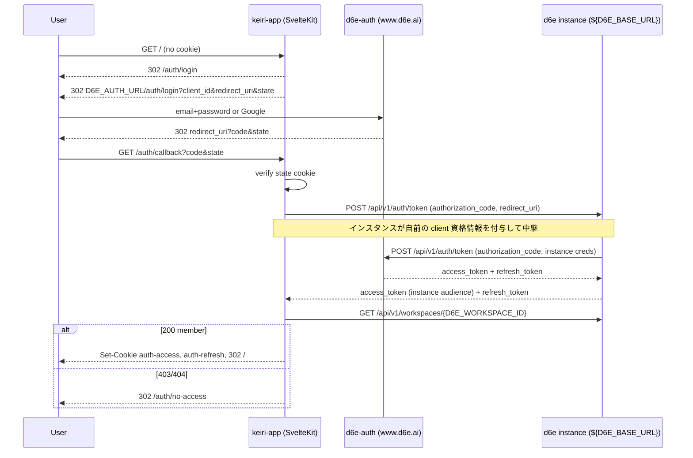

# インスタンス仲介型 OAuth 認証への移行

フロントエンドごとに d6e-auth へ独自クライアント登録（`client_id` /
`client_secret`）して二段階トークン交換する現行方式をやめ、認可コードを
**d6e インスタンス自身のトークンエンドポイント**で交換する「インスタンス
仲介型」へ置き換える。インスタンスが自前のクライアント資格情報を付与して
d6e-auth へ中継するため、本フロントエンドは `client_secret` を持たず、交換
結果はそのままインスタンスの audience を持つ。新規フロントエンド追加時の
クライアント登録作業をなくすのが目的。

## ゴール

1. ログイン時の認可コード交換を `${D6E_BASE_URL}/api/v1/auth/token`
   （d6e インスタンス）に一本化する。`client_id` / `client_secret` は
   送らない。二段階目（refresh による再交換）を撤去。
2. `D6E_AUTH_CLIENT_SECRET` を廃止し、`D6E_AUTH_CLIENT_ID` は「インスタンス
   自身の client_id」を指す変数に意味を変更する。
3. コード・`.env.example`・ドキュメント・Agent Skill を一括で整合させる。
   旧方式（自前クライアント + 二段階交換）は「インスタンスを運用しない
   開発者向けの代替手段」として Skill に残す（ハイブリッド方針）。
4. d6e 本体の `.env.example` に `ALLOWED_REDIRECT_URIS` を追記する。

## 認証フロー（新）

## 主な変更点（keiri-example）

### コード

- `src/lib/server/oauth.ts`
  - `exchangeAuthorizationCode(caller, code)` を `${D6E_BASE_URL}/api/v1/auth/token`
    へ送るよう変更。body は `grant_type` / `code` / `redirect_uri` のみ
    （`client_id` / `client_secret` を送らない）。
  - `getD6eAuthClientSecret` の import を削除。ヘッダコメント・
    `buildAuthorizeUrl` コメントをインスタンス仲介型に更新。
- `src/routes/auth/callback/+server.ts`
  - Stage 2（`refreshAccessTokenViaBaseUrl` 呼び出し）を撤去し、
    `exchangeAuthorizationCode` の結果を直接セッションへ。import と
    ヘッダコメントを更新。
- `src/lib/server/env.ts`
  - `getD6eAuthClientSecret()` を削除。`getD6eAuthClientId()` のコメントを
    「インスタンス自身の client_id」に更新。

### 設定 / ドキュメント

- `.env.example`：`D6E_AUTH_CLIENT_SECRET` を削除、`D6E_AUTH_CLIENT_ID` の
  説明を更新、OAuth セクションをインスタンス仲介型に書き換え。
- `README.md`：環境変数表・ログインシーケンス図・オンボーディング手順・
  Skill 表・caveats を更新。
- `docs/d6e-api-integration.md`：§4 を単段交換へ全面改稿、auth model 表を更新。
- `docs/architecture.md`：ログインシーケンス図・trust boundaries・モジュール
  表を更新。
- `docs/workspace-setup.md`：「インスタンス運用者向けログイン有効化」節を追加
  （redirectUris + `ALLOWED_REDIRECT_URIS`、Compose は `env_file: .env` で透過）。
- `docs/migration-to-full-integration.md`：Phase 1 に標準クライアント代替の
  注記を追加。
- `skills/d6e-auth-integration/SKILL.md`：主たる方式をインスタンス仲介型に
  し、「Alternative: standalone client」節を追加。`skills/README.md`・
  `CLAUDE.md` の関連記述も更新。

## d6e 本体の変更

- `.env.example` の Authentication セクションに `ALLOWED_REDIRECT_URIS` を
  追記（他フロントエンドのコールバック URL をカンマ区切りで許可）。Compose
  は `env_file: .env` で `api` サービスへ透過するため Compose 変更は不要。

## 対象外（このブランチでは触らない）

- `docs/d6e-overview-ja*.md`（別ブランチ `docs/d6e-overview-ja` で作業中の
  ため main 上に存在せず、本 MR には含めない）。

## 検証

- `npm run check` / `npm run format:check`。
- ログイン〜セッション更新の手動確認（インスタンスの allow-list 設定が前提）。
