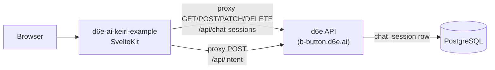
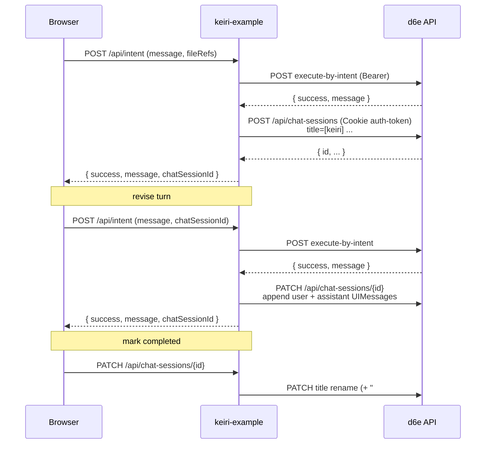

# Replace mock tasks with d6e chat_session

モックデータ (`src/lib/mock-data/tasks.ts`) を削除し、`/` の「対応待ちタスク」と `/tasks` の「完了タスク」を d6e の `chat_session` 由来データで描画する。仕訳生成・修正・一般質問・完了マーキングを d6e の `/api/chat-sessions` への proxy 経由で永続化する。

関連 Issue: [#3 Replace mock tasks with d6e chat_session](https://github.com/d6e-ai/d6e-ai-keiri-example/issues/3)

## 前提とデータモデル

- d6e の `chat_session` テーブルは `(id, workspaceId, title, messages jsonb, sns_source, external_conversation_key, createdAt, updatedAt)`。`sns_source=NULL` が通常 web セッション。
- `execute-by-intent` は SNS source 指定がない限り `chat_session` に書き込まない (`packages/frontend/src/routes/api/workflows/execute-by-intent/+server.ts`)。よって本実装では d6e-ai-keiri-example 側で `/api/chat-sessions` POST / PATCH を別途呼ぶ。
- d6e の `/api/chat-sessions` は cookie 認証 (`auth-token=<accessToken>`)。既存の `src/lib/server/d6e-token.ts` で取得した access_token を Cookie ヘッダに付ければ叩ける。
- ステータス判別は title の prefix + suffix で行う (DB schema 変更なし)。

### 命名規則

- 仕訳セッション title: `[keiri] {YYYY-MM-DD} ¥{total} ({entries.length}件)` (parse-journal 成功時)
  - fallback: `[keiri] {message の先頭 32 文字}` (parse 失敗時)
- 一般質問 title: `[keiri-ask] {question の先頭 32 文字}`
- 完了サフィックス: title 末尾に半角スペース + ` #completed` を追記
- `/` 表示対象: `[keiri] ` 始まり かつ ` #completed` を含まない
- `/tasks` 表示対象: `[keiri] ` 始まり かつ ` #completed` を含む
- `[keiri-ask] ` 始まりは両ページから除外 (将来 `/ask` での履歴表示用)

## アーキテクチャ





## 実装内容

### 1. d6e クライアント拡張

`src/lib/server/d6e-client.ts` に以下を追加。すべて `getAccessToken()` で取得した access_token を `Cookie: auth-token=<token>` ヘッダで送る (Bearer ではない)。401 時は `invalidateAccessToken()` + 1 度だけ retry する既存パターンに乗せる。

- `listChatSessions(workspaceId): Promise<ChatSessionRow[]>`
- `getChatSessionById(sessionId): Promise<ChatSessionRow>`
- `createChatSession({ workspaceId, title, messages }): Promise<ChatSessionRow>`
- `updateChatSession(sessionId, { title?, messages? }): Promise<ChatSessionRow>`
- `deleteChatSession(sessionId): Promise<void>`

### 2. SvelteKit proxy エンドポイント (新規)

- `src/routes/api/chat-sessions/+server.ts` (新規): `GET` (一覧), `POST` (新規作成)
- `src/routes/api/chat-sessions/[id]/+server.ts` (新規): `GET`, `PATCH`, `DELETE`

いずれもサーバ側で `D6E_WORKSPACE_ID` に固定し、誤って他 workspace を見ないようにする (既存の `/api/intent` と同じ方針)。

### 3. 共通ヘルパ (新規)

- `src/lib/journal-title.ts`
  - 定数: `KEIRI_PREFIX = '[keiri] '`, `ASK_PREFIX = '[keiri-ask] '`, `COMPLETED_SUFFIX = ' #completed'`
  - `buildJournalTitle(parsed, fallbackMessage)`
  - `buildAskTitle(question)`
  - `isJournalTitle(title)`, `isCompletedTitle(title)`, `markCompletedTitle(title)`, `unmarkCompletedTitle(title)`
- `src/lib/journal-task.ts`
  - `JournalTaskSummary` 型: `{ id, title, updatedAt, isCompleted, journal: JournalResult | null, rawAssistantText: string }`
  - `deriveJournalTaskSummary(row)` — `messages` 末尾の assistant text を `parse-journal.ts` で解析して件数 / 金額を導出
  - `filterJournalSessions(rows, { completed })`: title prefix / suffix で振り分け

### 4. UIMessage 形式の永続化

Phase 1 は text-only UIMessage を保存する。形式は d6e の AI SDK UIMessage に合わせる:

```ts
// user
{ id: <uuid>, role: 'user', parts: [{ type: 'text', text: message }] }
// assistant
{ id: <uuid>, role: 'assistant', parts: [{ type: 'text', text: rawMessage }] }
```

添付ファイル (parts に file 型を含める) は Phase 2 で対応する。Phase 1 では assistant message に元の markdown / JSON コードブロックがそのまま入っているので、`parse-journal` で再解析できる。

### 5. `/api/intent` 改修

`src/routes/api/intent/+server.ts` 修正:

- リクエスト body に以下を追加:
  - `chatSessionId?: string` — 既存セッションへの追記用
  - `persistAs?: 'journal' | 'ask'` — 新規作成時の prefix。省略時は `'journal'`
- execute-by-intent 成功後:
  - `chatSessionId` 指定あり → `getChatSessionById` で既存 messages を読み、user + assistant UIMessage を append して `updateChatSession`
  - 未指定 → `parse-journal` でタイトル生成 (`buildJournalTitle` or `buildAskTitle`) して `createChatSession`
- レスポンスに `chatSessionId` を追加

永続化失敗は `console.error` でログのみ。HTTP 200 は維持して LLM 応答自体は届ける。

### 6. SSR loader (新規)

- `src/routes/+page.server.ts` (新規): `load` で `listChatSessions(workspaceId)` Promise を `pendingTasks$` として返す (Promise streaming)。
- `src/routes/tasks/+page.server.ts` (新規): 同様に `completedTasks$` を返す。

呼び出し失敗時は空配列 Promise + エラー文字列を返してページ全体が落ちないようにする。

### 7. UI コンポーネント

- `src/lib/components/task-card.svelte` を `JournalTaskSummary` 受領に書き換え。クリック可能にし `onclick` callback を props で受ける。
- `src/lib/components/task-detail-dialog.svelte` (新規):
  - `bits-ui` の Dialog ベース
  - 既存 `JournalResult` を再利用して仕訳テーブル表示
  - 「完了にする」(未完了時のみ): PATCH で title を `markCompletedTitle` 後の文字列へ更新 → `invalidateAll()`
  - 「完了を取り消す」(完了時のみ): 逆操作
  - 「削除」: DELETE で削除 → `invalidateAll()`
- `src/routes/+page.svelte` 改修:
  - `pendingTasks$` を `{#await}` でレンダリング
  - 仕訳生成成功時に `chatSessionId` を state 保持 → revise 時に渡す → 成功後 `invalidateAll()`
- `src/routes/tasks/+page.svelte` 改修: 同様に `completedTasks$` を消費
- `src/routes/ask/+page.svelte` 改修: `/api/intent` 呼び出し body に `persistAs: 'ask'` を付ける
- Paraglide メッセージ (ja-JP / en-US) に dialog 用 i18n キーを追加

### 8. 削除対象

- `src/lib/mock-data/tasks.ts` (削除)
- `pendingTasks` / `completedTasks` / `JournalTask` 型への参照を全て削除

### 9. 検証

- `npm run check` で型エラーゼロ
- `npm run format`
- ブラウザで以下を手動確認 (画像アップロードは手元で実施):
  1. レシート画像をアップロード → カードが `/` に追加される
  2. revise コメント送信 → 同じカードが更新される
  3. カードクリック → 詳細ダイアログ → 「完了にする」 → `/tasks` に移動
  4. `/tasks` で「完了を取り消す」 → `/` に戻る
  5. `/ask` で質問 → カードは `/` / `/tasks` どちらにも出ない
  6. d6e UI 側で当該 workspace のチャット一覧に同タイトルのセッションが見える

## スコープ外 (Phase 2 以降)

- 仕訳セッションへの画像アタッチメントの UIMessage 永続化 (parts に file 型)
- `/ask` のマルチターン履歴 UI
- d6e UI 側との `sns_source` 切替 (d6e 本体側修正)
- Drive 未登録 / freee 連携などの外部 SaaS ステータス
