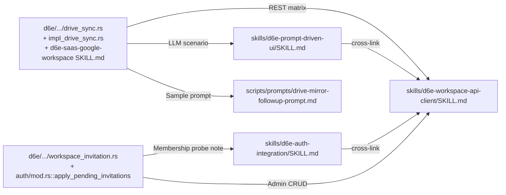

# Agent Skills を d6e 最新機能（Drive Sync / Pending Invitation）に追随させる

d6e 本体 (`gitlab.com/cauchye/d6e-ai/d6e`) に最近導入された以下の機能が、本リ
ポジトリの Agent Skills には未反映なので取り込む。

- **Google Drive Sync Mirror** (`feat/drive-sync-mirror` / `feat: cache Drive
  file reads with TTL eviction`) — 業務フォルダを `frontend.drive_sync_node`
  に同期し、`user_data.ws_<uuid>_drive_files` 投影テーブル経由で LLM (`d6e_sql`)
  に公開、未キャッシュの実体は `d6e_read_drive_file` MCP ツール / API の
  `/materialize` `/read` で `storage_file` に取り込む仕組み。REST API は
  `packages/api/src/routes/v1/drive_sync.rs` に新設。
- **Workspace Pending Invitation** (`feat(workspace): support pending
  invitations for unregistered users`) — `users` 行が存在しない email
  でもワークスペース招待を受け取れ、初回 JWT 認証時に
  `apply_pending_invitations` が自動で `workspace_membership` に昇格する。
  Admin 向け CRUD は `/api/v1/workspaces/{id}/invitations` (`workspace_invitation.rs`)。

## ゴール

1. `skills/d6e-workspace-api-client/SKILL.md` に Drive Sync REST API
   matrix と Workspace Invitation Admin API を追加し、URL / 認証
   ヘッダ / 必須 body の早見表を更新する。
2. `skills/d6e-auth-integration/SKILL.md` に pending invitation の
   自動昇格挙動を補足し、`verifyWorkspaceMembership` のフォールバック
   ロジックの解釈を更新する（403/404 を `no-access` に流す挙動は不変、
   ただし「招待だけして相手にログインしてもらえばよい」運用が可能）。
3. `skills/d6e-prompt-driven-ui/SKILL.md` に「Drive ミラー活用シナリオ」
   セクションを追加し、`drive_files` 投影テーブル → `d6e_read_drive_file`
   → `d6e_view_image` / `d6e_extract_file_text` という典型的なフロー
   と、それを引き出す prompt の書き方を例示する。
4. `scripts/prompts/drive-mirror-followup-prompt.md` を新設し、
   「シナリオ E: Drive ミラー検索からの仕訳提示」を `freee-registration-prompt.md`
   と同じ「シナリオ append 型 / 工房 UI で d6e AI に渡すアクティベーション
   ファイル」として配置する。`npm run init` の自動登録対象には含めない。
5. `skills/README.md` の「Available Skills」表で「Drive Sync 連携と
   workspace invitation も扱う」と簡潔に追記する。

非ゴール:

- d6e 本体の `drive_sync` / `workspace_invitation` 実装の修正・
  リファクタリング（本リポジトリの責務外）。
- Drive Sync UI（同期スイッチ、ピッカー）をこの keiri-example 上に
  実装すること。あくまで Skill ドキュメントとサンプル prompt の追加
  のみ。
- `verifyWorkspaceMembership` の戻り値変更（200/403/404 解釈は不変）。

## 編集対象ファイル

### `skills/d6e-workspace-api-client/SKILL.md`

- Authentication header matrix に以下を追加。
  | Endpoint | Auth | Notes |
  | --- | --- | --- |
  | `GET ${D6E_BASE_URL}/api/v1/drive-sync/config?workspace_id=…` | Bearer | Returns `{ config, roots }`. |
  | `PUT ${D6E_BASE_URL}/api/v1/drive-sync/config` | Bearer | Body: `{ workspace_id, enabled, sync_interval_seconds≥60 }`. |
  | `GET ${D6E_BASE_URL}/api/v1/drive-sync/roots?workspace_id=…` | Bearer | List of sync roots. |
  | `POST ${D6E_BASE_URL}/api/v1/drive-sync/roots` | Bearer | Body: `{ workspace_id, drive_id, drive_type∈{folder,shared_drive,my_drive}, name, shared_drive_id? }`; triggers an initial background sync. |
  | `DELETE ${D6E_BASE_URL}/api/v1/drive-sync/roots/{root_id}?workspace_id=…` | Bearer | Cascade-deletes nodes & rebuilds projection. |
  | `POST ${D6E_BASE_URL}/api/v1/drive-sync/sync` | Bearer | Body: `{ workspace_id }`. Returns immediately; status lands in `last_synced_at`/`last_sync_error`. |
  | `GET ${D6E_BASE_URL}/api/v1/drive-sync/status?workspace_id=…` | Bearer | `{ config, roots, node_count }`. |
  | `POST ${D6E_BASE_URL}/api/v1/drive-sync/materialize` | Bearer | Body: `{ workspace_id, node_id }`; downloads bytes into `storage_file`. |
  | `POST ${D6E_BASE_URL}/api/v1/drive-sync/read` | Bearer | Body: `{ workspace_id, drive_id }`; resolves Drive id → cached `storage_file` (TTL aware). |
  | `GET ${D6E_BASE_URL}/api/v1/drive-sync/picker?workspace_id=…&parent=…&shared_drives=…` | Bearer | Lists folders under `parent`, or shared drives. |
  | `GET ${D6E_BASE_URL}/api/v1/workspaces/{id}/invitations` | Bearer (admin) | Lists pending invitations (`{ id, workspace_id, email, role, invited_by_user_id, invited_by_user_name, created_at }`). |
  | `DELETE ${D6E_BASE_URL}/api/v1/workspaces/{id}/invitations/{invitationId}` | Bearer (admin) | Cancels a pending invitation. |
- 各エンドポイントは `auth::AuthContext` + `ensure_workspace_member`
  でガードされる点、`workspace_id` は URL パスに含めず body / query
  で渡すため SvelteKit プロキシは `pinWorkspaceId(payload)` のような
  サーバ側パッチで `D6E_WORKSPACE_ID` を上書きする責務がある点を Note
  で強調。
- 「Reference: optional helpers (not implemented in this repo)」
  小セクションを追加し、`registerDriveSyncRoot(caller, accessToken, payload)`
  / `triggerDriveSync(caller, accessToken)` などの実装テンプレを
  TypeScript 擬似コードで提示。
- Implementation Checklist に「If the app exposes Drive Sync controls,
  the workspaceId field is pinned server-side both in the JSON body
  and in the query string before forwarding.」を追加。
- Troubleshooting に「`drive-sync/sync` returns 200 immediately but
  `status.last_sync_error` is set」を追加し、`last_sync_error` を
  UI に出すこと、`/drive-sync/picker` の `shared_drives=true` で
  `corpora=drive` 経路を確認することなどを記載。

### `skills/d6e-auth-integration/SKILL.md`

- 「Workspace allow-list」セクションを **Workspace allow-list and
  pending invitations** に改名し、以下を追記。
  - d6e 本体は `provision_jwt_user` 内で `apply_pending_invitations`
    を呼び出し、未登録ユーザー宛て招待は **最初の JWT 認証付き
    リクエスト** (=`/auth/callback` 直後の `verifyWorkspaceMembership`
    でも可) で `workspace_membership` に昇格する。
  - したがって運用上は、未登録ユーザーに対してもまず admin が
    `POST /workspaces/{id}/members`（email 指定）で **pending
    invitation** を作っておけば、その email でログインしてもらうだけで
    `/auth/callback` の `verifyWorkspaceMembership` が 200 を返し、
    通常通り通る。
  - email の case-folding（`Foo@example.com` ≒ `foo@example.com`）は
    本体側で行うので、フロントエンドが正規化を重ねる必要はない。
  - フロントエンドは 403/404 と 5xx の挙動を変えなくてよい
    （pending → membership 化は通過するため）。ただし「招待を作って
    から相手のログインを待つ」運用フローを docs / UI コピーに反映
    すると親切。
- Implementation Checklist に「Admin が事前に
  `POST /workspaces/{id}/members` で email 招待しておけば、未登録
  ユーザーでも `/auth/callback` 通過後そのまま使える（クライアントは
  特別扱い不要）」を 1 行追加。

### `skills/d6e-prompt-driven-ui/SKILL.md`

- 「Core Concepts」 → 「Scenario classification」 表の下に「Drive
  ミラー活用シナリオ (optional)」セクションを追加。
  - LLM 側のトリガ: ユーザーメッセージが「過去の領収書を Drive から
    探して」などの探索要求を含む、あるいはシナリオ append で組み込まれた
    「シナリオ E」のシグナル句を含む。
  - 実行ステップ: `d6e_sql` で `SELECT drive_id, path, mime_type FROM
    drive_files WHERE path LIKE ...` → 候補ファイルから `d6e_read_drive_file`
    で `storage_file_id` を得る → `d6e_view_image` / `d6e_extract_file_text`
    で本文抽出 → シナリオ A と同じ `kind: "journal"` スキーマを返す。
  - 出力契約: 既存 `kind: "journal"` をそのまま再利用するか、
    `kind: "drive_search"` のような新 `kind` を返してから journal を
    返すかは UX 次第。最小実装は `kind: "journal"` のままで OK。
  - フォールバック: Drive ミラーが未設定 / 未同期の場合は LLM が
    `warnings` に「Drive 同期が未設定のため過去領収書から推定できません」
    と書いて従来のシナリオ A/C に落とすよう prompt で指示する。
- 「Implementation Checklist」に「Drive ミラーを利用する場合、未同期
  状態でもシナリオが破綻しないよう、prompt 側で `drive_files` が空でも
  フォールバックする経路を明記している」を追加。
- 「Related Skills」末尾に
  `[d6e-saas-google-workspace](https://gitlab.com/cauchye/d6e-ai/d6e/-/blob/main/packages/skills/d6e-saas-google-workspace/SKILL.md)`
  への外部リンクを 1 行追加。

### `scripts/prompts/drive-mirror-followup-prompt.md`（新規）

- `freee-registration-prompt.md` と同じ「**d6e の chat UI に手で
  貼り付ける** アクティベーション prompt」形式。`npm run init` で
  自動登録しない。
- 構成:
  1. Preamble（このファイルはルール登録ではなくシナリオ append 指示）。
  2. ガードレール（既存シナリオ A〜D を改変しない、
     `d6e_delete_workspace_prompt_rule` を呼ばない、idempotency check
     として「シナリオ E」ヘッディングが既に存在するなら何もしない）。
  3. MCP 手順（`d6e_list_workspace_prompt_rules` で対象ルール特定 →
     `d6e_call_external_api` で `drive_files` の存在確認 →
     `## 共通ルール` 直前に「### シナリオ E: Drive ミラー検索」を挿入）。
  4. テンプレ本文（シナリオ E の判定条件 / 実行ステップ / 出力フォーマット）。
- placeholder は `{{drive_root_hint}}` 程度（Drive 直下にどんなフォルダ
  名があるか LLM に教えるためのヒント）。プレースホルダが残ったまま
  登録されないよう post-condition も明記。

### `skills/README.md`

- 「Available Skills」表の `d6e-workspace-api-client` と
  `d6e-prompt-driven-ui` の説明文末尾に
  「(supports Drive Sync mirror endpoints / pending invitation API)」
  といった一句を追加し、追加範囲を一目で分かるようにする。
- 「Where to Look in the Reference Implementation」表に
  `scripts/prompts/drive-mirror-followup-prompt.md` を 1 行追加。

## 実装手順

1. `docs/skills-drive-sync-and-invitations` ブランチを `main` から切り、
   `.plans/skills-drive-sync-and-invitations.plan.md`（本ファイル）を
   コミット。
2. 各 SKILL.md を上記スコープで編集。Prettier の出力に注意（タブ +
   `printWidth: 100` / Markdown 表の `|` 位置）。
3. `scripts/prompts/drive-mirror-followup-prompt.md` を新規作成。
4. `skills/README.md` を微更新。
5. `npm run format:check` / `npm run check` をローカル実行。
6. コミットし `origin` に push して GitLab に MR を出す（target =
   `main`）。MR description に本 plan ファイルへのリンクを貼る。Issue
   は今回も省略（前回の運用に揃える）。

## 検証

- `npm run format:check` — Prettier クリーン。
- `npm run check` — svelte-kit sync は走るが、SKILL/Prompt のみの
  変更なので影響なし（実行して念のため確認）。
- `npx skills lint skills/<name>/SKILL.md` 相当を手作業で目視確認
  （skills CLI を持ち込まなくても、YAML frontmatter と相対リンクは
  目で見て検証）。
- 既存 `scripts/prompts/freee-registration-prompt.md` と新規
  `drive-mirror-followup-prompt.md` のスタイルが一致しているか
  確認（見出しレベル / preamble blockquote / ガードレール記述）。

## ロールアウト

- Skills 利用者は `npx skills update` で自動的に新エンドポイント表と
  pending invitation の補足を取り込める。breaking change は無い。
- `drive-mirror-followup-prompt.md` を有効化したいワークスペースは、
  d6e の chat UI にこのファイル内容を貼り付けて d6e AI に依頼する
  だけで、既存 prompt rule に「シナリオ E」が append される
  （`freee-registration-prompt.md` と同じ運用）。
