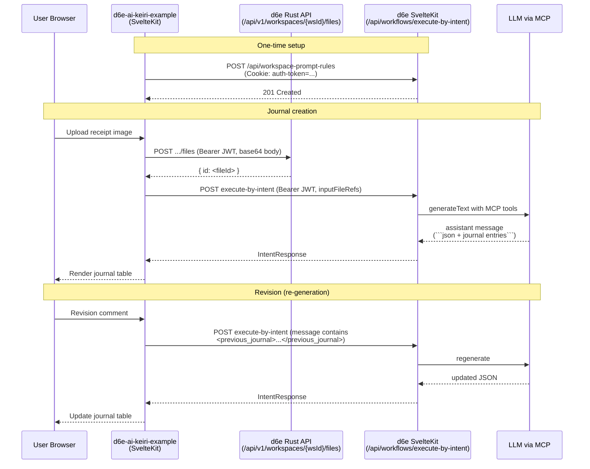

# Architecture

This document describes the request flow, deployment topology, and
directory layout of `d6e-ai-keiri-example`.

## Sequence



## Trust boundaries

- The browser only talks to this app's own SvelteKit server.
- All d6e Bearer JWTs live in environment variables on this server.
- The `auth-token` cookie value is used only by `scripts/init-workspace.mjs`,
  not by any runtime request path.

## Directory layout

```
src/
├── routes/
│   ├── +layout.svelte           # Sidebar + content shell
│   ├── +page.svelte             # AI Journal (root)
│   ├── tasks/+page.svelte       # Completed tasks (mock)
│   ├── ask/+page.svelte         # Free-form accounting Q&A
│   └── api/
│       ├── upload/+server.ts    # POST /api/upload  -> d6e Files API
│       └── intent/+server.ts    # POST /api/intent  -> execute-by-intent
└── lib/
    ├── components/
    │   ├── app-sidebar.svelte
    │   ├── receipt-uploader.svelte
    │   ├── task-card.svelte
    │   ├── journal-result.svelte
    │   └── revise-comment-form.svelte
    ├── server/
    │   ├── d6e-client.ts        # Bearer-authed fetch wrapper
    │   └── env.ts               # Lazy env-var validation
    ├── journal-schema.ts        # Zod schema for the LLM JSON contract
    ├── parse-journal.ts         # extractJsonBlocks + parseJournalMessage
    ├── mock-data/tasks.ts       # Pending / completed task fixtures
    ├── paraglide/               # Auto-generated i18n (do not edit)
    └── utils.ts                 # cn() and formatJpyAmount()
scripts/
├── init-workspace.mjs           # Register prompt rule on d6e
└── prompts/
    └── ai-keiri-prompt.md       # Single source of truth for LLM behaviour
docs/                            # This directory
messages/
├── ja-JP.json                   # Base locale
└── en-US.json
```

## Module responsibilities

| Module                                                      | Responsibility                                                                                            |
| ----------------------------------------------------------- | --------------------------------------------------------------------------------------------------------- |
| `src/lib/server/env.ts`                                     | Validate `D6E_*` env vars on first read with clear error messages.                                        |
| `src/lib/server/d6e-client.ts`                              | `uploadFile()` / `executeByIntent()` — single place that injects Bearer JWT and normalises upstream errors. |
| `src/routes/api/upload/+server.ts`                          | Accepts `multipart/form-data` and forwards each file to d6e Storage.                                      |
| `src/routes/api/intent/+server.ts`                          | Accepts JSON `{ message, inputFileRefs? }` and forwards to execute-by-intent, injecting `workspaceId`.    |
| `src/lib/parse-journal.ts`                                  | Pulls the first valid ` ```json ` block out of the assistant response and validates it with Zod.          |
| `src/lib/components/journal-result.svelte`                  | Renders the parsed journal as a read-only table; falls back to raw text on parse failure.                 |
| `src/lib/components/revise-comment-form.svelte`             | Captures the user's natural-language revision request and forwards it to the page.                        |
| `src/routes/+page.svelte`                                   | Owns the upload → parse → revise pipeline and the pending-task list.                                      |

## Failure model

- **d6e unreachable**: `D6eClientError` bubbles up with the upstream status
  and body. The route handler relays that status code back to the
  browser, and the AI Journal / Ask pages show a red banner.
- **JWT expired**: Same as above (typically 401). The user has to update
  `D6E_JWT` in `.env` and restart `npm run dev`.
- **LLM off-contract**: `parseJournalMessage` returns a `fallback` result.
  The UI shows a warning banner plus the raw assistant text. No data is
  thrown away.

## Deployment

The app is built with `@sveltejs/adapter-vercel`, so any Vercel project
can deploy it directly. Environment variables map 1:1 between `.env`
and the Vercel dashboard. The bootstrap script (`npm run init`) is a
one-shot script and is not part of the deployed runtime.
