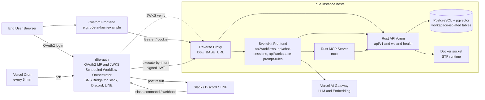
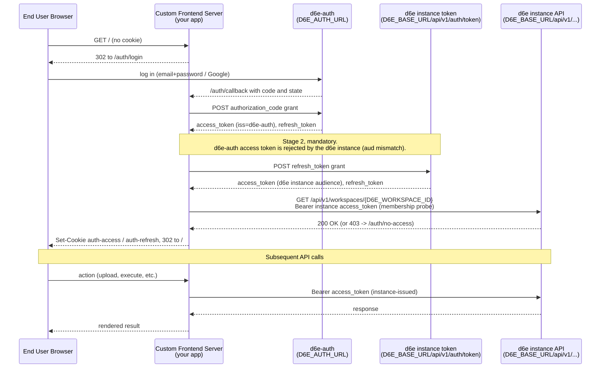

# d6e プラットフォーム概要(外部開発者向け / 日本語)

このドキュメントは、既存の d6e インスタンスに `.env` 相当の認証情報で接続して
**特化フロントエンド**を開発する外部開発者に向けて、d6e の全体像・主要エンドポイント・
ローカル起動方法を一枚にまとめた概要紹介です。

> [!NOTE]
> Discord では Mermaid 図がレンダリングされないため、
> **本ファイルへの GitHub リンク**を貼って共有してください。
> 詳細実装が必要な箇所は、本リポジトリの既存 docs(英語)へリンクで誘導しています。

## 1. d6e とは

d6e(Dialogue)は、自然言語でデータ操作・分析・ワークフロー実行が行える
**AI ネイティブな業務プラットフォーム**です。以下を 1 つの d6e インスタンス上で完結できます。

- **SQL ベースのデータ管理**:`ws_{workspace_id}_` プレフィックスでワークスペース分離された PostgreSQL を、SQL ライクに直接操作
- **Policy(行レベル相当のアクセス制御)**:`WHERE` 句インジェクション方式。違反は 403 を返す
- **STF(State Transition Function)**:JavaScript(QuickJS)または Docker で任意のロジックを実行
- **Workflow / Effect**:STF と HTTP リクエストプリセットをつないだ多段処理
- **MCP(Model Context Protocol)サーバー同梱**:AI クライアントから d6e のツール群を直接呼べる
- **API キー認証 + JWT(d6e-auth)認証**:audit log まで一元管理

詳細は [d6e/README.md](https://github.com/d6e-ai/d6e/blob/main/README.md) と
[d6e/CLAUDE.md](https://github.com/d6e-ai/d6e/blob/main/CLAUDE.md) を参照してください。

## 2. システム全体像



各コンポーネントの役割。

- **Reverse Proxy(`D6E_BASE_URL`)**:単一オリジン上で `/api/v1/*` を Rust API に、それ以外を SvelteKit Frontend に振り分ける(マネージド構成の場合は Caddy。[`compose.yml`](https://github.com/d6e-ai/d6e/blob/main/compose.yml) 参照)。
- **SvelteKit Frontend**:管理 UI と、本リポジトリのような外部フロントエンドが叩く高レベル API(`execute-by-intent`、`chat-sessions`、`workspace-prompt-rules` など)を提供。
- **Rust API(Axum)**:データ層に最も近い API。workspaces / files / sql / stf / workflow / effect / policy / embedding 等の CRUD と、`/ws`(WebSocket)・`/health` を提供。
- **Rust MCP Server**:Claude Desktop など MCP 対応クライアントから接続し、d6e のツール群(ファイル処理・SQL 等)を利用させる。
- **PostgreSQL + pgvector**:ワークスペースごとに `ws_{workspace_id}_<table>` プレフィックス命名で論理分離。
- **Docker socket**:STF を Docker ランタイムで実行する際に、API サーバから `/var/run/docker.sock` を read-only でマウントして利用([`compose.withdb.yml`](https://github.com/d6e-ai/d6e/blob/main/compose.withdb.yml))。
- **Vercel AI Gateway**:すべての LLM 呼び出しと埋め込みを集約。インスタンスは個別プロバイダキーを保持しない([d6e/.env.example](https://github.com/d6e-ai/d6e/blob/main/.env.example))。
- **d6e-auth**:複数の役割を兼ねる中心的なコンポーネント([d6e-auth リポジトリ](https://github.com/d6e-ai/d6e-auth))。
  - **OAuth2 IdP / JWKS**:エンドユーザーの認証と JWT 発行(§ 3 で詳述)。
  - **Scheduled Workflow Orchestrator**:Vercel Cron(5 分間隔)で `scheduled_workflow` テーブルを polling し、到来したスケジュールについて d6e-auth が JWT を sign して d6e インスタンスの `execute-by-intent` を Bearer 認証で呼び出す([`scheduled-workflow.ts`](https://github.com/d6e-ai/d6e-auth/blob/main/src/lib/server/scheduled-workflow.ts)、[`vercel.json`](https://github.com/d6e-ai/d6e-auth/blob/main/vercel.json))。
  - **SNS Bridge**:Slack slash command(`/d6e setup`、`/d6e schedule add/list/delete/pause/resume` 等、[`api/v1/slack/commands`](https://github.com/d6e-ai/d6e-auth/blob/main/src/routes/api/v1/slack/commands/+server.ts))、Discord interactions、LINE webhook から `execute-by-intent` を起動し、開始通知 → スレッド返信での結果通知(ファイル添付対応)まで自動で行う。
- **Vercel Cron**:`d6e-auth/vercel.json` で 5 分間隔のスケジュールが定義されており、スケジュール実行・月次付与・期間ロールオーバー等の定期処理を駆動する。
- **Slack / Discord / LINE**:エンドユーザーが自然言語で d6e ワークフローを叩く UI として、または cron 実行結果の配信先として機能する。

## 3. 接続方式(既存インスタンスへ `.env` 接続)

外部フロントエンドは、d6e インスタンスに直接 OAuth2 でログインさせるのではなく、
**自分のサーバ経由**で d6e-auth と d6e インスタンスの両方とトークンを交換します。

### 3.1 OAuth2 二段階トークン交換シーケンス



ポイント。

- d6e-auth から返ってくる最初の `access_token` は **`iss=d6e-auth`** で、d6e インスタンスの
  Rust API は `aud` 不整合で 401 を返します。
- そのため `refresh_token` を **すぐに** `${D6E_BASE_URL}/api/v1/auth/token` に再提示して、
  d6e インスタンス向けに署名された新しいペアに交換してから cookie に保存します。
- セッションリフレッシュ(`exp` の 60 秒前)も、d6e-auth ではなく
  **d6e インスタンスの token エンドポイント**で行います。
- 管理者向けの `scripts/init-workspace.mjs` も同じ二段階交換で `D6E_INIT_REFRESH_TOKEN` を
  使うため、エンドユーザーの cookie とは独立しています。

詳細は [`docs/architecture.md`](architecture.md) の Sequence 節と
[`src/lib/server/oauth.ts`](../src/lib/server/oauth.ts) /
[`src/lib/server/session.ts`](../src/lib/server/session.ts) を参照。

### 3.2 必要な環境変数(本リポジトリ [`.env.example`](../.env.example) より)

```
D6E_BASE_URL=https://your-d6e-instance.example.com
D6E_WORKSPACE_ID=<UUID>
D6E_AUTH_URL=https://www.d6e.ai
D6E_AUTH_CLIENT_ID=<client id>
D6E_AUTH_CLIENT_SECRET=<client secret>
D6E_AUTH_REDIRECT_URI=http://localhost:5173/auth/callback
D6E_INIT_REFRESH_TOKEN=<admin refresh token for npm run init>
```

- `D6E_AUTH_REDIRECT_URI` は d6e-auth 側の `registered_client.redirectUris` に **完全一致**で
  事前登録されている必要があります(本番 URL と localhost をそれぞれ登録)。
- `D6E_INIT_REFRESH_TOKEN` はワークスペース管理者のリフレッシュトークン(エンドユーザーの
  `auth-refresh` cookie とは別物)です。`/api/workspace-prompt-rules` への POST のみで使います。

## 4. 開発に使える主要エンドポイント

### 4.1 Rust API(Axum) - `${D6E_BASE_URL}/api/v1/*`

**認証:** `Authorization: Bearer <instance-issued access_token>` +
ワークスペーススコープが必要なものは `X-Workspace-ID: <UUID>` を付与。
ソース:[d6e/packages/api/src/routes/v1/](https://github.com/d6e-ai/d6e/tree/main/packages/api/src/routes/v1)

主なネスト([d6e/packages/api/src/routes/v1/mod.rs](https://github.com/d6e-ai/d6e/blob/main/packages/api/src/routes/v1/mod.rs))。

- `/admin` - インスタンス管理
- `/auth` - `POST /api/v1/auth/token`(リフレッシュ含むトークン発行、二段階交換の Stage 2 で使用)
- `/workspaces` - ワークスペース CRUD、メンバーシップ
- `/workspaces/{id}/files/multipart` - ファイルアップロード(後述)
- `/sql` - ワークスペース分離された SQL 実行
- `/stfs` - JavaScript / Docker で実行する State Transition Function
- `/stf-libraries` - STF が `import` できる共通ライブラリ
- `/effects` - HTTP リクエストプリセット(STF / Workflow から呼び出し)
- `/workflows` - STF と Effect を順次実行するワークフロー
- `/policies` / `/policy-groups` - テーブル単位のアクセス制御
- `/api-keys` - WebSocket・サーバ間連携用の API キー発行
- `/audit-logs` - 監査ログ
- `/pinned-charts` - ダッシュボード固定チャート
- `/saas-proxy` / `/saas-proxy-download` - 外部 SaaS への安全な中継

加えてルート直下に以下があります([d6e/packages/api/src/lib.rs](https://github.com/d6e-ai/d6e/blob/main/packages/api/src/lib.rs))。

- `GET /health` - ヘルスチェック
- `GET /ws` - WebSocket。`Authorization: Bearer <API key>` + `X-Workspace-ID` で接続し、
  ワークスペースのブロードキャストイベントを購読([d6e/packages/api/src/routes/ws.rs](https://github.com/d6e-ai/d6e/blob/main/packages/api/src/routes/ws.rs))。

### 4.2 SvelteKit Frontend が提供する高レベル API - `${D6E_BASE_URL}/api/*`

本リポジトリで実際に使っている 3 系統。詳細リクエスト / レスポンスは
[`docs/d6e-api-integration.md`](d6e-api-integration.md) に網羅されています。

- **ファイルアップロード**:`POST /api/v1/workspaces/{wsId}/files/multipart`(Rust API 側)
  - 本アプリでは [`src/routes/api/upload/+server.ts`](../src/routes/api/upload/+server.ts) が
    `multipart/form-data` をそのまま中継。
- **自然言語ワークフロー実行**:`POST /api/workflows/execute-by-intent`(SvelteKit Frontend)
  - 本アプリでは [`src/routes/api/intent/+server.ts`](../src/routes/api/intent/+server.ts) が呼び出し。
  - LLM が ` ```json ... ``` ` ブロックで返す
    [`Journal` Zod スキーマ](../src/lib/journal-schema.ts) を契約として使う(後述)。
- **チャットセッション CRUD**:`GET / POST / PATCH / DELETE /api/chat-sessions[/{id}]`(SvelteKit Frontend)
  - 本アプリでは
    [`src/routes/api/chat-sessions/+server.ts`](../src/routes/api/chat-sessions/+server.ts) と
    [`src/routes/api/chat-sessions/[id]/+server.ts`](../src/routes/api/chat-sessions/%5Bid%5D/+server.ts)
    から呼び出し。Cookie: `auth-token=<access_token>` を使うことに注意(Bearer と同じ JWT)。
- **ワークスペースプロンプトルール登録**:`POST /api/workspace-prompt-rules`(SvelteKit Frontend)
  - LLM の挙動契約を 1 度だけ書き込む。本アプリは
    [`scripts/init-workspace.mjs`](../scripts/init-workspace.mjs) から `npm run init` で実行。

### 4.3 MCP サーバー - `${D6E_BASE_URL}/mcp`(または `${D6E_MCP_SERVER_URL}`)

Rust 製。Claude Desktop / Cursor などから MCP クライアントとして接続し、d6e の各種ツール
(Excel/CSV パース、SQL 実行、OCR など)を AI から直接利用させる用途
([d6e/packages/mcp/src/](https://github.com/d6e-ai/d6e/tree/main/packages/mcp/src))。

## 5. ローカル Docker 起動(シークレットが手元にあれば)

d6e は 2 種類の Compose 構成を同梱しています。
[d6e リポジトリ](https://github.com/d6e-ai/d6e) を clone し、
[`.env.example`](https://github.com/d6e-ai/d6e/blob/main/.env.example) をコピーして埋めれば
そのまま立ちます。

### 5.1 外部 DB に繋ぐ構成 - `compose.yml`

GHCR のビルド済みイメージ(`ghcr.io/d6e-ai/d6e-api:latest` ほか)を pull し、
Caddy を 80 / 443 で front して動かします。

```bash
cp .env.example .env
# DATABASE_URL を外部 Postgres に向ける + 下記シークレットを設定
docker compose up -d
```

### 5.2 DB ごと全部立ち上げる構成 - `compose.withdb.yml`

開発・検証向け。Postgres(pgvector 0.8.2-pg18)を同居させ、API / MCP / Frontend を
ソースからビルドします。

```bash
cp .env.example .env
docker compose -f compose.withdb.yml up -d
```

### 5.3 最低限必要なシークレット

[d6e/.env.example](https://github.com/d6e-ai/d6e/blob/main/.env.example) の必須項目から抜粋。

- `POSTGRES_PASSWORD` - DB パスワード(`compose.withdb.yml` 専用)
- `DATABASE_URL` - 外部 DB を使うとき(`compose.yml` 専用)
- `D6E_CONTAINER_TOKEN_SECRET` - STF Docker ランタイムが API に折り返すための HMAC キー。`openssl rand -base64 32` で生成
- `D6E_AUTH_URL` / `D6E_AUTH_CLIENT_ID` / `D6E_AUTH_CLIENT_SECRET` - d6e-auth(SaaS)と接続するためのクライアント認証情報。インスタンスごとに発行が必要
- `AI_GATEWAY_API_KEY` - Vercel AI Gateway のキー。本番は d6e-auth が自動配布するが、ローカル検証ではここに直接ピン留め可能
- `EMBEDDING_MODEL` / `EMBEDDING_DIMENSIONS` - 既定は `gemini-embedding-2-preview` / `768`

> マネージドの SaaS d6e-auth に接続できる**シークレット(`D6E_AUTH_CLIENT_*`)があれば**、
> 上記の手順で API / DB / MCP / Frontend をフルローカルで起動可能です。
> シークレットの払い出しは d6e-auth 管理者(現状は d6e 開発元)が行います。

## 6. 参考実装

実際の特化フロントエンドの一例として、本リポジトリ
[`d6e-ai-keiri-example`](../README.md) があります。日本の経理業務(レシート → 仕訳)を
題材に、上記のすべての要素(OAuth2 二段階交換、ファイルアップロード、`execute-by-intent`、
チャットセッション、ワークスペースプロンプトルール登録)を最小構成で実装しています。

実装にあたっての詳細解説は以下の docs(英語)を参照してください。

- [`docs/architecture.md`](architecture.md) - シーケンス図 / 信頼境界 / モジュール責務一覧
- [`docs/d6e-api-integration.md`](d6e-api-integration.md) - 全エンドポイントの request/response 仕様
- [`docs/workspace-setup.md`](workspace-setup.md) - ワークスペースの初期セットアップ手順
- [`docs/llm-output-contract.md`](llm-output-contract.md) - LLM 出力の JSON 契約(Zod パース + raw 表示フォールバック)
- [`docs/migration-to-full-integration.md`](migration-to-full-integration.md) - モックから本番統合への移行ガイド

再利用可能な Agent Skills も `skills/` 配下に同梱しています
(`d6e-auth-integration`、`d6e-workspace-api-client`、`d6e-prompt-driven-ui`)。

## 7. 追加要望と d6e の対応関係

外部開発者から「`skill2api`」「`deploy-harness`」「ローカルテスト環境ツール」「Layer X 風の
イベントフック起動エージェント」という要望が出ています。**結論として、要望の大部分は
d6e に既存の仕組みでカバーできており、本当に欠けているのは限定的**です。誤解を避けるため、
各要望の**本質的なゴール**と、d6e の既存機能(STF / Workflow / Effect / Workspace Prompt
Rule / `execute-by-intent`)との対応を明示します。

### 7.0 前提:d6e がすでに提供している実行モデル

| 抽象                            | d6e 上の実体                                                                   | 役割                                                                                                                                                                                                        |
| ------------------------------- | ------------------------------------------------------------------------------ | ----------------------------------------------------------------------------------------------------------------------------------------------------------------------------------------------------------- |
| 決定論的なサーバ側ロジック 1 つ | **STF**(`/api/v1/stfs`)                                                        | JavaScript(QuickJS)または Docker コンテナでユーザー定義コードを実行。バージョン管理つき([d6e/packages/api/src/routes/v1/stf.rs](https://github.com/d6e-ai/d6e/blob/main/packages/api/src/routes/v1/stf.rs)) |
| 複数 STF の合成                 | **Workflow**(`/api/v1/workflows`)                                              | STF と Effect(HTTP プリセット)を順次実行                                                                                                                                                                    |
| 外部 HTTP の呼び出し            | **Effect**(`/api/v1/effects`)                                                  | URL / ヘッダ / ボディマッピングを保存して、STF・Workflow から再利用                                                                                                                                         |
| 自然言語起点での起動            | **`execute-by-intent`** + **Workspace Prompt Rule**                            | "intent" を Workflow にルーティングし、LLM に決まった JSON 契約で結果を返させる([`docs/llm-output-contract.md`](llm-output-contract.md))                                                                    |
| マルチテナント境界              | **Workspace**(`/api/v1/workspaces`)                                            | テーブル名プレフィックス `ws_{workspace_id}_` と Policy で論理分離                                                                                                                                          |
| Workspace 固有のコンテナ実行    | **STF Docker runtime**                                                         | API サーバが `/var/run/docker.sock` を read-only でマウントし、オンデマンドで起動                                                                                                                           |
| ワークスペース内データ保管      | **PostgreSQL(pgvector)** + **File Storage**(`/api/v1/workspaces/{id}/files/*`) | SQL テーブル / ファイルともワークスペース分離                                                                                                                                                               |

「Skill」「agent」「ハーネス」と呼びたくなるものは、d6e ではこれらの組み合わせで表現されます。

### 7.1 `skill2api`:`SKILL.md` を OpenAPI 化してサーバで叩く構想

**本質的なゴール:** 自然言語で書かれた一連の処理(`.claude/skills/*/SKILL.md` 等)を、
サーバ上で実行可能な単位として呼び分けたい。

**d6e の対応:** 上の表の通り、STF / Workflow / Effect / Workspace Prompt Rule /
`execute-by-intent` の **5 点セットで機能的にはほぼ満たされています**。マッピングは下表の
とおりです。

| `SKILL.md` 側の要素                            | d6e 上の対応物                                                |
| ---------------------------------------------- | ------------------------------------------------------------- |
| 自然言語で書かれた "ふるまい"                  | **Workspace Prompt Rule**(`POST /api/workspace-prompt-rules`) |
| 引数 `$ARGUMENTS` の解釈                       | `execute-by-intent` の `message` と `inputFileRefs[]`         |
| 決定論的なロジック(DB に書く・外部 API を呼ぶ) | **STF**(JS / Docker)                                          |
| 複数の skill / step の連鎖                     | **Workflow** + **Effect**                                     |
| エンドポイント                                 | **`POST /api/workflows/execute-by-intent`**(1 本)             |

つまり「ワークスペースごとに、自然言語で呼び出せる skill が n 個ある」という世界は、
**`execute-by-intent` 1 本 + Workspace Prompt Rule の中で intent ごとに分岐**として
すでに動いています。本リポジトリ `d6e-ai-keiri-example` も、`領収書を仕訳に変換してください`
という intent を 1 つの Workflow にルーティングする最小例です。

**設計上の注意(なぜ「SKILL.md → OpenAPI 化」がそのまま入れにくいか):**

- `SKILL.md` は本来 **Claude Code / Cursor 等の LLM クライアントが自律的に発見・ルーティング**
  するためのフォーマットです。サーバ API として `/{workspace}/api/v1/<skill-name>` に
  固定化すると、自然言語からの skill 選択をサーバが担うことになり、結局
  **`execute-by-intent` をリブランディングしたものになります**。
- URL 設計 `/{workspace}/api/v1/<skill-name>` は、d6e の現行ルーティング
  (`/api/v1/<resource>` + `X-Workspace-ID` ヘッダ、ファイルだけ例外的に
  `/api/v1/workspaces/{id}/files/...`)と合いません。1 ワークスペース 1 オリジンという
  Vercel project 的な発想は、d6e の単一インスタンス・マルチテナントモデルとは前提が違います。
- `.claude/skills/*/SKILL.md` をサーバで実行するということは、結局 LLM をサーバサイドで
  呼ぶことになり、それは **Vercel AI Gateway 経由の `execute-by-intent` がすでに担当**しています
  ([d6e/.env.example](https://github.com/d6e-ai/d6e/blob/main/.env.example))。

**本当に追加価値が出るとしたら:** 「**`SKILL.md` 1 ファイル → 対応する STF / Workflow /
Workspace Prompt Rule を生成する変換 CLI**」だけ、というのが現在の整理です。これは d6e の
本流アーキテクチャと整合します(出力先が既存の API リソース)。

### 7.2 `deploy-harness`:`npx d6e-deploy workspace=xxxx` で agent api server をデプロイ

**本質的なゴール:** 自分のリポジトリで書いた agent ロジックを、CI で `main` マージ後に
自動でワークスペース環境に反映したい。

**d6e の対応:** こちらも **STF + Workflow + Workspace Prompt Rule への PUT / POST 1 本**で
ほぼ達成可能です。

- ロジックは **STF**(`POST /api/v1/stfs` または `PATCH /api/v1/stfs/{id}`)に書き込めば、
  **Workspace 固有の Docker コンテナとして即座に実行可能**になります。Docker socket を
  API サーバが持っているので、専用の deploy 基盤は不要です([d6e/compose.withdb.yml](https://github.com/d6e-ai/d6e/blob/main/compose.withdb.yml) の
  `volumes: /var/run/docker.sock:/var/run/docker.sock:ro`)。
- 連鎖は **Workflow** に書き、自然言語ルーティングは **Workspace Prompt Rule** に書きます。
- CI から自動更新する場合は、本リポジトリの
  [`scripts/init-workspace.mjs`](../scripts/init-workspace.mjs) と同じパターン
  (admin の refresh token を `${D6E_BASE_URL}/api/v1/auth/token` で交換 → 各リソースに
  POST / PATCH)で十分です。GitHub Actions から curl 数本で完結します。

**設計上の注意(なぜ「workspace ごとに別 API サーバをデプロイ」が d6e と矛盾するか):**

- d6e の **「Workspace」は 1 つの d6e インスタンス上の論理マルチテナント境界**であって、
  デプロイの実体ではありません([d6e/README.md](https://github.com/d6e-ai/d6e/blob/main/README.md))。
  ワークスペースごとに別の API サーバを立てるという単位はそもそも存在しません。
- Workspace 固有のコンテナ実行は **STF Docker runtime が既に担当**しています。
  ワークスペースをまたいだ実行はテーブルプレフィックス `ws_{workspace_id}_` と Policy で
  防がれており、`audit_log` も 1 つに集約されます。**ここに「workspace ごとに別サーバ」を
  足すと、課金集計・監査ログ・テナント分離の前提がすべて崩れます**。
- 既存の [d6e-deploy](https://github.com/d6e-ai/d6e-deploy) は SSH 経由で**インスタンス全体**を
  更新するオペレーション用スクリプトで、ワークスペース粒度のデプロイとは別レイヤーの話です。
- Layer X / [getaiworkforce.com](https://getaiworkforce.com/) のような「agent 単位・組織単位の
  個別デプロイ」モデルは、シングルテナント(または agent ごとに container を立てる)前提です。
  d6e はそれよりも 1 段上のレイヤー(=複数 agent / workspace が 1 インスタンス上に共存する
  プラットフォーム)を設計しているので、同じモデルは直接持ち込めません。

**本当に追加価値が出るとしたら:** 「**STF dev loop の DX**」、つまり「ローカルで STF コードを
編集 → 自動 push → 即動作確認 → CI で `main` マージ後に自動 push」を 1 本の CLI
(`d6e-stf push` 等)にまとめることです。これは d6e の本流に乗ったまま、CI 自動更新の
ユーザビリティだけを上げる方向です。

### 7.3 ローカルテスト環境ツール(DB / ストレージ含む)

**本質的なゴール:** DB やストレージを含めて、agent 開発ライフサイクルをローカルで回したい。

**d6e の対応:** これは **`compose.withdb.yml` で既に完結**しています。

- Postgres(`pgvector/pgvector:0.8.2-pg18`)+ API + MCP + Frontend を 1 コマンドで起動
  ([d6e/compose.withdb.yml](https://github.com/d6e-ai/d6e/blob/main/compose.withdb.yml))。
- File Storage は d6e の `/api/v1/workspaces/{id}/files/*` 経由で **DB に永続化**されます。
  S3 / GCS のような外部オブジェクトストレージは不要です。
- d6e-auth(`D6E_AUTH_CLIENT_*`)の払い出しさえあれば、**本番と同じ OAuth2 二段階交換**で
  ローカル検証できます(§ 3.1 のシーケンスはローカルでもそのまま成立)。

**本当に欠けているのは:** ここでも「**STF dev loop**」(ホットリロード、ローカル LLM 切替の
UX)で、新規のハーネスを立てる話ではありません。

### 7.4 Layer X 風モデル(イベントフック → バックグラウンド agent → 成果物配置)

**本質的なゴール:** 自然言語チャットだけでなく、**イベント**(cron / Slack コマンド /
Discord interaction / LINE webhook / ファイル到着 等)をトリガに、エージェントが
バックグラウンドで動き、成果物を起点元(SNS チャネル等)に返す、という業務ワークフロー
全体を回したい。

**d6e の対応:** **大半が d6e + d6e-auth で既に実装済み**です。トリガ(cron・SNS slash
command・SNS webhook)・実行・結果配信までの一連のループは、**d6e-auth が
オーケストレータとして担当**しています(§ 2 の全体図参照)。

| Layer X 風モデルの要素                     | d6e + d6e-auth 側の対応                                                                                                                                                                                                                                                                                                                                                                                                                                                                                                                                                                                                                                                                                                     |
| ------------------------------------------ | --------------------------------------------------------------------------------------------------------------------------------------------------------------------------------------------------------------------------------------------------------------------------------------------------------------------------------------------------------------------------------------------------------------------------------------------------------------------------------------------------------------------------------------------------------------------------------------------------------------------------------------------------------------------------------------------------------------------------- |
| エージェント本体                           | **STF**(JS / Docker)— 既存                                                                                                                                                                                                                                                                                                                                                                                                                                                                                                                                                                                                                                                                                                  |
| 複数エージェントの合成                     | **Workflow** + **Effect** — 既存                                                                                                                                                                                                                                                                                                                                                                                                                                                                                                                                                                                                                                                                                            |
| 自然言語起点での起動                       | `execute-by-intent` — 既存                                                                                                                                                                                                                                                                                                                                                                                                                                                                                                                                                                                                                                                                                                  |
| 成果物の保存先(d6e 内)                     | Workspace 内 SQL テーブル / File Storage / `audit_log` — 既存                                                                                                                                                                                                                                                                                                                                                                                                                                                                                                                                                                                                                                                               |
| **Cron / スケジュール起動**                | **既存**:d6e-auth の `scheduled_workflow` テーブル(`cron_expression`、`timezone`、`next_run_at` を保持、[schema.ts](https://github.com/d6e-ai/d6e-auth/blob/main/src/lib/server/db/schema.ts))を、Vercel Cron が `vercel.json` の `*/5 * * * *` で polling し、到来した schedule について d6e-auth が JWT を sign して `${baseUrl}/api/workflows/execute-by-intent` を呼び出す([scheduled-workflow.ts](https://github.com/d6e-ai/d6e-auth/blob/main/src/lib/server/scheduled-workflow.ts))。                                                                                                                                                                                                                                |
| **Slack 起動**(slash command / メンション) | **既存**:`/d6e setup <client-id>` で Slack workspace を d6e instance に紐付け、`/d6e schedule add daily 09:00 <intent>` のような自然言語でスケジュール作成・一覧・一時停止が可能([api/v1/slack/commands](https://github.com/d6e-ai/d6e-auth/blob/main/src/routes/api/v1/slack/commands/+server.ts))。チャネルメンションでの即時実行もある。                                                                                                                                                                                                                                                                                                                                                                                 |
| **Discord 起動**(interaction)              | **既存**:[api/v1/discord/interactions](https://github.com/d6e-ai/d6e-auth/blob/main/src/routes/api/v1/discord/interactions/+server.ts) と `register-discord-commands.js` で Slack 同等のコマンドセットを提供。                                                                                                                                                                                                                                                                                                                                                                                                                                                                                                              |
| **LINE 起動**(webhook)                     | **既存**:[api/v1/line/webhook](https://github.com/d6e-ai/d6e-auth/blob/main/src/routes/api/v1/line/webhook/+server.ts) で受信、ファイル添付は `line_pending_file` テーブルに一時保管した上で d6e の File Storage に転送。                                                                                                                                                                                                                                                                                                                                                                                                                                                                                                   |
| **成果物の SNS 配信**                      | **既存**:`notifyStart` で開始通知 → 実行 → `notifyResult` でスレッド / 返信形式の結果通知。生成ファイル(`result.files[]`)は Buffer 化して `uploadFile` / `uploadChannelFile` で Slack / Discord に添付。                                                                                                                                                                                                                                                                                                                                                                                                                                                                                                                    |
| **管理 UI**                                | **既存**:d6e-auth `/account/schedules` でスケジュールの一覧・編集・手動 "Run Now" が可能。                                                                                                                                                                                                                                                                                                                                                                                                                                                                                                                                                                                                                                  |
| **長時間ジョブ実行**                       | **既存**:d6e-auth の Slack events / Discord interactions / LINE webhook はいずれも `export const config = { memory: 3008, maxDuration: 300 }` を宣言済み(Vercel Fluid Compute / Functions Pro tier の 300 秒上限を使用)。[`d6e-proxy.ts`](https://github.com/d6e-ai/d6e-auth/blob/main/src/lib/server/d6e-proxy.ts) は `DEFAULT_PROXY_TIMEOUT_MS = 270_000`(270 秒)で `execute-by-intent` を呼び出し、残り 30 秒を SNS への結果投稿・ファイル添付に確保。さらに `AbortSignal.any()` で SvelteKit の `request.signal` と timeout を OR 結合し、Slack 再送等で client が abort した場合は HTTP 499 で d6e 側も停止する設計。**d6e instance 側は `adapter-node` なので Vercel 制約に縛られず、実質無制限の長時間処理が可能**。 |
| **外部アプリからの schedule CRUD API**     | **未提供**:`scheduled_workflow` の追加 / 編集 / 削除 / 一時停止は **Slack slash command(`/d6e schedule add daily 09:00 <intent>` 等)、Discord interaction、d6e-auth `/account/schedules` Web UI のいずれか**でしか操作できません。外部の特化フロントエンドが `Bearer` 認証で叩ける REST API として d6e-auth は **`scheduled_workflow` を公開していない**(`/api/v1/cron/scheduled-workflows` は Vercel Cron 専用の `CRON_SECRET` 認証の内部 endpoint)。                                                                                                                                                                                                                                                                      |
| **汎用ファイル到着 / DB 行挿入トリガ**     | **未実装**(`line_pending_file` は LINE 経由のファイルを一時保管する専用機能で、汎用トリガではない)。                                                                                                                                                                                                                                                                                                                                                                                                                                                                                                                                                                                                                        |

つまり Layer X 風モデルのうち、**「cron 起動」「SNS 起動」「結果の SNS 配信」「最大 270 秒の
長時間ジョブ実行」**まで含めて**すでに本番稼働中**です。具体的なシナリオで言えば「Slack で
`/d6e schedule add daily 09:00 領収書を仕訳に変換` と打って毎朝 9 時に集計を仕込み、
完了したら同じスレッドに JSON とファイルが返ってくる」というところまで、外部に別の
ハーネスを立てずに動きます。

**本当に欠けているのは:** 上の表で「未提供」「未実装」となっている 2 点です。

- **外部アプリからの schedule CRUD API**:現状 `scheduled_workflow` は Slack/Discord の slash
  command と d6e-auth `/account/schedules` Web UI からしか管理できません。特化フロントエンド
  から「ユーザーがチャットで `毎週月曜 10 時に集計` と指示 → そのフロント自身が schedule を
  作成」のようなフローを組みたい場合、現状は cookie 経由で `/account/schedules` を画面遷移
  させる以外の手段がありません。d6e-auth に
  `GET / POST / PATCH / DELETE /api/v1/scheduled-workflows`(と `?id={id}/run-now`)相当を追加し、
  `Bearer` 認証で外部アプリから操作できるようにする拡張が必要です。
- **汎用ファイル到着 / DB 行挿入トリガ**:File Storage への新規 upload や任意の SQL テーブルへの
  INSERT を契機に Workflow を起動する。必要なら d6e instance 側に `workflow_trigger` テーブルを
  足す形での拡張で、**d6e-auth の `scheduled_workflow` モデルがそのまま参考にできます**。

> 補足:270 秒(約 4.5 分)を超える「超長時間ジョブ」を Slack/Discord/LINE 経由で動かしたい
> 場合だけは別途設計が必要です。`execute-by-intent` を `enqueue → /ws (WebSocket) push` に
> 分割し、d6e-auth は enqueue 結果を Slack に応答 → 完了後に別 webhook で配信、という改修が
> 必要になります。`/ws`([d6e/packages/api/src/routes/ws.rs](https://github.com/d6e-ai/d6e/blob/main/packages/api/src/routes/ws.rs))
> は既に Workspace スコープの broadcast チャネルを持っているので、進捗 push 用に流用できる
> 可能性があります。通常のレシート OCR / 仕訳生成程度であれば 270 秒予算で十分です。

このどちらも **d6e + d6e-auth への小さな拡張**として整理されるべきもので、外側に別のハーネス
(`skill2api` / `deploy-harness`)を立てる話ではありません。

### 7.5 まとめ

| 要望                                                     | d6e + d6e-auth 既存機能でのカバー                                                                                                                                                                                                    | 真に欠けているもの                                                                                                                                                                                    |
| -------------------------------------------------------- | ------------------------------------------------------------------------------------------------------------------------------------------------------------------------------------------------------------------------------------ | ----------------------------------------------------------------------------------------------------------------------------------------------------------------------------------------------------- |
| `skill2api`(SKILL.md → サーバ実行)                       | STF + Workflow + Workspace Prompt Rule + `execute-by-intent` でほぼ達成済                                                                                                                                                            | `SKILL.md` から STF / Workflow / Prompt Rule を生成する**変換 CLI**                                                                                                                                   |
| `deploy-harness`(workspace ごとに API server をデプロイ) | STF Docker runtime + `POST /api/v1/stfs` + CI スクリプトで達成済。"workspace ごとに別サーバ" はマルチテナント設計と矛盾                                                                                                              | **STF dev loop の DX**(`d6e-stf push` 的な CLI)                                                                                                                                                       |
| ローカルテスト環境ツール                                 | `compose.withdb.yml` で完結                                                                                                                                                                                                          | (上と同じ)**STF dev loop の DX**                                                                                                                                                                      |
| Layer X 風モデル(イベントフック → bg agent → 成果物配信) | **d6e-auth `scheduled_workflow` + Vercel Cron + Slack/Discord/LINE bridge** で「cron 起動」「SNS 起動」「結果の SNS 配信」「最大 270 秒の長時間ジョブ実行(`maxDuration: 300` + `DEFAULT_PROXY_TIMEOUT_MS = 270_000`)」まで本番稼働中 | **外部アプリ向け schedule CRUD API**(d6e-auth に `Bearer` 認証付き `/api/v1/scheduled-workflows` を追加)と、**汎用ファイル到着 / DB 行挿入トリガ**(d6e instance 側に `workflow_trigger` を足す小拡張) |

要望を「新しい外部ハーネスを作る」方向で解釈すると d6e のテナント分離・実行モデルと
ぶつかります。実際には **d6e + d6e-auth で要望の大部分は既に動いており**(特に Layer X 風の
イベント駆動シナリオは Slack/Discord/LINE と cron で 270 秒以内のジョブまで本番運用可能)、
**残るのは 2 点だけ**:**(1) 外部アプリ向け schedule CRUD API**、**(2) 汎用ファイル到着 /
DB 行挿入トリガ**。詳細な設計議論が必要になった場合は、本ドキュメントとは別途
`.plans/*.plan.md` を起こして進める想定です。
