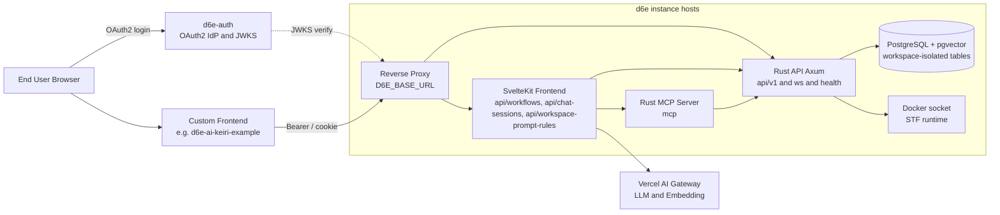
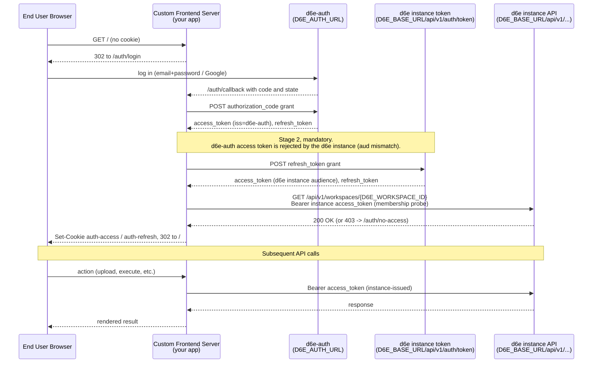

# d6e プラットフォーム概要(外部開発者向け / 日本語)

このドキュメントは、既存の d6e インスタンスに `.env` 相当の認証情報で接続して
**特化フロントエンド**を開発する外部開発者に向けて、d6e の全体像・主要エンドポイント・
ローカル起動方法を一枚にまとめた概要紹介です。

> [!NOTE]
> Discord では Mermaid 図がレンダリングされないため、
> **本ファイルへの GitHub リンク**を貼って共有してください。
> 詳細実装が必要な箇所は、本リポジトリの既存 docs(英語)へリンクで誘導しています。

## 1. d6e とは

d6e(Dialogue)は、自然言語でデータ操作・分析・ワークフロー実行が行える
**AI ネイティブな業務プラットフォーム**です。以下を 1 つの d6e インスタンス上で完結できます。

- **SQL ベースのデータ管理**:`ws_{workspace_id}_` プレフィックスでワークスペース分離された PostgreSQL を、SQL ライクに直接操作
- **Policy(行レベル相当のアクセス制御)**:`WHERE` 句インジェクション方式。違反は 403 を返す
- **STF(State Transition Function)**:JavaScript(QuickJS)または Docker で任意のロジックを実行
- **Workflow / Effect**:STF と HTTP リクエストプリセットをつないだ多段処理
- **MCP(Model Context Protocol)サーバー同梱**:AI クライアントから d6e のツール群を直接呼べる
- **API キー認証 + JWT(d6e-auth)認証**:audit log まで一元管理

詳細は [d6e/README.md](https://github.com/d6e-ai/d6e/blob/main/README.md) と
[d6e/CLAUDE.md](https://github.com/d6e-ai/d6e/blob/main/CLAUDE.md) を参照してください。

## 2. システム全体像



各コンポーネントの役割。

- **Reverse Proxy(`D6E_BASE_URL`)**:単一オリジン上で `/api/v1/*` を Rust API に、それ以外を SvelteKit Frontend に振り分ける(マネージド構成の場合は Caddy。[`compose.yml`](https://github.com/d6e-ai/d6e/blob/main/compose.yml) 参照)。
- **SvelteKit Frontend**:管理 UI と、本リポジトリのような外部フロントエンドが叩く高レベル API(`execute-by-intent`、`chat-sessions`、`workspace-prompt-rules` など)を提供。
- **Rust API(Axum)**:データ層に最も近い API。workspaces / files / sql / stf / workflow / effect / policy / embedding 等の CRUD と、`/ws`(WebSocket)・`/health` を提供。
- **Rust MCP Server**:Claude Desktop など MCP 対応クライアントから接続し、d6e のツール群(ファイル処理・SQL 等)を利用させる。
- **PostgreSQL + pgvector**:ワークスペースごとに `ws_{workspace_id}_<table>` プレフィックス命名で論理分離。
- **Docker socket**:STF を Docker ランタイムで実行する際に、API サーバから `/var/run/docker.sock` を read-only でマウントして利用([`compose.withdb.yml`](https://github.com/d6e-ai/d6e/blob/main/compose.withdb.yml))。
- **Vercel AI Gateway**:すべての LLM 呼び出しと埋め込みを集約。インスタンスは個別プロバイダキーを保持しない([d6e/.env.example](https://github.com/d6e-ai/d6e/blob/main/.env.example))。
- **d6e-auth**:OAuth2 IdP。エンドユーザーの認証と JWT 発行を担当([d6e-auth リポジトリ](https://github.com/d6e-ai/d6e-auth))。

## 3. 接続方式(既存インスタンスへ `.env` 接続)

外部フロントエンドは、d6e インスタンスに直接 OAuth2 でログインさせるのではなく、
**自分のサーバ経由**で d6e-auth と d6e インスタンスの両方とトークンを交換します。

### 3.1 OAuth2 二段階トークン交換シーケンス



ポイント。

- d6e-auth から返ってくる最初の `access_token` は **`iss=d6e-auth`** で、d6e インスタンスの
  Rust API は `aud` 不整合で 401 を返します。
- そのため `refresh_token` を **すぐに** `${D6E_BASE_URL}/api/v1/auth/token` に再提示して、
  d6e インスタンス向けに署名された新しいペアに交換してから cookie に保存します。
- セッションリフレッシュ(`exp` の 60 秒前)も、d6e-auth ではなく
  **d6e インスタンスの token エンドポイント**で行います。
- 管理者向けの `scripts/init-workspace.mjs` も同じ二段階交換で `D6E_INIT_REFRESH_TOKEN` を
  使うため、エンドユーザーの cookie とは独立しています。

詳細は [`docs/architecture.md`](architecture.md) の Sequence 節と
[`src/lib/server/oauth.ts`](../src/lib/server/oauth.ts) /
[`src/lib/server/session.ts`](../src/lib/server/session.ts) を参照。

### 3.2 必要な環境変数(本リポジトリ [`.env.example`](../.env.example) より)

```
D6E_BASE_URL=https://your-d6e-instance.example.com
D6E_WORKSPACE_ID=<UUID>
D6E_AUTH_URL=https://www.d6e.ai
D6E_AUTH_CLIENT_ID=<client id>
D6E_AUTH_CLIENT_SECRET=<client secret>
D6E_AUTH_REDIRECT_URI=http://localhost:5173/auth/callback
D6E_INIT_REFRESH_TOKEN=<admin refresh token for npm run init>
```

- `D6E_AUTH_REDIRECT_URI` は d6e-auth 側の `registered_client.redirectUris` に **完全一致**で
  事前登録されている必要があります(本番 URL と localhost をそれぞれ登録)。
- `D6E_INIT_REFRESH_TOKEN` はワークスペース管理者のリフレッシュトークン(エンドユーザーの
  `auth-refresh` cookie とは別物)です。`/api/workspace-prompt-rules` への POST のみで使います。

## 4. 開発に使える主要エンドポイント

### 4.1 Rust API(Axum) - `${D6E_BASE_URL}/api/v1/*`

**認証:** `Authorization: Bearer <instance-issued access_token>` +
ワークスペーススコープが必要なものは `X-Workspace-ID: <UUID>` を付与。
ソース:[d6e/packages/api/src/routes/v1/](https://github.com/d6e-ai/d6e/tree/main/packages/api/src/routes/v1)

主なネスト([d6e/packages/api/src/routes/v1/mod.rs](https://github.com/d6e-ai/d6e/blob/main/packages/api/src/routes/v1/mod.rs))。

- `/admin` - インスタンス管理
- `/auth` - `POST /api/v1/auth/token`(リフレッシュ含むトークン発行、二段階交換の Stage 2 で使用)
- `/workspaces` - ワークスペース CRUD、メンバーシップ
- `/workspaces/{id}/files/multipart` - ファイルアップロード(後述)
- `/sql` - ワークスペース分離された SQL 実行
- `/stfs` - JavaScript / Docker で実行する State Transition Function
- `/stf-libraries` - STF が `import` できる共通ライブラリ
- `/effects` - HTTP リクエストプリセット(STF / Workflow から呼び出し)
- `/workflows` - STF と Effect を順次実行するワークフロー
- `/policies` / `/policy-groups` - テーブル単位のアクセス制御
- `/api-keys` - WebSocket・サーバ間連携用の API キー発行
- `/audit-logs` - 監査ログ
- `/pinned-charts` - ダッシュボード固定チャート
- `/saas-proxy` / `/saas-proxy-download` - 外部 SaaS への安全な中継

加えてルート直下に以下があります([d6e/packages/api/src/lib.rs](https://github.com/d6e-ai/d6e/blob/main/packages/api/src/lib.rs))。

- `GET /health` - ヘルスチェック
- `GET /ws` - WebSocket。`Authorization: Bearer <API key>` + `X-Workspace-ID` で接続し、
  ワークスペースのブロードキャストイベントを購読([d6e/packages/api/src/routes/ws.rs](https://github.com/d6e-ai/d6e/blob/main/packages/api/src/routes/ws.rs))。

### 4.2 SvelteKit Frontend が提供する高レベル API - `${D6E_BASE_URL}/api/*`

本リポジトリで実際に使っている 3 系統。詳細リクエスト / レスポンスは
[`docs/d6e-api-integration.md`](d6e-api-integration.md) に網羅されています。

- **ファイルアップロード**:`POST /api/v1/workspaces/{wsId}/files/multipart`(Rust API 側)
  - 本アプリでは [`src/routes/api/upload/+server.ts`](../src/routes/api/upload/+server.ts) が
    `multipart/form-data` をそのまま中継。
- **自然言語ワークフロー実行**:`POST /api/workflows/execute-by-intent`(SvelteKit Frontend)
  - 本アプリでは [`src/routes/api/intent/+server.ts`](../src/routes/api/intent/+server.ts) が呼び出し。
  - LLM が ` ```json ... ``` ` ブロックで返す
    [`Journal` Zod スキーマ](../src/lib/journal-schema.ts) を契約として使う(後述)。
- **チャットセッション CRUD**:`GET / POST / PATCH / DELETE /api/chat-sessions[/{id}]`(SvelteKit Frontend)
  - 本アプリでは
    [`src/routes/api/chat-sessions/+server.ts`](../src/routes/api/chat-sessions/+server.ts) と
    [`src/routes/api/chat-sessions/[id]/+server.ts`](../src/routes/api/chat-sessions/%5Bid%5D/+server.ts)
    から呼び出し。Cookie: `auth-token=<access_token>` を使うことに注意(Bearer と同じ JWT)。
- **ワークスペースプロンプトルール登録**:`POST /api/workspace-prompt-rules`(SvelteKit Frontend)
  - LLM の挙動契約を 1 度だけ書き込む。本アプリは
    [`scripts/init-workspace.mjs`](../scripts/init-workspace.mjs) から `npm run init` で実行。

### 4.3 MCP サーバー - `${D6E_BASE_URL}/mcp`(または `${D6E_MCP_SERVER_URL}`)

Rust 製。Claude Desktop / Cursor などから MCP クライアントとして接続し、d6e の各種ツール
(Excel/CSV パース、SQL 実行、OCR など)を AI から直接利用させる用途
([d6e/packages/mcp/src/](https://github.com/d6e-ai/d6e/tree/main/packages/mcp/src))。

## 5. ローカル Docker 起動(シークレットが手元にあれば)

d6e は 2 種類の Compose 構成を同梱しています。
[d6e リポジトリ](https://github.com/d6e-ai/d6e) を clone し、
[`.env.example`](https://github.com/d6e-ai/d6e/blob/main/.env.example) をコピーして埋めれば
そのまま立ちます。

### 5.1 外部 DB に繋ぐ構成 - `compose.yml`

GHCR のビルド済みイメージ(`ghcr.io/d6e-ai/d6e-api:latest` ほか)を pull し、
Caddy を 80 / 443 で front して動かします。

```bash
cp .env.example .env
# DATABASE_URL を外部 Postgres に向ける + 下記シークレットを設定
docker compose up -d
```

### 5.2 DB ごと全部立ち上げる構成 - `compose.withdb.yml`

開発・検証向け。Postgres(pgvector 0.8.2-pg18)を同居させ、API / MCP / Frontend を
ソースからビルドします。

```bash
cp .env.example .env
docker compose -f compose.withdb.yml up -d
```

### 5.3 最低限必要なシークレット

[d6e/.env.example](https://github.com/d6e-ai/d6e/blob/main/.env.example) の必須項目から抜粋。

- `POSTGRES_PASSWORD` - DB パスワード(`compose.withdb.yml` 専用)
- `DATABASE_URL` - 外部 DB を使うとき(`compose.yml` 専用)
- `D6E_CONTAINER_TOKEN_SECRET` - STF Docker ランタイムが API に折り返すための HMAC キー。`openssl rand -base64 32` で生成
- `D6E_AUTH_URL` / `D6E_AUTH_CLIENT_ID` / `D6E_AUTH_CLIENT_SECRET` - d6e-auth(SaaS)と接続するためのクライアント認証情報。インスタンスごとに発行が必要
- `AI_GATEWAY_API_KEY` - Vercel AI Gateway のキー。本番は d6e-auth が自動配布するが、ローカル検証ではここに直接ピン留め可能
- `EMBEDDING_MODEL` / `EMBEDDING_DIMENSIONS` - 既定は `gemini-embedding-2-preview` / `768`

> マネージドの SaaS d6e-auth に接続できる**シークレット(`D6E_AUTH_CLIENT_*`)があれば**、
> 上記の手順で API / DB / MCP / Frontend をフルローカルで起動可能です。
> シークレットの払い出しは d6e-auth 管理者(現状は d6e 開発元)が行います。

## 6. 参考実装

実際の特化フロントエンドの一例として、本リポジトリ
[`d6e-ai-keiri-example`](../README.md) があります。日本の経理業務(レシート → 仕訳)を
題材に、上記のすべての要素(OAuth2 二段階交換、ファイルアップロード、`execute-by-intent`、
チャットセッション、ワークスペースプロンプトルール登録)を最小構成で実装しています。

実装にあたっての詳細解説は以下の docs(英語)を参照してください。

- [`docs/architecture.md`](architecture.md) - シーケンス図 / 信頼境界 / モジュール責務一覧
- [`docs/d6e-api-integration.md`](d6e-api-integration.md) - 全エンドポイントの request/response 仕様
- [`docs/workspace-setup.md`](workspace-setup.md) - ワークスペースの初期セットアップ手順
- [`docs/llm-output-contract.md`](llm-output-contract.md) - LLM 出力の JSON 契約(Zod パース + raw 表示フォールバック)
- [`docs/migration-to-full-integration.md`](migration-to-full-integration.md) - モックから本番統合への移行ガイド

再利用可能な Agent Skills も `skills/` 配下に同梱しています
(`d6e-auth-integration`、`d6e-workspace-api-client`、`d6e-prompt-driven-ui`)。

## 7. 追加要望メモ(現状は未対応、議論用)

以下は外部開発者から寄せられた要望で、**現状の d6e にはまだ無い**機能です。設計議論の
たたき台としてここに残します。

- **`skill2api`**:`.claude/skills/*` や `.codex/skills/*` 配下の `SKILL.md` を読み込み、
  `${D6E_BASE_URL}/{workspace}/api/v1/<skill-name>` のような POST エンドポイントとして
  サーバ上で実行できる OpenAPI を吐き出すツール。SKILL の `description` と
  `$ARGUMENTS` 規約をそのまま OpenAPI の summary / request body に対応付けるイメージ。
- **`deploy-harness`**:`npx d6e-deploy workspace=xxxx` で、上記 `skill2api` で生成した
  agent API server を指定ワークスペースの環境にデプロイする CLI。CI で
  `main` マージ後に自動更新する用途を想定。現状の
  [d6e-deploy](https://github.com/d6e-ai/d6e-deploy) は既存インスタンスを SSH 経由で
  `git pull && docker compose up -d` するだけのオペレーション用スクリプトで、別物。
- **ローカルテスト用ツール**:DB / ストレージを含めた agent server 開発ライフサイクル支援
  (`d6e-agent-server` のローカル動作環境)。
- **アーキテクチャ参考**:[Layer X の Agent サービス(getaiworkforce.com)](https://getaiworkforce.com/)が
  採用している「イベントフックでエージェントが起動 → バックグラウンド実行 → 成果物をどこかへ置く」
  というモデル。通常の API サーバと**同時並行で開発**できる体験を目指す。

これらが必要になった場合は本ドキュメントとは別途、設計プラン(`.plans/*.plan.md`)を
起こして議論する想定です。
