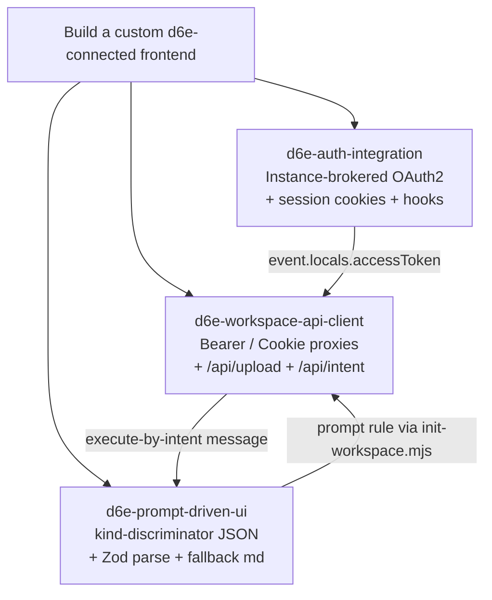

# Agent Skills for d6e Custom Frontend Development

Three Agent Skills, distilled from this repository's working
implementation, that teach AI agents how to build d6e-connected
custom frontends.

これら 3 つの Agent Skills は本リポジトリの実装をベースに、AI
エージェントが d6e ワークスペース接続型のカスタムフロントエンドを
構築する手順を解説します。Cursor / Claude などの AI エージェントが
`@skills` 経由でインポートして利用できます。

## Available Skills

| Skill                                                             | What it teaches                                                                                                                                                                                                                                                                                                                                                                                                                                               |
| ----------------------------------------------------------------- | ------------------------------------------------------------------------------------------------------------------------------------------------------------------------------------------------------------------------------------------------------------------------------------------------------------------------------------------------------------------------------------------------------------------------------------------------------------- |
| [`d6e-auth-integration`](./d6e-auth-integration/SKILL.md)         | End-user OAuth2 with the instance-brokered token exchange (the d6e instance relays the code to d6e-auth, no client secret in the frontend) plus a standalone-client alternative, HTTP-only session cookies, transparent refresh with in-flight deduplication, workspace allow-list with the **pending-invitation auto-promote** behaviour on first JWT login, and the logout that also clears d6e-auth's session.                                             |
| [`d6e-workspace-api-client`](./d6e-workspace-api-client/SKILL.md) | The server-side proxy layer (`/api/upload`, `/api/intent`, `/api/chat-sessions`), the `caller + accessToken + AbortSignal` wrapper convention in `src/lib/server/d6e-client.ts`, the Bearer vs `auth-token` cookie header matrix, the SHA-256-keyed idempotent prompt-rule bootstrap in `scripts/init-workspace.mjs`, and the optional **Drive Sync mirror endpoints** + **workspace pending-invitation admin CRUD** exposed by recent d6e instance releases. |
| [`d6e-prompt-driven-ui`](./d6e-prompt-driven-ui/SKILL.md)         | The three-layer pattern that turns LLM free-form text into structured UI: workspace prompts with `kind`-discriminated JSON inside fenced code blocks, Zod parse with markdown fallback, revision flows driven by XML tags, the interactive "scenario append" pattern from `scripts/prompts/freee-registration-prompt.md`, and the **Drive mirror lookup** pattern from `scripts/prompts/drive-mirror-followup-prompt.md`.                                     |

## How the Skills Fit Together



Each skill can be installed independently, but a full d6e-connected
frontend typically uses all three together. The `Related Skills`
section at the bottom of each `SKILL.md` cross-links them.

## Installation

```bash
npx skills add https://gitlab.com/cauchye/d6e-ai/d6e-custom-frontend-skills --skill d6e-auth-integration
npx skills add https://gitlab.com/cauchye/d6e-ai/d6e-custom-frontend-skills --skill d6e-workspace-api-client
npx skills add https://gitlab.com/cauchye/d6e-ai/d6e-custom-frontend-skills --skill d6e-prompt-driven-ui
```

After installation, type `@skills` in Cursor Composer (or the
equivalent in Claude Code) to verify the skills are available.

## Discovery

The [skills CLI](https://skills.sh) discovers the
`skills/<name>/SKILL.md` files in this repository directly from the
GitLab URL above. This repository is hosted at
<https://gitlab.com/cauchye/d6e-ai/d6e-custom-frontend-skills>, so always
install with the full URL — the `owner/repo` shorthand only resolves
against github.com and does not work for this repository.

## Why These Three?

A d6e-connected frontend has three orthogonal concerns:

1. **Identity.** Who is the user, and how does their JWT survive the
   round trip through the central d6e-auth server _and_ the per-app
   d6e instance without becoming a 401 trap? (→
   `d6e-auth-integration`)
2. **Transport.** How does the browser get bytes to and from d6e's
   storage / workflow / chat-session APIs without ever holding the
   token client-side, while also surviving timeouts and cancellation
   cleanly? (→ `d6e-workspace-api-client`)
3. **Contract.** How does the assistant's free-form prose become
   typed JSON the frontend can render as cards, tables, and
   follow-up forms — without the UI going blank when the model
   drifts? (→ `d6e-prompt-driven-ui`)

These rarely change together, so splitting them keeps each skill
short, focused, and independently usable when only one concern is in
play.

## Where to Look in the Reference Implementation

| Concern                            | Files                                                                                                                                                    | Skill                      |
| ---------------------------------- | -------------------------------------------------------------------------------------------------------------------------------------------------------- | -------------------------- |
| OAuth2 + session cookies           | `src/lib/server/oauth.ts`, `src/lib/server/session.ts`, `src/hooks.server.ts`, `src/routes/auth/**`                                                      | `d6e-auth-integration`     |
| API wrappers + SvelteKit proxies   | `src/lib/server/d6e-client.ts`, `src/routes/api/**`, `scripts/init-workspace.mjs`                                                                        | `d6e-workspace-api-client` |
| Prompts, schemas, parsers, render  | `scripts/prompts/ai-keiri-prompt.md`, `src/lib/journal-schema.ts`, `src/lib/parse-journal.ts`, `src/lib/components/{journal,registration}-result.svelte` | `d6e-prompt-driven-ui`     |
| Scenario-append activation prompts | `scripts/prompts/freee-registration-prompt.md` (freee + Drive upload), `scripts/prompts/drive-mirror-followup-prompt.md` (Drive mirror lookup)           | `d6e-prompt-driven-ui`     |

For deeper architectural background see the in-repo docs:
[`docs/architecture.md`](../docs/architecture.md),
[`docs/d6e-api-integration.md`](../docs/d6e-api-integration.md),
[`docs/llm-output-contract.md`](../docs/llm-output-contract.md),
[`docs/workspace-setup.md`](../docs/workspace-setup.md).
