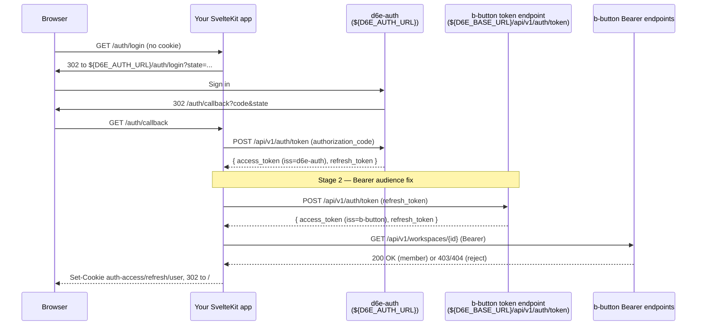

# d6e Auth Integration

## Overview

Every user-facing call this app makes to the d6e platform — file
upload, workflow execution, chat-session CRUD — needs a JWT issued by
the **b-button** instance (`${D6E_BASE_URL}`). Logins, however, happen
at the central **d6e-auth** server (`${D6E_AUTH_URL}`), whose tokens
carry `iss=d6e-auth` and are rejected by b-button's audience check
with a 401. This skill teaches the OAuth2 Authorization Code flow plus
the **mandatory second exchange** that re-mints the d6e-auth refresh
token at b-button so every Bearer call against the Rust API succeeds.

Companion concepts covered here:

- HTTP-only cookie session model (`auth-access` / `auth-refresh` /
  `auth-user` / `auth-oauth-state`).
- Transparent access-token refresh 60 seconds before `exp`, with
  in-flight deduplication so parallel requests don't race the
  rotating refresh token.
- Workspace allow-list enforcement via a single membership probe at
  `/auth/callback`.
- The two-stage logout that also drops d6e-auth's own session cookie.
- The separate admin-only `D6E_INIT_REFRESH_TOKEN` used by
  bootstrap scripts.

## When to Use

Apply this skill when the user says:

- "Add login to my d6e frontend" / "d6e でログインを実装したい"
- "Why do I get 401 on `/api/v1/workspaces/...` after login?"
- "Connect this app to d6e-auth"
- "Implement OAuth2 with d6e"
- "Add workspace membership check"
- "Why does logout sign me right back in?"
- "End-user authentication for a d6e b-button instance"

## Core Concepts

### Two-stage token exchange



The access token returned by **Stage 1 is never persisted or sent to
b-button**. Only the b-button-signed pair from Stage 2 lands in
cookies. Skipping Stage 2 is the single most common cause of "login
works but every subsequent API call returns 401".

### Cookie layout

| Cookie             | Lifetime                           | Contents                                                                          |
| ------------------ | ---------------------------------- | --------------------------------------------------------------------------------- |
| `auth-access`      | Until JWT `exp` (fallback 1h)      | b-button access token                                                             |
| `auth-refresh`     | 30 days (rotated on every refresh) | b-button refresh token                                                            |
| `auth-user`        | 30 days                            | base64(JSON({id, email, name})) for the sidebar greeting                          |
| `auth-oauth-state` | 10 min                             | base64(JSON({state, returnTo})) — only between `/auth/login` and `/auth/callback` |

All four are `HttpOnly`, `SameSite=Lax`, and `Secure` outside dev.
The user record is also kept locally so the sidebar can render the
user's name without re-fetching `/api/v1/auth/userinfo` on every page
render — the JWT itself still authenticates each API call.

### Token refresh and in-flight deduplication

`loadSession()` (called from `hooks.server.ts` on every server-side
request) refreshes the access token when its `exp` is within 60
seconds. Because b-button rotates the refresh token on every successful
use, two parallel requests that both notice the grace window must not
both POST `/api/v1/auth/token` independently — only one would succeed
and the loser's `clearSession()` would clobber the winner's
`Set-Cookie` headers. The module deduplicates by refresh token value
so concurrent callers share the same `Promise<OauthTokens>` and emit
identical cookies in their respective responses.

Refresh **always** targets `${D6E_BASE_URL}/api/v1/auth/token`, never
d6e-auth, so the rotated access token keeps `iss=b-button`.

### Workspace allow-list

After Stage 2, `/auth/callback` calls
`GET ${D6E_BASE_URL}/api/v1/workspaces/${D6E_WORKSPACE_ID}` with the
freshly issued Bearer. Only an explicit `403` or `404` routes the user
to `/auth/no-access`; transient errors (timeout, 5xx) fall back to
`/auth/login` so the user can retry without seeing a misleading
"contact your administrator" message.

### Two-stage logout

A bare local cookie wipe leaks the user back in: d6e-auth's own
session cookie is still alive on `${D6E_AUTH_URL}`, so the next hit on
`/auth/login` would silently re-issue a code and complete a fresh
OAuth round-trip within ~200ms. `/auth/logout` must therefore:

1. Delete the four local cookies on the app's origin.
2. 303-redirect the browser to
   `${D6E_AUTH_URL}/auth/logout?redirect_uri=${origin}/auth/login`,
   which deletes the d6e-auth session row + cookie before bouncing
   back. The user finally sees the login form.

Logout is also gated to `POST` so a third-party `` tag can't
force-sign-out users.

### Admin vs. end-user tokens

| Token                            | Lifetime            | Where it's stored            | Used by                           |
| -------------------------------- | ------------------- | ---------------------------- | --------------------------------- |
| End-user `auth-refresh` cookie   | 30 days (rotated)   | HTTP-only cookie per browser | every browser request             |
| `D6E_INIT_REFRESH_TOKEN` env var | Operator-controlled | `.env` / Vercel env          | `scripts/init-workspace.mjs` only |

These two refresh tokens must never be mixed: the end-user cookie
belongs to whoever last logged in through the UI, while the init
token is a long-lived admin-on-workspace credential used to register
workspace prompt rules and seed configuration. Keeping them in
separate variables prevents a deploy from accidentally posting under
a developer's identity.

## Quick Start

A minimal SvelteKit implementation has four files plus a hook.

### Step 1: Environment

```dotenv
D6E_AUTH_URL=https://www.d6e.ai
D6E_AUTH_CLIENT_ID=<from d6e-auth admin>
D6E_AUTH_CLIENT_SECRET=<from d6e-auth admin>
D6E_AUTH_REDIRECT_URI=http://localhost:5173/auth/callback
D6E_BASE_URL=https://b-button.d6e.ai
D6E_WORKSPACE_ID=<UUID of the workspace this app is bound to>
```

The `redirected_uris` array on the d6e-auth `registered_client` must
contain `D6E_AUTH_REDIRECT_URI` **exactly**, or the authorize step
fails with `invalid_redirect_uri`.

### Step 2: `/auth/login`

```ts
// src/routes/auth/login/+server.ts
import { redirect } from '@sveltejs/kit';

import { buildAuthorizeUrl, createOauthState } from '$lib/server/oauth';
import { writeOauthStateCookie } from '$lib/server/session';

import type { RequestHandler } from './$types';

export const GET: RequestHandler = async (event) => {
  const state = createOauthState();
  const returnTo = event.url.searchParams.get('returnTo') ?? '/';
  writeOauthStateCookie(event, encodeStateCookieValue(state, returnTo));
  throw redirect(302, buildAuthorizeUrl('/auth/login', state));
};
```

`createOauthState()` is 32 cryptographic bytes base64url-encoded; the
cookie carries `{state, returnTo}` so `/auth/callback` can both verify
CSRF and bounce the user to a deep link.

### Step 3: `/auth/callback`

```ts
// src/routes/auth/callback/+server.ts
const authTokens = await exchangeAuthorizationCode(CALLER_TAG, code);
// Stage 2: re-mint at b-button so the Bearer audience matches.
const tokens = await refreshAccessTokenViaBaseUrl(CALLER_TAG, authTokens.refreshToken);

const memberOk = await verifyWorkspaceMembership(CALLER_TAG, tokens.accessToken);
if (!memberOk) {
  clearSession(event);
  throw redirect(302, '/auth/no-access');
}

const user = decodeUserFromAccessToken(tokens.accessToken);
storeSession(event, tokens, user);
throw redirect(302, decoded.returnTo || '/');
```

Real file: [`src/routes/auth/callback/+server.ts`](../../src/routes/auth/callback/+server.ts).

### Step 4: `hooks.server.ts`

```ts
export const handle: Handle = async ({ event, resolve }) => {
  const session = await loadSession(event);
  if (session) {
    event.locals.accessToken = session.accessToken;
    event.locals.user = session.user;
  }
  if (!session && !isPublicPath(event.url.pathname) && !isApiPath(event.url.pathname)) {
    throw redirect(302, `/auth/login?returnTo=${encodeURIComponent(event.url.pathname)}`);
  }
  return resolve(event);
};
```

`/auth/*` and `/api/*` skip the redirect so login pages can render
anonymously and client-side `fetch()` calls receive JSON 401s
(redirecting them to `/auth/login` would cause CORS errors on the
following hop to d6e-auth).

### Step 5: `/auth/logout`

```ts
export const POST: RequestHandler = async (event) => {
  clearSession(event);
  clearOauthStateCookie(event);
  const redirectUri = `${event.url.origin}/auth/login`;
  throw redirect(
    303,
    `${getD6eAuthUrl('/auth/logout')}/auth/logout?redirect_uri=${encodeURIComponent(redirectUri)}`
  );
};
```

POST-only by design so an `` cannot force a sign-out.

## Reference

### OAuth helpers ([`src/lib/server/oauth.ts`](../../src/lib/server/oauth.ts))

| Function                                             | Purpose                                                                                                                                          |
| ---------------------------------------------------- | ------------------------------------------------------------------------------------------------------------------------------------------------ |
| `buildAuthorizeUrl(caller, state)`                   | Returns `${D6E_AUTH_URL}/auth/login?client_id&redirect_uri&state&response_type=code`.                                                            |
| `exchangeAuthorizationCode(caller, code)`            | Stage 1 — POSTs `grant_type=authorization_code` to d6e-auth. Returns `OauthTokens` whose `accessToken` is d6e-auth-issued and must be discarded. |
| `refreshAccessTokenViaBaseUrl(caller, refreshToken)` | Stage 2 / per-session refresh — POSTs `grant_type=refresh_token` to **b-button**. No `client_id` needed.                                         |
| `createOauthState()`                                 | 32 bytes from `crypto.getRandomValues`, base64url-encoded.                                                                                       |
| `constantTimeEqual(a, b)`                            | Constant-time string compare for the state cookie.                                                                                               |
| `decodeJwtPayload(token)` / `decodeJwtExpMs(token)`  | Local-only decode (no signature check) so the session layer can pick a refresh moment.                                                           |

`OauthError(message, status, upstreamBody)` carries the upstream HTTP
status and body so callers can surface meaningful errors.

### Token endpoint requests

Stage 1 (`POST ${D6E_AUTH_URL}/api/v1/auth/token`):

```json
{
  "grant_type": "authorization_code",
  "code": "<from /auth/callback>",
  "client_id": "<D6E_AUTH_CLIENT_ID>",
  "client_secret": "<D6E_AUTH_CLIENT_SECRET>",
  "redirect_uri": "<D6E_AUTH_REDIRECT_URI>"
}
```

Stage 2 / refresh (`POST ${D6E_BASE_URL}/api/v1/auth/token`):

```json
{
  "grant_type": "refresh_token",
  "refresh_token": "<from stage 1 or rotated cookie>"
}
```

Both endpoints rotate `refresh_token` on every successful call.

### Session store ([`src/lib/server/session.ts`](../../src/lib/server/session.ts))

| Function                                                                                               | Purpose                                                                                                                                               |
| ------------------------------------------------------------------------------------------------------ | ----------------------------------------------------------------------------------------------------------------------------------------------------- |
| `storeSession(event, tokens, user)`                                                                    | Writes `auth-access` (max-age from JWT exp), `auth-refresh` (30d cap), and `auth-user`.                                                               |
| `clearSession(event)`                                                                                  | Deletes the three cookies above.                                                                                                                      |
| `loadSession(event)`                                                                                   | Reads cookies; transparently refreshes via b-button when the access token is within 60s of `exp`; returns `null` to signal "redirect to /auth/login". |
| `readOauthStateCookie(event)` / `writeOauthStateCookie(event, value)` / `clearOauthStateCookie(event)` | Short-lived CSRF cookie helpers.                                                                                                                      |
| `requireAccessToken(event, caller)`                                                                    | Route-handler narrowing — throws `error(401)` when `event.locals.accessToken` is unset.                                                               |
| `decodeUserFromAccessToken(token)`                                                                     | Extracts `{ id, email, name }` from `sub`/`email`/`name` claims.                                                                                      |

`inflightRefreshes` is a module-level `Map<refreshToken, Promise<OauthTokens>>`
that deduplicates concurrent refresh attempts; without it the rotating
refresh token causes one POST to win and the rest to log the user out.

### Public path policy in `hooks.server.ts`

`/auth/*` and `/favicon.ico` bypass the redirect; `/api/*` also
bypasses it so XHR/fetch calls receive a JSON 401 from
`requireAccessToken()` instead of a 302 chain into d6e-auth (which
would manifest as CORS errors in the browser).

### `verifyWorkspaceMembership(caller, accessToken)`

Defined in [`src/lib/server/d6e-client.ts`](../../src/lib/server/d6e-client.ts).
Returns `true` on 200, `false` on 403/404, and throws `D6eClientError`
on transport failures so the caller can distinguish "user is not a
member" (route to `/auth/no-access`) from "couldn't ask" (route to
`/auth/login`).

## Implementation Checklist

- [ ] All six env vars are present and validated on startup (see `src/lib/server/env.ts`).
- [ ] `D6E_AUTH_REDIRECT_URI` is registered **exactly** under the d6e-auth `registered_client.redirectUris` array.
- [ ] `/auth/callback` performs BOTH `exchangeAuthorizationCode` and `refreshAccessTokenViaBaseUrl`; the Stage 1 access token is never stored.
- [ ] All four cookies set `httpOnly`, `sameSite: 'lax'`, `secure: !dev`, `path: '/'`.
- [ ] `loadSession()` refreshes via `${D6E_BASE_URL}/api/v1/auth/token` (b-button), not d6e-auth.
- [ ] `hooks.server.ts` populates `event.locals.accessToken` and `event.locals.user` from `loadSession()` before any route reads them.
- [ ] `/auth/logout` is POST-only and 303-redirects through `${D6E_AUTH_URL}/auth/logout`.
- [ ] `/auth/callback` calls `verifyWorkspaceMembership()` and routes 403/404 to `/auth/no-access`.
- [ ] The state cookie value is constant-time compared against the `state` query param.
- [ ] `returnTo` is restricted to same-origin paths and rejects `/auth/*` to prevent post-login loops.
- [ ] Refresh tokens are deduplicated by value to survive concurrent requests in the grace window.

## Best Practices

### Security

- Do not relax `SameSite=Lax` to `None` unless the app needs cross-site embeds; `Lax` blocks the most common CSRF entry points while letting top-level navigations work.
- Never send a Bearer header to `/api/workspace-prompt-rules` or `/api/chat-sessions` — those endpoints authenticate via the `auth-token` cookie. Mixing them up surfaces as 401 / 403 with empty bodies.
- Never log the access token or refresh token. The repo's logs only include the `caller`, status code, and upstream body (capped at 500 chars) by design.
- Do not call `clearSession()` blindly on the first 401 from a downstream API — the hook layer already keeps the cookie token fresh, so a 401 in a route handler means the token was revoked server-side. Surface it and let the next browser navigation hit `/auth/login`.

### Operations

- Treat `D6E_INIT_REFRESH_TOKEN` as a secret with the same sensitivity as a database password. Rotate it whenever a developer with admin access leaves.
- When `D6E_AUTH_URL` is unreachable during logout, the user is still locally signed out (cookies clear synchronously); the d6e-auth-side cleanup waits for the upstream to recover.
- Vercel deploys map env vars 1:1 with `.env`. Don't forget to set `D6E_AUTH_REDIRECT_URI` per environment (preview deploys need their own redirect URIs registered on d6e-auth).

## Troubleshooting

### Login succeeds but every API call returns 401

Stage 2 was skipped. Confirm that `/auth/callback` calls
`refreshAccessTokenViaBaseUrl()` after `exchangeAuthorizationCode()`,
and that the cookie value posted as `Bearer` decodes (via
`decodeJwtPayload()`) to a JWT whose `iss` matches the b-button
instance — not `iss=d6e-auth`.

### "OAuth state mismatch" on `/auth/callback`

The `auth-oauth-state` cookie was missing or the comparison failed.
Two common causes:

- Browser dropped the cookie because the user followed a non-HTTPS
  redirect in production (`Secure` cookies refuse to attach over
  HTTP). Ensure both the app and d6e-auth are HTTPS.
- Two parallel login attempts in the same browser overwrote each
  other's state cookie. This is rare; instruct the user to retry.

### Logout sends the user straight back in

`/auth/logout` is clearing local cookies but not delegating to
d6e-auth. Add the `303` to `${D6E_AUTH_URL}/auth/logout?redirect_uri=...`.
The d6e-auth side will hold the user's session row otherwise.

### "ERR_TOO_MANY_REDIRECTS" after callback

`returnTo` was set to `/auth/login` or `/auth`. Both must be rejected
because they would just start another OAuth round-trip that the
still-live d6e-auth session would complete silently. `isSafeReturnTo()`
in `/auth/login/+server.ts` blocks the loop.

### `verifyWorkspaceMembership` returns false

The user is not a member of `D6E_WORKSPACE_ID`. Add them through the
d6e admin UI, or change the environment variable to a workspace they
do belong to. Transient failures (504, timeout) should NOT route to
`/auth/no-access`; route to `/auth/login` so the user can retry.

### Sidebar shows wrong user after refresh

`auth-user` cookie is stale. `loadSession()` falls back to JWT claims
when the user cookie is missing, but it doesn't overwrite a present
cookie. Have users log out and back in after a profile rename, or call
`storeSession()` again after rotating the user's display name.

## Related Skills

- [`d6e-workspace-api-client`](../d6e-workspace-api-client/SKILL.md) — Uses the access token populated by this skill to talk to file storage, workflow execution, and chat-session APIs.
- [`d6e-prompt-driven-ui`](../d6e-prompt-driven-ui/SKILL.md) — Designs the LLM contract that `execute-by-intent` (authenticated via this skill) actually consumes.
