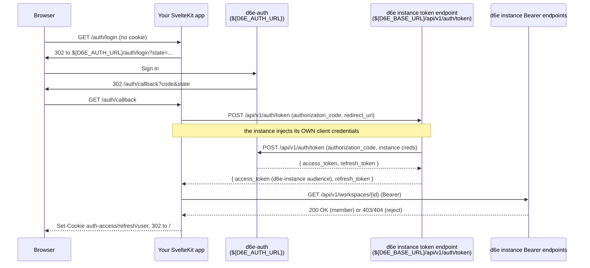

# d6e Auth Integration

## Overview

Every user-facing call this app makes to the d6e platform — file
upload, workflow execution, chat-session CRUD — needs a JWT whose
audience matches the **d6e instance** (`${D6E_BASE_URL}`). The
interactive login still happens at the central **d6e-auth** server
(`${D6E_AUTH_URL}`), but the authorization code is exchanged at the
**d6e instance's** own token endpoint, which relays it to d6e-auth
using the instance's own client credentials and returns a pair already
signed for the instance's audience. This skill teaches that
instance-brokered Authorization Code flow (no client secret in the
frontend), plus a standalone-client alternative for frontends that
cannot change the instance's redirect-uri allow-list.

Companion concepts covered here:

- HTTP-only cookie session model (`auth-access` / `auth-refresh` /
  `auth-user` / `auth-oauth-state`).
- Transparent access-token refresh 60 seconds before `exp`, with
  in-flight deduplication so parallel requests don't race the
  rotating refresh token.
- Workspace allow-list enforcement via a single membership probe at
  `/auth/callback`.
- The logout that also drops d6e-auth's own session cookie.
- The separate admin-only `D6E_INIT_REFRESH_TOKEN` used by
  bootstrap scripts.

## When to Use

Apply this skill when the user says:

- "Add login to my d6e frontend" / "d6e でログインを実装したい"
- "Why do I get 401 on `/api/v1/workspaces/...` after login?"
- "Connect this app to d6e-auth"
- "Implement OAuth2 with d6e"
- "Add workspace membership check"
- "Why does logout sign me right back in?"
- "End-user authentication for a d6e instance"

## Core Concepts

### Instance-brokered token exchange



Because the exchange happens at the instance, the returned pair is
already signed for the audience the instance's Bearer endpoints accept,
so it lands straight in cookies. The frontend sends **no client
secret** — the instance owns those credentials. Two allow-lists gate the
flow: d6e-auth checks the authorize request's `redirect_uri` against the
instance's `registered_client.redirectUris` (editable self-service in
the d6e-auth franchise portal), and the instance's token relay checks it
against the ORIGIN-derived callback plus `ALLOWED_REDIRECT_URIS`.

**Loopback callbacks skip both allow-lists.** A `redirect_uri` on
`localhost`, `127.0.0.0/8`, or `[::1]` — any port, any path — is always
accepted by d6e-auth and by the instance's token relay, so local
development (`npm run dev` on any port) needs no registration at all.
Only deployed (non-loopback) callback URLs must be registered — see
"Registering the redirect URI" under Step 1.

### Alternative: standalone client (when you don't operate the instance)

If you cannot change the d6e instance's redirect-uri allow-list — e.g.
you are a third party building against a managed instance you do not
operate — register your **own** `registered_client` on d6e-auth instead
and use the original two-stage exchange:

1. Obtain your own `client_id` + `client_secret` with your callback URL
   in its `redirect_uris`. A franchise owner/admin can self-serve this
   from the d6e-auth franchise portal
   (`${D6E_AUTH_URL}/{locale}/account/franchise`): register a client
   under *d6e Instance Connection* and manage its **Redirect URIs** on
   the same card. Without a franchise role, ask a d6e-auth operator.
   Set `D6E_AUTH_CLIENT_ID` to that id and add `D6E_AUTH_CLIENT_SECRET`.
2. `exchangeAuthorizationCode` POSTs `authorization_code` (with your
   `client_id` / `client_secret`) to `${D6E_AUTH_URL}/api/v1/auth/token`.
   That access token carries `iss=d6e-auth` and is rejected by the
   instance, so discard it and keep the refresh token.
3. Re-mint by POSTing that refresh token to
   `${D6E_BASE_URL}/api/v1/auth/token` (`refreshAccessTokenViaBaseUrl`),
   which returns an instance-audience pair. Store only this pair.

Everything else in this skill (cookies, refresh, allow-list, logout) is
identical. The trade-off: one extra exchange on login and a client
secret to protect, in return for needing no change on the instance side.
Prefer the instance-brokered flow above for local development (loopback
callbacks need no registration anywhere) and whenever you (or your
operator) can edit the instance's `ALLOWED_REDIRECT_URIS` for deployed
URLs.

### Cookie layout

| Cookie             | Lifetime                           | Contents                                                                          |
| ------------------ | ---------------------------------- | --------------------------------------------------------------------------------- |
| `auth-access`      | Until JWT `exp` (fallback 1h)      | d6e instance access token                                                         |
| `auth-refresh`     | 30 days (rotated on every refresh) | d6e instance refresh token                                                        |
| `auth-user`        | 30 days                            | base64(JSON({id, email, name})) for the sidebar greeting                          |
| `auth-oauth-state` | 10 min                             | base64(JSON({state, returnTo})) — only between `/auth/login` and `/auth/callback` |

All four are `HttpOnly`, `SameSite=Lax`, and `Secure` outside dev.
The user record is also kept locally so the sidebar can render the
user's name without re-fetching `/api/v1/auth/userinfo` on every page
render — the JWT itself still authenticates each API call.

### Token refresh and in-flight deduplication

`loadSession()` (called from `hooks.server.ts` on every server-side
request) refreshes the access token when its `exp` is within 60
seconds. Because the d6e instance rotates the refresh token on every
successful use, two parallel requests that both notice the grace
window must not both POST `/api/v1/auth/token` independently — only
one would succeed and the loser's `clearSession()` would clobber the
winner's `Set-Cookie` headers. The module deduplicates by refresh
token value so concurrent callers share the same
`Promise<OauthTokens>` and emit identical cookies in their respective
responses.

Refresh **always** targets `${D6E_BASE_URL}/api/v1/auth/token`, never
d6e-auth, so the rotated access token keeps its
d6e-instance-issued audience.

### Workspace allow-list and pending invitations

After the code exchange, `/auth/callback` calls
`GET ${D6E_BASE_URL}/api/v1/workspaces/${D6E_WORKSPACE_ID}` with the
freshly issued Bearer. Only an explicit `403` or `404` routes the user
to `/auth/no-access`; transient errors (timeout, 5xx) fall back to
`/auth/login` so the user can retry without seeing a misleading
"contact your administrator" message.

The d6e instance auto-converts **pending invitations** into real
memberships on the user's first JWT-authenticated request, so the
frontend never has to special-case the "first login of an invited
email" path:

- When an admin POSTs `/api/v1/workspaces/{id}/members` for an email
  that does not yet exist in the d6e instance, the row lands in a
  separate `workspace_invitation` table instead of
  `workspace_membership` (see the [`d6e-workspace-api-client`](../d6e-workspace-api-client/SKILL.md)
  skill for the admin CRUD that exposes these rows).
- The d6e auth layer's `provision_jwt_user` calls
  `apply_pending_invitations(db, user_id, email)` whenever it sees a
  JWT, looking up any `workspace_invitation` row whose lowercased
  `email` matches the JWT's `email` claim. Matching rows are converted
  into `workspace_membership` rows inside the same provisioning step,
  and the invitation row is deleted only after the membership INSERT
  succeeds (so a transient DB failure simply retries on the next
  request rather than dropping the invitation).
- Email case is folded server-side (`Foo@example.com` and
  `foo@example.com` resolve to the same membership), so the frontend
  must **not** lowercase or otherwise rewrite the JWT claim before
  passing it through.

Operational consequence: a workspace admin can pre-invite a user
who has never logged in to the d6e instance, and the moment that user
completes their first sign-in through this app's `/auth/login`, the
subsequent `verifyWorkspaceMembership` probe at `/auth/callback`
returns 200 without any additional steps. No frontend code change is
required to support this flow — the existing 200 / 403 / 404 / retry
branching keeps working.

What the frontend should NOT do:

- **Do not** treat 403 / 404 differently for pre-invited emails. By the
  time `/auth/callback` runs the probe, the invitation has already
  been consumed (or it never matched). A 403/404 still means "not a
  member, route to `/auth/no-access`".
- **Do not** retry the probe with a backoff hoping a pending
  invitation lands. The conversion is synchronous inside
  `provision_jwt_user`; if it didn't fire on this request it isn't
  going to fire on the immediate retry either.

### Two-stage logout

A bare local cookie wipe leaks the user back in: d6e-auth's own
session cookie is still alive on `${D6E_AUTH_URL}`, so the next hit on
`/auth/login` would silently re-issue a code and complete a fresh
OAuth round-trip within ~200ms. `/auth/logout` must therefore:

1. Delete the four local cookies on the app's origin.
2. 303-redirect the browser to
   `${D6E_AUTH_URL}/auth/logout?redirect_uri=${origin}/auth/login`,
   which deletes the d6e-auth session row + cookie before bouncing
   back. The user finally sees the login form.

Logout is also gated to `POST` so a third-party `` tag can't
force-sign-out users.

### Admin vs. end-user tokens

| Token                            | Lifetime            | Where it's stored            | Used by                           |
| -------------------------------- | ------------------- | ---------------------------- | --------------------------------- |
| End-user `auth-refresh` cookie   | 30 days (rotated)   | HTTP-only cookie per browser | every browser request             |
| `D6E_INIT_REFRESH_TOKEN` env var | Operator-controlled | `.env` / Vercel env          | `scripts/init-workspace.mjs` only |

These two refresh tokens must never be mixed: the end-user cookie
belongs to whoever last logged in through the UI, while the init
token is a long-lived admin-on-workspace credential used to register
workspace prompt rules and seed configuration. Keeping them in
separate variables prevents a deploy from accidentally posting under
a developer's identity.

## Quick Start

A minimal SvelteKit implementation has four files plus a hook.

### Step 0: Collect the values from the d6e console

Every value except the redirect URI can be read off the d6e instance
itself — you do not need d6e-auth admin access:

| Variable | Where to get it |
| --- | --- |
| `D6E_BASE_URL` | The origin of the d6e console you already use, e.g. `https://cauchye.d6e.ai` |
| `D6E_WORKSPACE_ID` | Workspace settings page (`{D6E_BASE_URL}/{locale}/workspaces/{id}/settings`) → **Integration** section has a copy button. It is also the UUID in every workspace URL |
| `D6E_AUTH_CLIENT_ID` | Same **Integration** section on the settings page ("Client ID" field). Shown only to users with the workspace **admin** role — ask a workspace admin to copy it for you if the section is missing |
| `D6E_AUTH_URL` | The login page the console redirects you to when signed out (typically `https://www.d6e.ai`). The settings page's "account linking" button also points at it |
| `D6E_AUTH_REDIRECT_URI` | You choose it: `<your app origin>/auth/callback`. Loopback origins (localhost, any port) work as-is; deployed origins must be allow-listed (see below) |

The Integration section renders only for workspace admins
(`userRole === 'admin'` in the settings loader), and only when the
instance has `D6E_AUTH_CLIENT_ID` configured. A regular member can
still read the workspace UUID from the URL bar.

### Step 1: Environment

```dotenv
D6E_AUTH_URL=https://www.d6e.ai
D6E_AUTH_CLIENT_ID=<the d6e instance's own OAuth client id>
D6E_AUTH_REDIRECT_URI=http://localhost:5173/auth/callback
D6E_BASE_URL=https://your-d6e-instance.example.com
D6E_WORKSPACE_ID=<UUID of the workspace this app is bound to>
```

Set `D6E_AUTH_CLIENT_ID` to the **instance's** own client id; the
frontend needs no client secret. (The standalone-client alternative
above instead uses your own `client_id` + `D6E_AUTH_CLIENT_SECRET`.)

#### Registering the redirect URI

**Loopback callbacks need no registration.** If
`D6E_AUTH_REDIRECT_URI` points at `localhost`, `127.0.0.0/8`, or
`[::1]` — any port, any path — both validation layers accept it
automatically, so the local-dev value above works out of the box.

A **deployed** (non-loopback) `D6E_AUTH_REDIRECT_URI` must be
allow-listed in BOTH places below, or the flow fails (see
Troubleshooting for the distinct error each list produces):

| Allow-list | Checked when | Who can edit |
| --- | --- | --- |
| `registered_client.redirectUris` on d6e-auth | At the d6e-auth login form, before any code is issued | **Self-service for franchise owners/admins**: open `${D6E_AUTH_URL}/{locale}/account/franchise`, find the instance card under *d6e Instance Connection*, and add the URL under **Redirect URIs**. d6e-auth platform admins can also edit any instance under `/admin/instances` |
| `ALLOWED_REDIRECT_URIS` env var on the d6e instance | At the instance's token relay during the code exchange | Whoever operates the instance deployment (comma-separated env var) |

Allow-listing is still the only step a plain workspace developer cannot
do alone, but it now only applies to deployed URLs and no longer
requires a d6e-auth platform admin: the d6e-auth half is a UI edit for
whoever holds the franchise owner/admin role (typically the
organization that registered the instance), and the env var is set by
the instance operator. Request both **before** you deploy — local
development and every other step in this skill work with plain
workspace access. Each deployed environment (preview deploy,
production) needs its own entry in both lists, matching your callback
URL character-for-character.

### Step 2: `/auth/login`

```ts
// src/routes/auth/login/+server.ts
import { redirect } from '@sveltejs/kit';

import { buildAuthorizeUrl, createOauthState } from '$lib/server/oauth';
import { writeOauthStateCookie } from '$lib/server/session';

import type { RequestHandler } from './$types';

export const GET: RequestHandler = async (event) => {
  const state = createOauthState();
  const returnTo = event.url.searchParams.get('returnTo') ?? '/';
  writeOauthStateCookie(event, encodeStateCookieValue(state, returnTo));
  throw redirect(302, buildAuthorizeUrl('/auth/login', state));
};
```

`createOauthState()` is 32 cryptographic bytes base64url-encoded; the
cookie carries `{state, returnTo}` so `/auth/callback` can both verify
CSRF and bounce the user to a deep link.

### Step 3: `/auth/callback`

```ts
// src/routes/auth/callback/+server.ts
// One call: the d6e instance brokers the code to d6e-auth and returns a
// pair already signed for the instance's audience.
const tokens = await exchangeAuthorizationCode(CALLER_TAG, code);

const memberOk = await verifyWorkspaceMembership(CALLER_TAG, tokens.accessToken);
if (!memberOk) {
  clearSession(event);
  throw redirect(302, '/auth/no-access');
}

const user = decodeUserFromAccessToken(tokens.accessToken);
storeSession(event, tokens, user);
throw redirect(302, decoded.returnTo || '/');
```

Real file: [`src/routes/auth/callback/+server.ts`](../../src/routes/auth/callback/+server.ts).

### Step 4: `hooks.server.ts`

```ts
export const handle: Handle = async ({ event, resolve }) => {
  const session = await loadSession(event);
  if (session) {
    event.locals.accessToken = session.accessToken;
    event.locals.user = session.user;
  }
  if (!session && !isPublicPath(event.url.pathname) && !isApiPath(event.url.pathname)) {
    throw redirect(302, `/auth/login?returnTo=${encodeURIComponent(event.url.pathname)}`);
  }
  return resolve(event);
};
```

`/auth/*` and `/api/*` skip the redirect so login pages can render
anonymously and client-side `fetch()` calls receive JSON 401s
(redirecting them to `/auth/login` would cause CORS errors on the
following hop to d6e-auth).

### Step 5: `/auth/logout`

```ts
export const POST: RequestHandler = async (event) => {
  clearSession(event);
  clearOauthStateCookie(event);
  const redirectUri = `${event.url.origin}/auth/login`;
  throw redirect(
    303,
    `${getD6eAuthUrl('/auth/logout')}/auth/logout?redirect_uri=${encodeURIComponent(redirectUri)}`
  );
};
```

POST-only by design so an `` cannot force a sign-out.

## Reference

### OAuth helpers ([`src/lib/server/oauth.ts`](../../src/lib/server/oauth.ts))

| Function                                             | Purpose                                                                                                                                           |
| ---------------------------------------------------- | ------------------------------------------------------------------------------------------------------------------------------------------------- |
| `buildAuthorizeUrl(caller, state)`                   | Returns `${D6E_AUTH_URL}/auth/login?client_id&redirect_uri&state&response_type=code`. `client_id` is the d6e instance's own client id.            |
| `exchangeAuthorizationCode(caller, code)`            | POSTs `grant_type=authorization_code` (+ `redirect_uri`) to the **d6e instance**. Sends no client credentials; returns an instance-audience pair. |
| `refreshAccessTokenViaBaseUrl(caller, refreshToken)` | Per-session refresh — POSTs `grant_type=refresh_token` to the **d6e instance**. No `client_id` needed.                                            |
| `createOauthState()`                                 | 32 bytes from `crypto.getRandomValues`, base64url-encoded.                                                                                        |
| `constantTimeEqual(a, b)`                            | Constant-time string compare for the state cookie.                                                                                                |
| `decodeJwtPayload(token)` / `decodeJwtExpMs(token)`  | Local-only decode (no signature check) so the session layer can pick a refresh moment.                                                            |

`OauthError(message, status, upstreamBody)` carries the upstream HTTP
status and body so callers can surface meaningful errors.

### Token endpoint requests

Code exchange (`POST ${D6E_BASE_URL}/api/v1/auth/token`):

```json
{
  "grant_type": "authorization_code",
  "code": "<from /auth/callback>",
  "redirect_uri": "<D6E_AUTH_REDIRECT_URI>"
}
```

Refresh (`POST ${D6E_BASE_URL}/api/v1/auth/token`):

```json
{
  "grant_type": "refresh_token",
  "refresh_token": "<rotated cookie value>"
}
```

The instance injects its own `client_id` / `client_secret` before
relaying to d6e-auth, and rotates `refresh_token` on every successful
call. (The standalone-client alternative instead posts the code — with
your own `client_id` / `client_secret` — to
`${D6E_AUTH_URL}/api/v1/auth/token`, then refreshes at the instance.)

### Session store ([`src/lib/server/session.ts`](../../src/lib/server/session.ts))

| Function                                                                                               | Purpose                                                                                                                                                       |
| ------------------------------------------------------------------------------------------------------ | ------------------------------------------------------------------------------------------------------------------------------------------------------------- |
| `storeSession(event, tokens, user)`                                                                    | Writes `auth-access` (max-age from JWT exp), `auth-refresh` (30d cap), and `auth-user`.                                                                       |
| `clearSession(event)`                                                                                  | Deletes the three cookies above.                                                                                                                              |
| `loadSession(event)`                                                                                   | Reads cookies; transparently refreshes via the d6e instance when the access token is within 60s of `exp`; returns `null` to signal "redirect to /auth/login". |
| `readOauthStateCookie(event)` / `writeOauthStateCookie(event, value)` / `clearOauthStateCookie(event)` | Short-lived CSRF cookie helpers.                                                                                                                              |
| `requireAccessToken(event, caller)`                                                                    | Route-handler narrowing — throws `error(401)` when `event.locals.accessToken` is unset.                                                                       |
| `decodeUserFromAccessToken(token)`                                                                     | Extracts `{ id, email, name }` from `sub`/`email`/`name` claims.                                                                                              |

`inflightRefreshes` is a module-level `Map<refreshToken, Promise<OauthTokens>>`
that deduplicates concurrent refresh attempts; without it the rotating
refresh token causes one POST to win and the rest to log the user out.

### Public path policy in `hooks.server.ts`

`/auth/*` and `/favicon.ico` bypass the redirect; `/api/*` also
bypasses it so XHR/fetch calls receive a JSON 401 from
`requireAccessToken()` instead of a 302 chain into d6e-auth (which
would manifest as CORS errors in the browser).

### `verifyWorkspaceMembership(caller, accessToken)`

Defined in [`src/lib/server/d6e-client.ts`](../../src/lib/server/d6e-client.ts).
Returns `true` on 200, `false` on 403/404, and throws `D6eClientError`
on transport failures so the caller can distinguish "user is not a
member" (route to `/auth/no-access`) from "couldn't ask" (route to
`/auth/login`).

## Implementation Checklist

- [ ] All five env vars are present and validated on startup (see `src/lib/server/env.ts`); `D6E_AUTH_CLIENT_ID` is the instance's own client id and no client secret is required. Client ID and Workspace ID come from the workspace settings page's Integration section (admin-only view — see Quick Start Step 0).
- [ ] A deployed (non-loopback) `D6E_AUTH_REDIRECT_URI` is allow-listed on the instance — in BOTH its `registered_client.redirectUris` on d6e-auth (self-service for franchise owners/admins at `${D6E_AUTH_URL}/{locale}/account/franchise`) and its `ALLOWED_REDIRECT_URIS` env var. Loopback callbacks (localhost / 127.0.0.0/8 / [::1], any port) skip both lists and need no registration.
- [ ] `/auth/callback` exchanges the code at the d6e instance (`exchangeAuthorizationCode`) and stores the returned pair directly.
- [ ] All four cookies set `httpOnly`, `sameSite: 'lax'`, `secure: !dev`, `path: '/'`.
- [ ] `loadSession()` refreshes via `${D6E_BASE_URL}/api/v1/auth/token` (the d6e instance), not d6e-auth.
- [ ] `hooks.server.ts` populates `event.locals.accessToken` and `event.locals.user` from `loadSession()` before any route reads them.
- [ ] `/auth/logout` is POST-only and 303-redirects through `${D6E_AUTH_URL}/auth/logout`.
- [ ] `/auth/callback` calls `verifyWorkspaceMembership()` and routes 403/404 to `/auth/no-access` **without** any special case for "pre-invited" emails — the d6e instance auto-converts pending invitations into memberships during JWT provisioning.
- [ ] The state cookie value is constant-time compared against the `state` query param.
- [ ] `returnTo` is restricted to same-origin paths and rejects `/auth/*` to prevent post-login loops.
- [ ] Refresh tokens are deduplicated by value to survive concurrent requests in the grace window.
- [ ] Operator-facing docs explain the "invite by email, ask user to sign in, no extra config" flow so admins don't try to manually flip status flags after the user logs in.

## Best Practices

### Security

- Do not relax `SameSite=Lax` to `None` unless the app needs cross-site embeds; `Lax` blocks the most common CSRF entry points while letting top-level navigations work.
- Never send a Bearer header to `/api/workspace-prompt-rules` or `/api/chat-sessions` — those endpoints authenticate via the `auth-token` cookie. Mixing them up surfaces as 401 / 403 with empty bodies.
- Never log the access token or refresh token. The repo's logs only include the `caller`, status code, and upstream body (capped at 500 chars) by design.
- Do not call `clearSession()` blindly on the first 401 from a downstream API — the hook layer already keeps the cookie token fresh, so a 401 in a route handler means the token was revoked server-side. Surface it and let the next browser navigation hit `/auth/login`.

### Operations

- Treat `D6E_INIT_REFRESH_TOKEN` as a secret with the same sensitivity as a database password. Rotate it whenever a developer with admin access leaves.
- When `D6E_AUTH_URL` is unreachable during logout, the user is still locally signed out (cookies clear synchronously); the d6e-auth-side cleanup waits for the upstream to recover.
- Vercel deploys map env vars 1:1 with `.env`. Don't forget to set `D6E_AUTH_REDIRECT_URI` per environment (preview deploys need their own redirect URIs registered on d6e-auth — a franchise owner/admin can add them in the franchise portal).

## Troubleshooting

### Login form shows "Invalid client configuration" (400)

d6e-auth rejected the authorize request because the `redirect_uri` in
the login URL is a non-loopback URL that is not in the instance's
`registered_client.redirectUris` — this happens **before any code is
issued**, so the browser never returns to your app. (Loopback callbacks
are always accepted; if you see this on localhost, check the URL is
really loopback — e.g. `app.localhost` or a LAN IP does not count.) A
franchise owner/admin fixes it self-service: open
`${D6E_AUTH_URL}/{locale}/account/franchise`, pick the instance card
under *d6e Instance Connection*, and add your exact callback URL under
**Redirect URIs** (matching is character-for-character; no trailing
slash normalization).

### `invalid_redirect_uri` (400) from the token exchange

The instance checks a non-loopback `redirect_uri` you POST against its
own allow-list before relaying the code: the primary
`{ORIGIN}/auth/callback` plus every entry in its
`ALLOWED_REDIRECT_URIS` env var (comma-separated; trailing slashes are
ignored). Your app's callback is not on that list. Ask the instance
operator to add it — and remember each deployed environment (preview
deploy, production) needs its own entry. Loopback callbacks skip this
check on instances running d6e api v0.21+; on older instances,
localhost ports still need explicit `ALLOWED_REDIRECT_URIS` entries.

### `token_exchange_failed` (400/401) from the token exchange

The instance relays the exchange to d6e-auth and deliberately returns
this generic error to the client while logging the real reason
server-side. Common causes, in order of likelihood:

- The authorization code expired — codes live **5 minutes** and are
  single-use. A page reload on `/auth/callback` re-sends a consumed
  code.
- The `redirect_uri` sent in the exchange differs from the one used at
  `/auth/login` (both must be the exact same string, also registered in
  the d6e-auth client's `redirectUris`).
- The refresh token was already rotated by a parallel request (see the
  in-flight deduplication section).

If you can read the instance's logs, look for
`Auth service returned error (status=...)`.

### Login form shows "email domain not allowed" (403)

The instance's registered client on d6e-auth has
`allowedEmailDomains` configured, and the signing-in user's email
domain is not on it. This is enforced by d6e-auth at the login form,
before any code is issued. A d6e-auth admin must extend the client's
domain list (or the user must use an allowed account).

### Login succeeds but every API call returns 401

The stored access token has the wrong audience. Confirm
`exchangeAuthorizationCode()` targets `${D6E_BASE_URL}/api/v1/auth/token`
(the instance), not d6e-auth directly, and that the cookie value posted
as `Bearer` decodes (via `decodeJwtPayload()`) to a JWT whose `aud`
matches the instance's client id — not a `d6e-auth`-audience token. If
you use the standalone-client alternative, make sure the refresh
re-mint step at the instance still runs.

### "OAuth state mismatch" on `/auth/callback`

The `auth-oauth-state` cookie was missing or the comparison failed.
Two common causes:

- Browser dropped the cookie because the user followed a non-HTTPS
  redirect in production (`Secure` cookies refuse to attach over
  HTTP). Ensure both the app and d6e-auth are HTTPS.
- Two parallel login attempts in the same browser overwrote each
  other's state cookie. This is rare; instruct the user to retry.

### Logout sends the user straight back in

`/auth/logout` is clearing local cookies but not delegating to
d6e-auth. Add the `303` to `${D6E_AUTH_URL}/auth/logout?redirect_uri=...`.
The d6e-auth side will hold the user's session row otherwise.

### "ERR_TOO_MANY_REDIRECTS" after callback

`returnTo` was set to `/auth/login` or `/auth`. Both must be rejected
because they would just start another OAuth round-trip that the
still-live d6e-auth session would complete silently. `isSafeReturnTo()`
in `/auth/login/+server.ts` blocks the loop.

### `verifyWorkspaceMembership` returns false

The user is not a member of `D6E_WORKSPACE_ID`. Add them through the
d6e admin UI, or change the environment variable to a workspace they
do belong to. Transient failures (504, timeout) should NOT route to
`/auth/no-access`; route to `/auth/login` so the user can retry.

If the user **was** pre-invited as a pending invitation but the probe
still returns 403/404, check that:

- The invitation email and the JWT's `email` claim agree after both
  sides are lowercased — the conversion uses
  `email.trim().to_lowercase()` in `apply_pending_invitations`.
- The target workspace is not soft-deleted (`workspace.deleted_at IS
NULL`). Soft-deleted workspaces are filtered out of the auto-promote
  loop on purpose.
- The d6e instance's logs do not show
  `Failed to apply pending invitation ...` warnings — those indicate a
  transient DB error that needs another login attempt to retry the
  insert. (The invitation row is preserved until the INSERT succeeds.)

### Sidebar shows wrong user after refresh

`auth-user` cookie is stale. `loadSession()` falls back to JWT claims
when the user cookie is missing, but it doesn't overwrite a present
cookie. Have users log out and back in after a profile rename, or call
`storeSession()` again after rotating the user's display name.

## Related Skills

- [`d6e-workspace-api-client`](../d6e-workspace-api-client/SKILL.md) — Uses the access token populated by this skill to talk to file storage, workflow execution, and chat-session APIs.
- [`d6e-prompt-driven-ui`](../d6e-prompt-driven-ui/SKILL.md) — Designs the LLM contract that `execute-by-intent` (authenticated via this skill) actually consumes.
