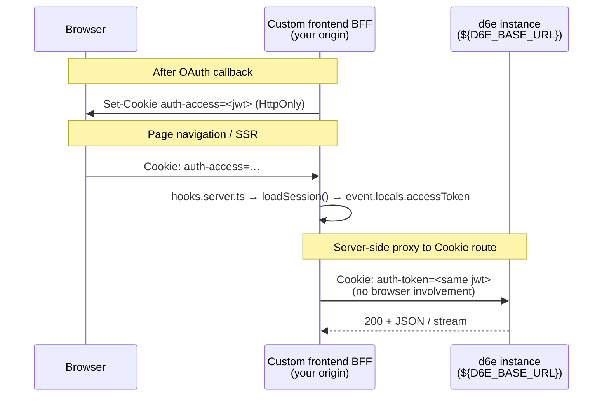

# Cookie transport bridge — `auth-access` → `auth-token`

Custom frontends in this repo store the end-user JWT in an HTTP-only cookie named
**`auth-access`**. The d6e instance's Cookie BFF routes (`/api/chat`,
`/api/chat-sessions`, `/api/workspace-prompt-rules`, SaaS connect flows) read a
cookie named **`auth-token`** on `${D6E_BASE_URL}`.

The JWT string is **identical** in both cases — only the cookie **name** and
**which origin** holds it differ. Your same-origin BFF must translate between
them on every upstream call to Cookie-authenticated surfaces.

Implementation:
[`src/lib/server/session.ts`](../../../src/lib/server/session.ts) (stores
`auth-access`), [`src/lib/server/d6e-client.ts`](../../../src/lib/server/d6e-client.ts)
(forwards `auth-token`), [`d6e/packages/frontend/src/lib/server/auth.ts`](https://github.com/d6e-ai/d6e/blob/main/packages/frontend/src/lib/server/auth.ts)
(`accessTokenCookieName = 'auth-token'`).

---

## Two-cookie model



| Cookie | Set by | Read by | Lifetime |
| ------ | ------ | ------- | -------- |
| `auth-access` | Your app `/auth/callback` (`storeSession`) | Your `hooks.server.ts` (`loadSession`) | Until JWT `exp` (~1h; refreshed proactively) |
| `auth-refresh` | Your app | Your `loadSession` refresh | 30 days (rotated on each refresh) |
| `auth-token` | **Never set in the browser** | d6e instance Cookie BFF routes | Injected per upstream `fetch` only |

The browser **never** receives an `auth-token` cookie from `${D6E_BASE_URL}` in
the custom-frontend pattern — cross-origin cookies would not attach to your
same-origin `/api/*` proxies anyway.

---

## How this repo bridges

1. **`hooks.server.ts`** calls `loadSession(event)`, which reads `auth-access`
   (and refreshes via `auth-refresh` when within 60s of `exp`).
2. On success it sets `event.locals.accessToken` to the JWT string.
3. Route handlers call `requireAccessToken(event, caller)` or read
   `event.locals.accessToken` directly.
4. **`d6e-client.ts`** forwards that string upstream:

```ts
// chatSessionsRequest() in src/lib/server/d6e-client.ts
const headers: Record<string, string> = {
  Cookie: `auth-token=${accessToken}`,
  Accept: 'application/json'
};
```

5. Rust `/api/v1/*` calls from the same module use
   `Authorization: Bearer ${accessToken}` instead — same JWT, different transport.

`scripts/init-workspace.mjs` follows the same bridge: it refreshes via
`${D6E_BASE_URL}/api/v1/auth/token`, then POSTs to `/api/workspace-prompt-rules`
with `Cookie: auth-token=${accessToken}` (never Bearer).

---

## Bearer vs Cookie on the d6e instance

| Upstream route family | Header your BFF must send |
| --------------------- | ------------------------- |
| Rust `/api/v1/*` | `Authorization: Bearer <jwt>` |
| `/api/workflows/execute-by-intent` (+ jobs) | `Authorization: Bearer <jwt>` |
| `/api/chat`, `/api/chat-sessions`, `/api/workspace-prompt-rules` | `Cookie: auth-token=<jwt>` |
| `/api/saas-auth/*`, `/api/saas-credentials/*` | `Cookie: auth-token=<jwt>` |

Full per-endpoint table:
[auth-header-matrix.md](../../d6e-workspace-api-client/references/auth-header-matrix.md).

Chat streaming uses the same Cookie transport:
[chat-streaming.md](../../d6e-workspace-api-client/references/chat-streaming.md).

---

## Security rules

| Rule | Why |
| ---- | --- |
| **Never put `d6e_*` API keys in the browser** | Long-lived secrets belong in server env / CI only. |
| **Never expose `auth-access` to client JS** | Keep `httpOnly: true`; the sidebar uses `auth-user` (display only). |
| **Never forward the browser's cookies to `${D6E_BASE_URL}`** | Inject `auth-token` server-side from `event.locals.accessToken`. |
| **Do not set `auth-token` on your app's origin** | d6e's hooks read that name only on the instance origin. |

Provider API keys (`OPENAI_API_KEY`, `GEMINI_API_KEY`, …) also stay on the
instance — your proxy forwards the session JWT only. See
[llm-and-embedding-keys.md](../../d6e-workspace-api-client/references/llm-and-embedding-keys.md).

---

## Common mistakes

| Symptom | Cause | Fix |
| ------- | ----- | --- |
| 401 on `/api/chat-sessions`, Bearer works on `/api/v1` | Sent `Authorization: Bearer` to Cookie route | Bridge `auth-access` → `Cookie: auth-token=…` in BFF |
| 401 on Cookie route with empty `locals.user` upstream | Expired or wrong-audience JWT | Confirm instance-brokered exchange; check `aud` |
| CORS error chasing redirects to d6e-auth | Browser called `${D6E_BASE_URL}` directly | Proxy through same-origin `/api/*` |
| Init script 401 on prompt rules | Used Bearer instead of Cookie | Match `init-workspace.mjs` Cookie header |

---

## Related

- [custom-frontend-auth-decision-tree.md](./custom-frontend-auth-decision-tree.md) — when Bearer vs Cookie
- [jwt-claims-and-lifetimes.md](./jwt-claims-and-lifetimes.md) — what the JWT contains
- [token-kinds.md](./token-kinds.md) — instance vs scoped JWT vs API key
