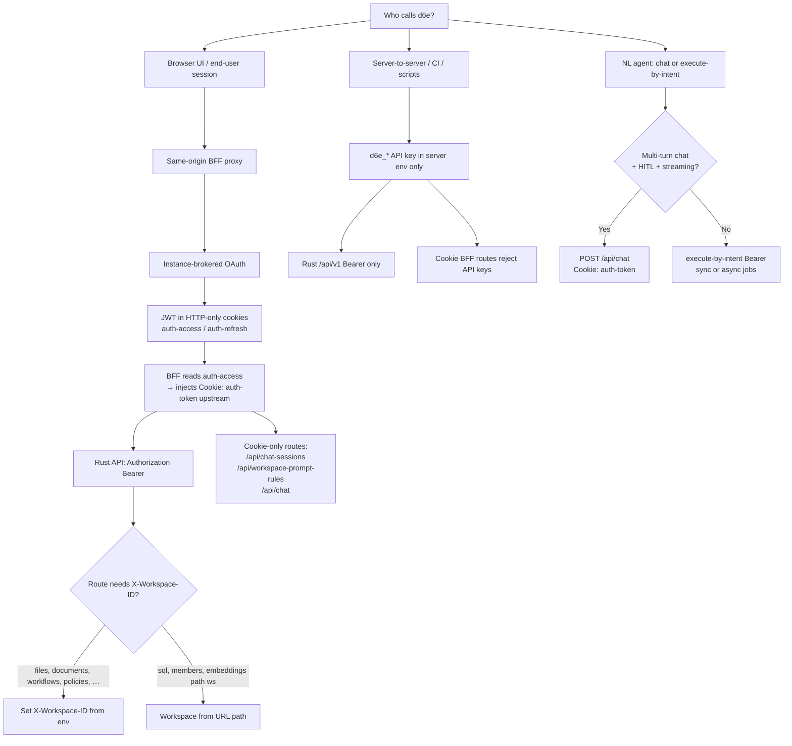

# Custom frontend auth decision tree

How to choose credentials and transport when a custom frontend talks to a d6e
instance. All three token kinds travel as `Authorization: Bearer <value>` on
Rust `/api/v1` routes; only interactive OAuth sessions also work on Cookie BFF
routes.

See also [token-kinds.md](./token-kinds.md) and
[`d6e-workspace-api-client` auth-header matrix](../../d6e-workspace-api-client/references/auth-header-matrix.md).

---

## Flowchart



---

## Decision tree (text)

```
Is the caller a browser tab?
  YES → Never put d6e_* API keys in the browser or in client-side JS.
        Proxy through your same-origin BFF; store OAuth tokens in HTTP-only cookies
        (auth-access / auth-refresh on your origin).
        BFF reads auth-access via hooks.server.ts → event.locals.accessToken.
        For d6e Cookie routes, inject Cookie: auth-token=<jwt> on server fetch
        (see cookie-transport-bridge.md) — the browser never holds auth-token.
        Use Bearer (same JWT, server-forwarded) for Rust /api/v1.

Is the caller a server script, MCP, or CI job without interactive login?
  YES → Use d6e_* API key as Bearer on Rust /api/v1.
        API keys cannot call Cookie BFF routes or CRUD other API keys.
        Pin workspace via X-Workspace-ID (header-scoped routes) or path {id} (SQL, members).

Does the same OAuth callback URL exist in multiple workspaces?
  YES → Add d6e_workspace_id to the authorize URL → workspace-scoped JWT.
        Scoped JWTs cannot POST/GET/DELETE /api/v1/api-keys.

Need to mint API keys programmatically?
  YES → Use an unscoped instance JWT session or an existing API key — not a scoped JWT.
```

---

## Bearer vs Cookie

| Concern | Bearer (`Authorization: Bearer …`) | Cookie (`Cookie: auth-token=<jwt>`) |
| ------- | ------------------------------------ | ----------------------------------- |
| Rust `/api/v1/*` | Yes — JWT, scoped JWT, or `d6e_*` key | No — rejected |
| `/api/chat` | No — rejected | Yes — requires `locals.user` session |
| `/api/chat-sessions`, `/api/workspace-prompt-rules` | No | Yes |
| `/api/workflows/execute-by-intent` (+ jobs) | Yes | No |
| Custom frontend pattern | BFF reads cookie, forwards Bearer upstream | Browser hits same-origin BFF only |

The JWT string is identical; only the **transport** differs. Custom frontends
store it in `auth-access`; d6e Cookie BFF routes expect `auth-token` — your BFF
bridges the two server-side. See
[cookie-transport-bridge.md](./cookie-transport-bridge.md) and
[auth-header-matrix.md](../../d6e-workspace-api-client/references/auth-header-matrix.md).

---

## API keys (`d6e_*`) — server/CI only

Long-lived keys authenticate as Bearer on most Rust routes. They are **user-level**:
the API key owner must be a workspace member (checked when `X-Workspace-ID` or path
workspace is present).

| Capability | API key |
| ---------- | ------- |
| `POST …/sql`, file CRUD, workflows, embeddings | Yes (policies apply as the key owner) |
| `/api/chat`, `/api/chat-sessions` | **No** |
| `POST/GET/DELETE /api/v1/api-keys` | **No** (`require_session`) |
| `POST /api/v1/workspaces` (create workspace) | **No** |
| Workspace-scoped OAuth JWT | N/A — different token kind |

**SQL note:** API keys use `PolicySubject::User(key_owner_id)` on execute — same
row-level policies as an interactive user. There is no separate “API key policy
mode”. Heavy SQL workloads are fine on `POST /api/v1/workspaces/{id}/sql`; use
preview (`…/sql/preview`) only for HITL planning — preview skips policy
evaluation (see [sql.md](../../d6e-workspace-api-client/references/sql.md)).

**Never** embed `d6e_*` in frontend bundles, mobile apps, or browser storage.

---

## Scoped JWT cannot CRUD API keys

`POST/GET/DELETE /api/v1/api-keys` call `reject_scoped_token()` upstream.
Workspace-scoped OAuth tokens (claim `d6e_workspace_id`) **cannot create, list,
or revoke** API keys.

Operational pattern:

- End-user login via workspace-registered redirect URI → scoped JWT → normal
  workspace API use.
- Operator bootstrap (`scripts/init-workspace.mjs`, key rotation) → unscoped
  session, `D6E_INIT_REFRESH_TOKEN`, or existing API key.

---

## Common mistakes

| Symptom | Cause | Fix |
| ------- | ----- | --- |
| 401 on `/api/chat-sessions`, Bearer works on `/api/v1` | Sent Bearer to Cookie route | Proxy with session cookie |
| 403 on `/api/v1/api-keys` with scoped JWT | `reject_scoped_token` | Use unscoped admin session |
| 403 on `/api/v1/api-keys` with `d6e_*` key | `require_session` | Keys cannot manage keys |
| 403 `WORKSPACE_SCOPE_VIOLATION` | Scoped JWT + wrong `X-Workspace-ID` | Pin header from token claim or env |
| Login OK, all Bearer calls 401 | JWT `aud` ≠ `D6E_AUTH_CLIENT_ID` | Exchange at instance, not raw d6e-auth |

---

## Related

- [cookie-transport-bridge.md](./cookie-transport-bridge.md) — `auth-access` → `auth-token`
- [token-kinds.md](./token-kinds.md) — JWT, scoped JWT, API key comparison
- [platform-adapters.md](./platform-adapters.md) — cookie/session per host
- [auth-header-matrix.md](../../d6e-workspace-api-client/references/auth-header-matrix.md) — per-endpoint headers
- [api-keys-and-audit.md](../../d6e-workspace-api-client/references/api-keys-and-audit.md) — key CRUD rules
