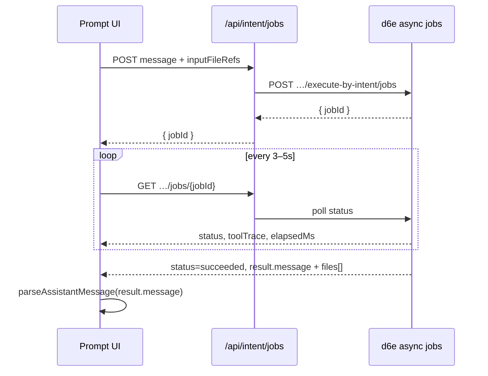

# Async jobs for prompt-driven UI

Prompt-driven screens call `/api/workflows/execute-by-intent` (directly or
via a same-origin `/api/intent` proxy). The LLM returns fenced JSON in
`message`; the parse layer turns that into cards. **Long runs** — Drive mirror
lookups, multi-tool agent loops, STF file generation — can exceed serverless
timeouts; use the **async intent job API** instead of blocking the HTTP
request until the model finishes.

Full API shapes:
[`d6e-workspace-api-client` async-intent-jobs.md](../../d6e-workspace-api-client/references/async-intent-jobs.md).

Platform limits (Vercel `maxDuration`, Cloudflare ~30s CPU):
[`platform-timeouts.md`](../../d6e-workspace-api-client/references/platform-timeouts.md).

## When the UI should use async jobs

| Signal | Use async |
| ------ | --------- |
| Agent run often > 2–5 minutes | Yes |
| Progress UI (tool names, elapsed time) | Yes — poll `toolTrace` |
| User cancel button | Yes — cooperative cancel |
| Simple receipt → journal (< 1 min) | Sync `/api/intent` is fine (this repo's default) |
| SNS bot webhook | Sync — caller owns timeout |

## UI flow



1. **Submit** — server route calls `createAsyncIntentJob()`, returns `{ jobId }`
   immediately. Pin `workspaceId` from `D6E_WORKSPACE_ID`; never from the browser.
2. **Poll** — client hits same-origin `GET /api/intent/jobs/{id}` every 3–5s.
   Never expose raw `${D6E_BASE_URL}/…/jobs/…` URLs (JWT is server-only).
3. **Progress** — while `status` is `queued` or `running`, render:
   - `toolTrace[]` — `{ tool, startedAt, finishedAt? }` (cap 100 entries)
   - `elapsedMs` — wall clock for a live timer
4. **Cancel** — `POST …/jobs/{id}/cancel`; expect cooperative stop (~10s).
5. **Finalize** — on `succeeded`, read `result` (same `IntentResponse` as sync):
   - `result.message` → `parseAssistantMessage()` → card or markdown fallback
   - `result.files[]` → see [output-files.md](./output-files.md)
   - On `failed` / `cancelled`, show `error` and keep `rawText` fallback if any

Optional: Vercel `waitUntil()` to persist the finished turn to
`chat_session` after terminal status without blocking the poll response.

## `inputFileRefs` and soft-deleted files

Upload flow: browser POSTs files to `/api/upload` → receives `fileId` → sends
`inputFileRefs[]` with the intent message.

**Validation at job create:** d6e drops refs whose `fileId` is not a UUID;
malformed ids never reach the agent.

**Soft-deleted files fail later:** if the user removes a queued file via
`DELETE /api/upload/{fileId}` (or another tab deletes storage) but the UI
still submits the old `fileId`, job creation **succeeds**. When the runner
calls `injectFileAttachments` / Storage download, the row has
`deleted_at IS NOT NULL` → **404** → vision inline and tool reads fail mid-run.

UI guardrails:

- Drop removed files from the queue before submit; only send refs still shown.
- On restore from `chat_session`, re-validate attachments exist (HEAD/metadata)
  or disable "retry" when `fileId` was deleted.
- Do not assume a failed run left storage intact — this repo intentionally
  does **not** delete `inputFileRefs` on intent failure so users can retry;
  the queue owns lifecycle via explicit DELETE.

See [file-storage.md](../../d6e-workspace-api-client/references/file-storage.md)
(soft delete → 404 on download).

## When the LLM materializes files during the job

Tool chains may persist binaries to workspace storage (e.g.
`d6e_download_external_file` / `saas-proxy-download`, Drive
`materialize`, STF output cached server-side). Those paths yield a
**storage `fileId`**, not inline base64 in `result.files[]`.

Render downloads via the same-origin streaming proxy — never redirect to
`${D6E_BASE_URL}`:

[`download-two-step.md`](../../d6e-workspace-api-client/references/download-two-step.md)

Inline `result.files[]` (base64 Excel/PDF from MCP binary capture) is
documented in [output-files.md](./output-files.md).

## Prompt-layer considerations

- Async does not change the **JSON contract** — the prompt still emits one
  ` ```json ` block with `kind` in `result.message`.
- Show progress copy while polling ("Searching Drive…", "Running workflow…")
  driven by `toolTrace[].tool` names; do not parse partial assistant text.
- Revision flows re-send `inputFileRefs[]` and embed `<previous_journal>` in
  `message` the same way as sync — only transport differs.

## Related

- [output-files.md](./output-files.md)
- [`d6e-workspace-api-client` async-intent-jobs.md](../../d6e-workspace-api-client/references/async-intent-jobs.md)
- [`d6e-workspace-api-client` download-two-step.md](../../d6e-workspace-api-client/references/download-two-step.md)
- [`d6e-prompt-driven-ui` SKILL.md](../SKILL.md)
