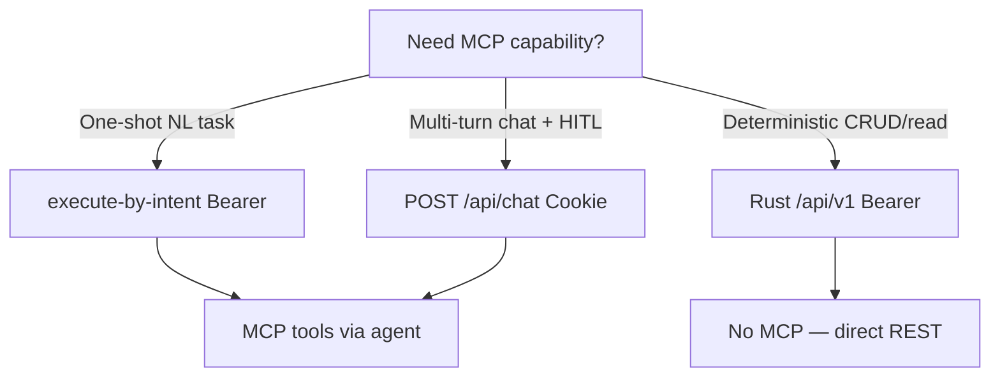

# MCP tools ↔ REST mapping

d6e exposes ~80 MCP tools via the MCP server
([`packages/mcp/src/server/mod.rs`](https://gitlab.com/cauchye/d6e-ai/d6e/-/blob/main/packages/mcp/src/server/mod.rs)).
Custom frontends **cannot call MCP tools directly** — there is no public MCP
HTTP endpoint for browser or arbitrary server clients outside the agent/chat
pipelines.

To use MCP-only capabilities from a custom frontend:

1. **`POST /api/chat`** — full tool set with streaming (Cookie) —
   [chat-streaming.md](./chat-streaming.md)
2. **`POST /api/workflows/execute-by-intent`** — NL agent with MCP tools (Bearer) —
   [async-intent-jobs.md](./async-intent-jobs.md)
3. **Reimplement via REST** where a Bearer equivalent exists (table below)

Tool names may be prefixed when loaded from external MCP servers
(e.g. `myserver__d6e_sql`). Chat treats any name equal to `d6e_sql` or ending
with `__d6e_sql` as the SQL tool for HITL approval.

---

## Core rule

| Access path | Auth | MCP tools |
| ----------- | ---- | --------- |
| `/api/chat` | Cookie | Yes — d6e MCP + workspace MCP servers |
| `/api/workflows/execute-by-intent` (+ jobs) | Bearer | Yes |
| `/api/v1/*` Rust REST | Bearer | **No** — use mapped REST routes |
| Custom FE direct MCP | — | **Not supported** |

---

## Instance MCP wiring vs Cookie BFF MCP config

Two different configuration layers:

| Layer | Config | Who reads it | Custom FE |
| ----- | ------ | ------------ | --------- |
| **Instance env** | `D6E_MCP_SERVER_URL` (e.g. `http://mcp:8081/mcp` in `compose.yml`) | d6e frontend when building MCP client for chat / execute-by-intent | Set on **d6e instance** deploy — not in your SvelteKit app |
| **Workspace DB** | Rows in `mcp_server` table | Same MCP loader + Cookie BFF `GET/POST /api/mcp-servers` | Admin configures in d6e console; loaded into chat/intent when `workspaceId` is set |
| **Per-user timeout** | `mcpTimeoutMs` in workspace user settings | Chat path only | Cookie BFF `GET/PATCH /api/workspace-settings/{id}` |

Chat and execute-by-intent call `getMCPTools()`:

1. If `D6E_MCP_SERVER_URL` **and** a Bearer token (session JWT or API key) are
   present → register the built-in `d6e` MCP server with
   `Authorization: Bearer` + `X-Workspace-Id`.
2. Merge enabled workspace MCP servers from the database (URL + optional OAuth
   headers from `saas_credential`).
3. Append **Tavily** tools when `TAVILY_API_KEY` is set on the **instance**
   (not per-workspace) — `getTavilyTools()` in `tavily-tools.ts`.

Custom frontends **cannot** configure `D6E_MCP_SERVER_URL` from the browser.
Proxy `/api/chat` or execute-by-intent; ensure the instance operator set env
vars. Workspace-specific external MCP URLs are managed via console
[memories-mcp-settings.md § mcp-servers](./memories-mcp-settings.md) (Cookie
admin BFF — no Rust REST equivalent for CRUD).

**Tavily:** instance-level `TAVILY_API_KEY` only. No REST shortcut — available
in chat and execute-by-intent agent tool sets, not in `/api/v1/*`.

---

## Mapping table (major tools)

| MCP tool | REST / BFF equivalent | Notes |
| -------- | --------------------- | ----- |
| `d6e_health` | **MCP-only** | Liveness check for MCP session |
| `d6e_sql` | `POST /api/v1/workspaces/{id}/sql` | Execute; preview via `…/sql/preview`. Chat adds HITL approval — REST does not |
| `d6e_call_external_api` | `POST /api/v1/saas-proxy` | Same credential store; 10 MB response cap |
| `d6e_download_external_file` | `POST /api/v1/saas-proxy-download` | Persists to storage; [download-two-step.md](./download-two-step.md) |
| `d6e_view_image` | `GET …/files/{id}/download` + client decode | MCP returns image content to model; REST is raw bytes |
| `d6e_extract_file_text` | **Partial** — download + client extract | No dedicated REST text-extraction endpoint |
| `d6e_replace_document_section` | `PATCH …/documents/{id}` with section logic | MCP tool wraps document API; no single REST "replace section" route |
| `d6e_read_drive_file` | `POST /api/v1/drive-sync/materialize` or `…/read` | MCP caches to `storage_file`; see [drive-sync.md](./drive-sync.md) |
| `drive_files` (SQL table) | Query via `POST …/sql` | Mirror populated by Drive Sync — not an MCP tool name but used with `d6e_sql` |
| `d6e_list_files` | `GET /api/v1/workspaces/{id}/files` | Header-scoped — [file-storage.md](./file-storage.md) |
| `d6e_get_file` | `GET …/files/{fileId}` | Metadata only |
| `d6e_upload_file` | `POST …/files` or `…/files/multipart` | |
| `d6e_download_file` | `GET …/files/{fileId}/download` | Stream via proxy |
| `d6e_delete_file` | `DELETE …/files/{fileId}` | |
| `d6e_generate_embeddings` | `POST …/embeddings/generate` | [embeddings.md](./embeddings.md) |
| `d6e_similarity_search` | `POST …/embeddings/similarity-search` | Column vectors |
| `d6e_embed_files` | `POST …/embeddings/files/embed` | |
| `d6e_file_embedding_status` | `GET …/embeddings/files/status` | |
| `d6e_search_files` | `POST …/embeddings/files/search` | Semantic file search |
| `d6e_regenerate_file_embeddings` | `POST …/embeddings/files/regenerate` | |
| `d6e_embed_table_rows` | `POST …/embeddings/tables/embed` | |
| `d6e_table_row_embedding_status` | `GET …/embeddings/tables/status` | |
| `d6e_search_table_rows` | `POST …/embeddings/tables/search` | |
| `d6e_regenerate_table_rows` | `POST …/embeddings/tables/regenerate` | |
| `d6e_list_workflows` | `GET /api/v1/workflows` | + `X-Workspace-ID` |
| `d6e_execute_workflow` | `POST /api/v1/workflows/{id}/execute` | |
| `d6e_list_saas_credentials` | `GET /api/v1/workspaces/{id}/setup/saas-credentials` (Bearer) or Cookie BFF list — [saas-oauth-bff.md](./saas-oauth-bff.md) | List only on Rust; connect via BFF |
| `d6e_list_workspace_prompt_rules` | `GET …/setup/prompt-rules` (Bearer) or `/api/workspace-prompt-rules` (Cookie) | |
| `d6e_list_workspace_skills` | `GET …/setup/skills` (Bearer metadata) or skills BFF — [workspace-skills-bff.md](./workspace-skills-bff.md) | |
| `d6e_list_policies` | `GET /api/v1/policies` | |
| `d6e_create_policy_group` | `POST /api/v1/policy-groups` | Body: `user_ids[]`, `stf_ids[]` — [policies.md](./policies.md) |
| `d6e_list_audit_logs` | `GET /api/v1/audit-logs` | |
| `d6e_set_workspace` / `d6e_get_current_workspace` | **MCP-only** | Session context tools for agents |
| `d6e_instant_run_stf` | `POST /api/v1/stfs/instant-run` | |
| `d6e_describe_stf` | `POST /api/v1/stfs/{id}/describe` | |
| Workspace setup tools (title-rule, chat-templates, dashboard) | `GET/PUT …/setup/*` (Bearer) or Cookie BFF twins — [console-bff-catalog.md](./console-bff-catalog.md) | |
| Document CRUD MCP tools | `…/documents/*` REST | [documents.md](./documents.md) |
| STF / Effect MCP tools | `/api/v1/stfs/*`, `/api/v1/effects/*` | [stfs-and-effects.md](./stfs-and-effects.md) |
| Member admin MCP tools | `…/workspaces/{id}/members/*` | [members-and-invitations.md](./members-and-invitations.md) |

---

## MCP-only categories (no REST shortcut)

These are only available through chat or execute-by-intent:

- **`d6e_health`** — MCP handshake / diagnostics
- **`d6e_set_workspace`**, **`d6e_get_current_workspace`** — agent session helpers
- **`d6e_extract_file_text`** — no standalone REST; approximate with download + local parser
- **`d6e_view_image`** — optimized multimodal return for LLM; REST gives raw bytes
- **`d6e_replace_document_section`** — structured edit helper; use document PATCH or chat
- **External workspace MCP servers** — tools from user-configured MCP URLs
  ([memories-mcp-settings.md § mcp-servers](./memories-mcp-settings.md))
- **Tavily search tools** — loaded in chat only (`getTavilyTools()`)
- **`fetch`** builtin — chat-only URL/skill fetch
- **`ask_user`** — chat-only interactive UI — [chat-streaming.md](./chat-streaming.md)

---

## Drive tools summary

| Goal | MCP | REST |
| ---- | --- | ---- |
| Browse synced folder tree | `d6e_sql` on `drive_files` table | Same SQL via `POST …/sql` |
| Read file bytes into storage | `d6e_read_drive_file` | `POST /api/v1/drive-sync/materialize` or `…/read` |
| Configure sync | — (agent uses MCP or manual) | [drive-sync.md](./drive-sync.md) full REST |
| Live Drive API call | `d6e_call_external_api` | [saas-proxy.md](./saas-proxy.md) |

---

## Embedding / search tools summary

All embedding MCP tools map 1:1 to `/api/v1/workspaces/{id}/embeddings/*` routes.
Long-running jobs — poll status endpoints. See [embeddings.md](./embeddings.md).

Cookie BFF shortcut for column generate only:
`POST /api/embeddings/generate` — [console-bff-catalog.md](./console-bff-catalog.md).

---

## Choosing an integration path

---

## Related

- [chat-streaming.md](./chat-streaming.md) — chat MCP pipeline
- [async-intent-jobs.md](./async-intent-jobs.md) — Bearer NL agent
- [saas-proxy.md](./saas-proxy.md) — external API proxy
- [drive-sync.md](./drive-sync.md) — Drive mirror
- [embeddings.md](./embeddings.md) — vector search REST
- [api-catalog.md](./api-catalog.md) — master index
