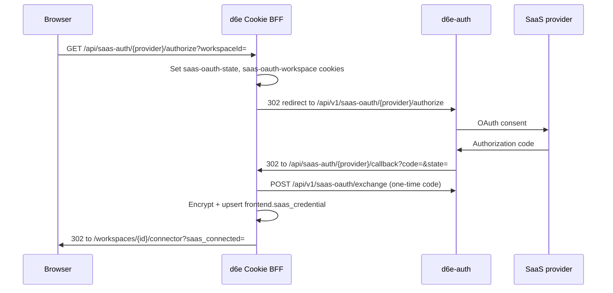

# SaaS OAuth and credentials — Cookie BFF flow

Connect external SaaS providers (freee, Google Workspace, Notion, GitHub PAT,
Chatwork, etc.) to a workspace. Encrypted tokens are stored in the d6e instance
PostgreSQL table `frontend.saas_credential`. The Rust `POST /api/v1/saas-proxy`
endpoint reads the **same table** (`frontend.saas_credential`) — credentials
connected via this BFF flow are immediately usable from Bearer proxies.

**Previous docs incorrectly stated "console only."** Custom frontends **can**
drive the full connect flow by proxying these Cookie BFF routes on the d6e
instance (`D6E_BASE_URL`), same-origin with `Cookie: auth-token=<jwt>`.
Bearer is rejected on these routes.

Implementation reference:
[`packages/frontend/src/routes/api/saas-auth/`](https://gitlab.com/cauchye/d6e-ai/d6e/-/tree/main/packages/frontend/src/routes/api/saas-auth),
[`packages/frontend/src/routes/api/saas-credentials/`](https://gitlab.com/cauchye/d6e-ai/d6e/-/tree/main/packages/frontend/src/routes/api/saas-credentials).

---

## Auth

All routes below require:

```
Cookie: auth-token=<jwt>
```

The d6e instance validates `locals.user` and reads the session JWT from the
`auth-token` cookie (`accessTokenCookieName` in
[`packages/frontend/src/lib/server/auth.ts`](https://gitlab.com/cauchye/d6e-ai/d6e/-/blob/main/packages/frontend/src/lib/server/auth.ts)).

Custom frontend pattern:

1. Browser calls your same-origin `/api/saas-connect/...` proxy.
2. Your server forwards to `${D6E_BASE_URL}/api/saas-auth/...` with the user's
   `auth-token` cookie (or inject cookie from `event.locals` after
   [d6e-auth-integration](../../d6e-auth-integration/SKILL.md)).
3. OAuth redirects must land on the **d6e instance** callback URL (or your
   proxy must preserve the redirect chain).

**Do not** send `Authorization: Bearer` on these routes.

---

## Provider discovery

### `GET /api/saas-auth/providers`

Lists SaaS providers that have OAuth client credentials configured in d6e-auth.

| | |
| --- | --- |
| Auth | Cookie (session) |
| Response | `{ providers: [...] }` proxied from `${D6E_AUTH_URL}/api/v1/saas-oauth/providers` |
| Errors | 401 if unauthenticated; returns `{ providers: [] }` on upstream failure |

Use this to grey out providers that are not configured on the instance.

---

## OAuth connect flow (OAuth providers)

Three-step browser flow:



### Step 1 — `GET /api/saas-auth/{provider}/authorize?workspaceId=<uuid>`

| | |
| --- | --- |
| Auth | Cookie |
| Query | `workspaceId` **required** |
| Membership | Verified via `getWorkspace(sessionToken, workspaceId)` — 403 if not a member |
| Side effects | Sets httpOnly cookies: `saas-oauth-state`, `saas-oauth-workspace`, `saas-oauth-locale` (10 min TTL) |
| Response | `302` redirect to `${D6E_AUTH_URL}/api/v1/saas-oauth/{provider}/authorize?client_id=&d6e_callback=&workspace_id=&state=` |

`d6e_callback` is `${origin}/api/saas-auth/{provider}/callback` on the d6e
instance.

### Step 2 — `GET /api/saas-auth/{provider}/callback`

Called by d6e-auth after SaaS OAuth completes. Not typically invoked directly
by custom frontends.

| | |
| --- | --- |
| Auth | Cookie |
| Query | `code` (one-time), `state`, optional `workspace_id`, optional `error` |
| Validation | `state` must match `saas-oauth-state` cookie; workspace from query or cookie |
| Exchange | `POST ${D6E_AUTH_URL}/api/v1/saas-oauth/exchange` with client credentials |
| Storage | Encrypts `access_token` / `refresh_token`; upserts `frontend.saas_credential` with `authType: 'oauth'` |
| Response | `302` to localized `/workspaces/{workspaceId}/connector?saas_connected={provider}` |

On `?error=` from provider: `400 OAuth authorization was denied or failed`.

---

## PAT / API token providers

### `POST /api/saas-auth/{provider}/token`

For providers that use personal access tokens or API keys instead of OAuth
(Chatwork, Zendesk, GitHub PAT, etc.).

| | |
| --- | --- |
| Auth | Cookie |
| Body | `{ workspaceId, token, fields? }` |
| `token` | Required — the PAT or API key (stored encrypted) |
| `fields` | Optional provider-specific config (e.g. subdomain); keys `api_token` / `pat` are stripped |
| Membership | Verified via `getWorkspace` |
| Storage | Upserts `frontend.saas_credential` with `authType: 'api_token'` or `'pat'` |
| Response | `{ success: true }` |

---

## Credential listing and management

### `GET /api/saas-credentials?workspaceId=<uuid>`

List connected providers for a workspace (non-secret metadata only).

Response array items:

```json
{
  "id": "<uuid>",
  "provider": "google_workspace",
  "authType": "oauth",
  "enabled": true,
  "tokenExpiresAt": "2026-08-01T00:00:00.000Z",
  "connectedAt": "2026-07-01T00:00:00.000Z",
  "lastUsedAt": null
}
```

Tokens, refresh secrets, and API keys are **never** returned.

### `GET /api/workspaces/{workspaceId}/saas-credentials`

Same shape as above; workspace id from path instead of query. Any workspace
member may read (informational only).

### `PATCH /api/saas-credentials/{id}`

Toggle a credential on/off without deleting it.

| | |
| --- | --- |
| Body | `{ enabled: boolean }` |
| Auth | Cookie; caller must be member of credential's workspace |
| Response | `{ success: true, enabled: boolean }` |

Disabling prevents [saas-proxy.md](./saas-proxy.md) from using the credential.

### `DELETE /api/saas-credentials/{id}`

Remove credential and any auto-created `mcp_server` rows linked via
`saasCredentialId`.

| | |
| --- | --- |
| Auth | Cookie; workspace membership required |
| Response | `{ success: true }` |

---

## Contrast with Rust `GET …/setup/saas-credentials`

| | Cookie BFF (this doc) | Rust setup API |
| --- | --------------------- | -------------- |
| List | `GET /api/saas-credentials?workspaceId=` or `GET /api/workspaces/{id}/saas-credentials` | `GET /api/v1/workspaces/{id}/setup/saas-credentials` |
| Connect OAuth | `GET /api/saas-auth/{provider}/authorize` → callback | **No Rust route** — OAuth is BFF-only |
| Save PAT | `POST /api/saas-auth/{provider}/token` | **No Rust route** |
| Enable/disable | `PATCH /api/saas-credentials/{id}` | **No Rust route** |
| Delete | `DELETE /api/saas-credentials/{id}` | **No Rust route** |
| Auth | Cookie (`auth-token`) | Bearer (path workspace) |
| Mutations | Full CRUD via BFF | **List only** on Rust side |

Both list endpoints read the same underlying `frontend.saas_credential` table.
Use the BFF routes when building a custom admin/settings UI that connects
providers. Use the Rust list route from server-side Bearer scripts that only
need to check connection status before calling
[saas-proxy.md](./saas-proxy.md).

---

## After connecting — calling SaaS APIs

Once a provider appears in the credential list, call external APIs from your
**server proxy** via Bearer:

```
POST /api/v1/saas-proxy
Authorization: Bearer <jwt>
{ "workspace_id": "<pinned>", "provider": "google_workspace", ... }
```

See [saas-proxy.md](./saas-proxy.md) and
[saas-proxy-download.md](./saas-proxy-download.md).

MCP tool equivalents: `d6e_call_external_api`, `d6e_download_external_file`
— see [mcp-rest-map.md](./mcp-rest-map.md). Custom frontends cannot invoke MCP
tools directly; use REST proxies or `/api/chat`.

---

## Custom frontend checklist

- [ ] Proxy OAuth authorize URL through same-origin route; preserve cookies on
      redirect chain or open d6e instance authorize URL directly when user is
      logged into d6e.
- [ ] Use `GET /api/saas-auth/providers` to show available providers.
- [ ] Use `GET /api/saas-credentials?workspaceId=` (Cookie) for status UI.
- [ ] Use `POST /api/saas-auth/{provider}/token` for PAT providers.
- [ ] Pin `workspaceId` server-side — never trust browser-supplied workspace
      on your BFF (d6e BFF validates membership itself).
- [ ] After connect, use Bearer `saas-proxy` from your server — not Cookie.
- [ ] Surface "connect provider" when `saas-proxy` returns 404 (no credential).

## Related

- [saas-proxy.md](./saas-proxy.md) — JSON SaaS proxy after connect
- [workspace-setup.md](./workspace-setup.md) — Rust setup API (list-only creds)
- [console-bff-catalog.md](./console-bff-catalog.md) — full BFF vs Rust table
- [api-catalog.md](./api-catalog.md) — master index
- [auth-header-matrix.md](./auth-header-matrix.md) — Cookie vs Bearer
